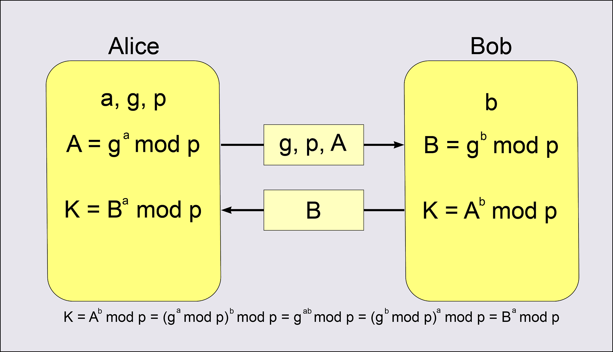
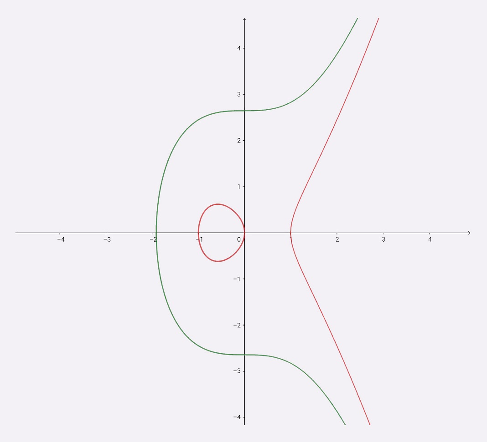

ECDHE就是“短暂-椭圆曲线-迪菲-赫尔曼”算法（ephemeral Elliptic Curve Diffie–Hellman），里面的关键字是“短暂”“椭圆曲线”和“迪菲-赫尔曼”。

# 离散对数

DH算法是一种非对称加密算法，只能用于密钥交换，它的数学基础是“离散对数”（Discrete logarithm）。

离散对数里的一个核心操作是模运算，也就是取余数。假设有模数17，底数5，那么“5的3次方再对17取余数得6”（5 ^ 3 % 17 = 6）就是在离散整数域上的一次指数运算（5 ^ 3 (mod 17) = 6）。反过来，以5为底，17为模数，6的离散对数就是3（Ind(5, 6) = 3 ( mod 17)）。

这里的（17，5）是离散对数的公共参数，6是真数，3是对数。知道了对数，就可以用幂运算很容易地得到真数，但反过来，知道真数却很难推断出对数，于是就形成了一个“单向函数”。

在这个例子里，选择的模数17很小，使用穷举法从1到17暴力破解也能够计算得到6的离散对数是3。但如果我们选择的是一个非常非常大的数，比如说是有1024位的超大素数，那么暴力破解的成本就非常高了，几乎没有什么有效的方法能够快速计算出离散对数，这就是DH算法的数学基础。

# DH算法

假设Alice和Bob约定使用DH算法来交换密钥。基于离散对数，Alice和Bob需要首先确定模数和底数作为算法的参数，这两个参数是公开的，用P和G来代称，简单起见我们还是用17和5（P=17，G=5）。

然后Alice和Bob各自选择一个随机整数作为私钥（必须在1和P-2之间），严格保密。比如Alice选择a=10，Bob选择b=5。有了DH的私钥，Alice和Bob再计算幂作为公钥，也就是A = (G ^ a % P) = 9，B = (G ^ b % P) = 14，这里的A和B完全可以公开，因为根据离散对数的原理，从真数反向计算对数a和b是非常困难的。

交换DH公钥之后，Alice手里有五个数：P=17，G=5，a=10，A=9，B=14，然后执行一个运算：(B ^ a % P)= 8。因为离散对数的幂运算有交换律，B ^ a = (G ^ b ) ^ a = (G ^ a) ^ b = A ^ b，所以Bob计算A ^ b % P也会得到同样的结果8，这个就是Alice和Bob之间的共享秘密，可以作为会话密钥使用，也就是TLS里的Pre-Master。

整个通信过程中，Alice和Bob公开了4个信息：P、G、A、B，其中P、G是算法的参数，A和B是公钥，而a、b是各自秘密保管的私钥，无法获取，所以黑客只能从已知的P、G、A、B下手，计算9或14的离散对数。

由离散对数的性质就可以知道，如果P非常大，那么他很难在短时间里破解出私钥a、b，所以Alice和Bob的通信是安全的。

# DHE算法

DH算法有两种实现形式，一种是已经被废弃的DH算法，也叫static DH算法，另一种是现在常用的DHE算法（有时候也叫EDH）。

static DH算法里有一方的私钥是静态的，通常是服务器方固定，即a不变。而另一方（也就是客户端）随机选择私钥，即b采用随机数。

于是DH交换密钥时就只有客户端的公钥会变，而服务器公钥不变，在长期通信时就增加了被破解的风险，使得拥有海量计算资源的攻击者获得了足够的时间，最终能够暴力破解出服务器私钥，然后计算得到所有的共享秘密Pre-Master，不具有“前向安全”。

而DHE算法的关键在于“E”表示的临时性上（ephemeral），每次交换密钥时双方的私钥都是随机选择、临时生成的，用完就扔掉，下次通信不会再使用，相当于“一次一密”。

所以，即使攻击者破解了某一次的私钥，其他通信过程的私钥仍然是安全的，不会被解密，实现了“前向安全”。

# ECDHE算法

ECDHE算法，就是把DHE算法里整数域的离散对数，替换成了椭圆曲线上的离散对数。

原来DHE算法里的是任意整数，而ECDHE则是把连续的椭圆曲线给“离散化”成整数，用椭圆曲线上的“倍运算”替换了DHE里的幂运算。

在ECDHE里，算法的公开参数是椭圆曲线C、基点G和模数P，私钥是倍数x，公钥是倍点xG，已知倍点xG要想计算出离散对数x是非常困难的。

在通信时Alice和Bob各自随机选择两个数字a和b作为私钥，计算A=aG、B=bG作为公钥，然后互相交换，用与DHE相同的算法，计算得到aB=abG=Ab，就是共享秘密Pre-Master。

因为椭圆曲线离散对数的计算难度比普通的离散对数更大，所以ECDHE的安全性比DHE还要高，更能够抵御黑客的攻击。

