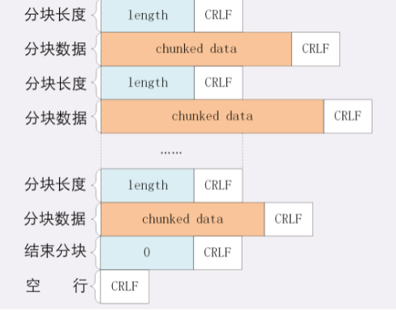
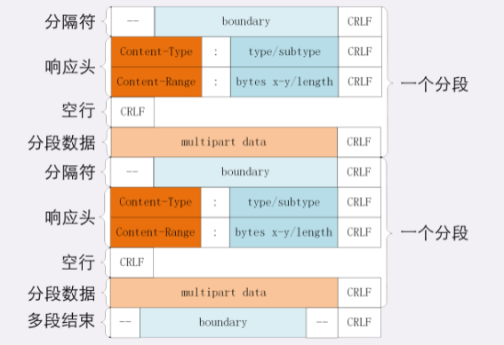

# HTTP 连接管理

## 短连接

HTTP 协议最初（0.9/1.0）是个非常简单的协议，通信过程也采用了简单的“请求-应答”方式。它底层的数据传输基于 TCP/IP，每次发送请求前需要先与服务器建立连接，收到响应报文后会立即关闭连接。因为客户端与服务器的整个连接过程很短暂，不会与服务器保持长时间的连接状态，所以就被称为“短连接”（short-lived connections）。早期的HTTP协议也被称为是“无连接”的协议。

短连接的缺点相当严重，因为在TCP协议里，建立连接和关闭连接都是非常“昂贵”的操作。TCP建立连接要有“三次握手”，发送3个数据包，需要1个RTT；关闭连接是“四次挥手”，4个数据包需要2个RTT。而HTTP的一次简单“请求-响应”通常只需要4个包，如果不算服务器内部的处理时间，最多是2个RTT。这么算下来，浪费的时间就是“3÷5=60%”，有三分之二的时间被浪费掉了，传输效率低得惊人。

## 长连接

针对短连接暴露出的缺点，HTTP 协议就提出了“长连接”的通信方式，也叫“持久连接”（persistent connections）、“连接保活”（keep alive）、“连接复用”（connection reuse）。其实解决办法也很简单，用的就是“成本均摊”的思路，既然TCP的连接和关闭非常耗时间，那么就把这个时间成本由原来的一个“请求-应答”均摊到多个“请求-应答”上。这样虽然不能改善TCP的连接效率，但基于“分母效应”，每个“请求-应答”的无效时间就会降低不少，整体传输效率也就提高了。

在短连接里发送了三次 HTTP “请求-应答”，每次都会浪费60%的RTT时间。而在长连接的情况下，同样发送三次请求，因为只在第一次时建立连接，在最后一次时关闭连接，所以浪费率就是“3÷9≈33%”，降低了差不多一半的时间损耗。显然，如果在这个长连接上发送的请求越多，分母就越大，利用率也就越高。

## 连接相关的头字段

由于长连接对性能的改善效果非常显著，所以在 HTTP/1.1 中的连接都会默认启用长连接。不需要用什么特殊的头字段指定，只要向服务器发送了第一次请求，后续的请求都会重复利用第一次打开的 TCP 连接，也就是长连接，在这个连接上收发数据。当然，我们也可以在请求头里明确地要求使用长连接机制，使用的字段是 Connection，值是 “keep-alive”。

不过不管客户端是否显式要求长连接，如果服务器支持长连接，它总会在响应报文里放一个 “Connection: keep-alive” 字段，告诉客户端：“我是支持长连接的，接下来就用这个 TCP 一直收发数据吧”。

不过长连接也有一些小缺点，因为 TCP 连接长时间不关闭，服务器必须在内存里保存它的状态，这就占用了服务器的资源。如果有大量的空闲长连接只连不发，就会很快耗尽服务器的资源，导致服务器无法为真正有需要的用户提供服务。所以，长连接也需要在恰当的时间关闭，不能永远保持与服务器的连接，这在客户端或者服务器都可以做到。在客户端，可以在请求头里加上 “Connection: close” 字段，告诉服务器：“这次通信后就关闭连接”。服务器看到这个字段，就知道客户端要主动关闭连接，于是在响应报文里也加上这个字段，发送之后就调用 Socket API 关闭 TCP 连接。

服务器端通常不会主动关闭连接，但也可以使用一些策略：

- 设置长连接的超时时间，如果在一段时间内连接上没有任何数据收发就主动断开连接，避免空闲连接占用系统资源
- 设置长连接上可发送的最大请求次数，超过这个最大次数，也会主动断开连接

## 队头阻塞

“队头阻塞”与短连接和长连接无关，而是由 HTTP 基本的“请求-应答”模型所导致的。

因为 HTTP 规定报文必须是“一发一收”，这就形成了一个先进先出的“串行”队列。队列里的请求没有轻重缓急的优先级，只有入队的先后顺序，排在最前面的请求被最优先处理。如果队首的请求因为处理的太慢耽误了时间，那么队列里后面的所有请求也不得不跟着一起等待，结果就是其他的请求承担了不应有的时间成本。

因为“请求-应答”模型不能变，所以“队头阻塞”问题在 HTTP/1.1 里无法解决，只能缓解：

- “并发连接”（concurrent connections），也就是同时对一个域名发起多个长连接，用数量来解决质量的问题。但这种方式也存在缺陷。如果每个客户端都想自己快，建立很多个连接，用户数×并发数就会是个天文数字。服务器的资源根本就扛不住，或者被服务器认为是恶意攻击，反而会造成“拒绝服务”。所以，HTTP协议建议客户端使用并发，但不能“滥用”并发
- "域名分片"，还是用数量来解决质量的思路。多开几个域名，比如，`shard1.chrono.com`、`shard2.chrono.com`，而这些域名都指向同一台服务器 `www.chrono.com`，这样实际长连接的数量就又上去了

# HTTP 传输大文件

## 数据压缩

通常浏览器在发送请求时都会带着 “Accept-Encoding” 头字段，里面是浏览器支持的压缩格式列表，例如：gzip、deflate、br 等，这样服务器就可以从中选择一种压缩算法，放进 “Content-Encoding” 响应头里，再把原数据压缩后发给浏览器。

gzip 等压缩算法通常只对文本文件有较好的压缩率，而图片、音频视频等多媒体数据本身就已经是高度压缩的，再用 gzip 处理也不会变小（甚至还有可能会增大一点），所以它就失效了。

不过数据压缩在处理文本的时候效果还是很好的，所以各大网站的服务器都会使用这个手段作为“保底”。

## 分块传输

如果大文件整体不能变小，那就把它“拆开”，分解成多个小块，把这些小块分批发给浏览器，浏览器收到后再组装复原。这样浏览器和服务器都不用在内存里保存文件的全部，每次只收发一小部分，网络也不会被大文件长时间占用，内存、带宽等资源也就节省下来了。

这种“化整为零”的思路在 HTTP 协议里就是 “chunked” 分块传输编码，在响应报文里用头字段 “Transfer-Encoding: chunked” 来表示，意思是报文里的 body 部分不是一次性发过来的，而是分成了许多的块（chunk）逐个发送。

分块传输也可以用于“流式数据”，例如由数据库动态生成的表单页面，这种情况下body数据的长度是未知的，无法在头字段 “Content-Length” 里给出确切的长度，所以也只能用 chunked 方式分块发送。

“Transfer-Encoding: chunked” 和 “Content-Length” 这两个字段是互斥的，也就是说响应报文里这两个字段不能同时出现，一个响应报文的传输要么是长度已知，要么是长度未知（chunked）。

分块传输的编码规则，其实也很简单，同样采用了明文的方式，很类似响应头：

- 每个分块包含两个部分，长度头和数据块
- 长度头是以 CRLF（回车换行，即\r\n）结尾的一行明文，用 16 进制数字表示长度
- 数据块紧跟在长度头后，最后也用CRLF结尾，但数据不包含 CRLF
- 最后用一个长度为 0 的块表示结束，即“0\r\n\r\n”

##　范围请求

有了分块传输编码，服务器就可以轻松地收发大文件了，但对于上 G 的超大文件，还有一些问题需要考虑。例如想获取一个大文件其中的片段数据，而分块传输并没有这个能力。HTTP协议为了满足这样的需求，提出了“范围请求”（range requests）的概念，允许客户端在请求头里使用专用字段来表示只获取文件的一部分，相当于是客户端的“化整为零”。

范围请求不是 Web 服务器必备的功能，可以实现也可以不实现，所以服务器必须在响应头里使用字段 “Accept-Ranges: bytes” 明确告知客户端：“我是支持范围请求的”。如果不支持的话服务器可以发送 “Accept-Ranges: none”，或者干脆不发送 “Accept-Ranges” 字段，这样客户端就认为服务器没有实现范围请求功能，只能老老实实地收发整块文件了。

请求头 Range 是 HTTP 范围请求的专用字段，格式是“bytes=x-y”，其中的x和y是以字节为单位的数据范围。

假设文件是100个字节，那么：

- “0-9” 表示前 10 个字节
- “0-” 表示从文档起点到文档终点，相当于“0-99”，即整个文件
- “10-” 是从第10个字节开始到文档末尾，相当于“10-99”
- “-1” 是文档的最后一个字节，相当于“99-99”
- “-10” 是从文档末尾倒数10个字节，相当于“90-99”

服务器收到Range字段后，需要做四件事：

- 第一，它必须检查范围是否合法，比如文件只有100个字节，但请求“200-300”，这就是范围越界了。服务器就会返回状态码416，意思是“你的范围请求有误，我无法处理，请再检查一下”
- 第二，如果范围正确，服务器就可以根据Range头计算偏移量，读取文件的片段了，返回状态码“206 Partial Content”，和200的意思差不多，但表示body只是原数据的一部分
- 第三，服务器要添加一个响应头字段Content-Range，告诉片段的实际偏移量和资源的总大小，格式是“bytes x-y/length”，与Range头区别在没有“=”，范围后多了总长度。例如，对于“0-10”的范围请求，值就是“bytes 0-10/100”
- 最后剩下的就是发送数据了，一个范围请求就算是处理完了

有了范围请求之后，HTTP处理大文件就更加轻松了，例如，看视频时可以根据时间点计算出文件的Range，不用下载整个文件，直接精确获取片段所在的数据内容。常用的下载工具里的多段下载、断点续传也是基于它实现的，要点是：

- 先发个 HEAD，看服务器是否支持范围请求，同时获取文件的大小
- 开 N 个线程，每个线程使用 Range 字段划分出各自负责下载的片段，发请求传输数据
- 下载意外中断也不怕，不必重头再来一遍，只要根据上次的下载记录，用 Range 请求剩下的那一部分就可以了

## 多段数据

在 Range 头里使用多个“x-y”，一次性获取多个片段数据。这种情况需要使用一种特殊的MIME类型：“multipart/byteranges”，表示报文的body是由多段字节序列组成的，并且还要用一个参数 “boundary=xxx” 给出段之间的分隔标记。

多段数据的格式与分块传输也比较类似，但它需要用分隔标记boundary来区分不同的片段：

每一个分段必须以 “- -boundary”开始（前面加两个“-”），之后要用 “Content-Type” 和 “Content-Range” 标记这段数据的类型和所在范围，然后就像普通的响应头一样以回车换行结束，再加上分段数据，最后用一个 “- -boundary- -”（前后各有两个“-”）表示所有的分段结束。

# HTTP 的 Cookie 机制 

HTTP 是“无状态”的，这既是优点也是缺点。优点是服务器没有状态差异，可以很容易地组成集群，而缺点就是无法支持需要记录状态的事务操作。好在 HTTP 协议是可扩展的，后来发明的 Cookie 技术，给 HTTP 增加了“记忆能力”。

Cookie 机制相当于是服务器给每个客户端都贴上一张小纸条，上面写了一些只有服务器才能理解的数据，需要的时候客户端把这些信息发给服务器，服务器看到Cookie，就能够认出对方是谁了。

##　Cookie 的工作过程

Cookie 的传递需要用到两个字段：响应头字段 Set-Cookie 和请求头字段 Cookie。

当用户通过浏览器第一次访问服务器的时候，服务器肯定是不知道他的身份的。所以，就要创建一个独特的身份标识数据，格式是 “key=value”，然后放进 Set-Cookie 字段里，随着响应报文一同发给浏览器。浏览器收到响应报文，看到里面有 Set-Cookie，知道这是服务器给的身份标识，于是就保存起来，下次再请求的时候就自动把这个值放进 Cookie 字段里发给服务器。

因为第二次请求里面有了 Cookie 字段，服务器就知道这个用户不是新人，之前来过，就可以拿出 Cookie 里的值，识别出用户的身份，然后提供个性化的服务。不过因为服务器的“记忆能力”实在是太差，，服务器有时会在响应头里添加多个 Set-Cookie，存储多个 “key=value”。但浏览器这边发送时不需要用多个 Cookie 字段，只要在一行里用“;”隔开就行。

Cookie 是由浏览器负责存储的，而不是操作系统。所以，它是“浏览器绑定”的，只能在本浏览器内生效。

## Cookie 的属性

Cookie 就是服务器委托浏览器存储在客户端里的一些数据，而这些数据通常都会记录用户的关键识别信息。所以，就需要在 “key=value” 外再用一些手段来保护，防止外泄或窃取，这些手段就是 Cookie 的属性。

首先应该设置 Cookie 的生存周期，也就是它的有效期，让它只能在一段时间内可用，一旦超过这个期限浏览器就认为是Cookie失效，在存储里删除，也不会发送给服务器。Cookie 的有效期可以使用 Expires  和Max-Age 两个属性来设置：

- “Expires” 俗称“过期时间”，用的是绝对时间点，可以理解为“截止日期”（deadline）。
- “Max-Age” 用的是相对时间，单位是秒，浏览器用收到报文的时间点再加上 Max-Age，就可以得到失效的绝对时间
- Expires 和 Max-Age 可以同时出现，两者的失效时间可以一致，也可以不一致，但浏览器会优先采用 Max-Age计算失效期

其次，我们需要设置 Cookie 的作用域，让浏览器仅发送给特定的服务器 和URI，避免被其他网站盗用。作用域的设置比较简单，“Domain” 和 “Path” 指定了 Cookie 所属的域名和路径，浏览器在发送 Cookie 前会从 URI 中提取出 host 和 path 部分，对比 Cookie 的属性。如果不满足条件，就不会在请求头里发送 Cookie。使用这两个属性可以为不同的域名和路径分别设置各自的 Cookie。

最后要考虑的就是 Cookie 的安全性，尽量不要让服务器以外的人看到：

- 属性 “HttpOnly” 会告诉浏览器，此 Cookie 只能通过浏览器HTTP协议传输，禁止其他方式访问

- 属性 “SameSite” 可以防范“跨站请求伪造”（XSRF）攻击，设置成“SameSite=Strict”可以严格限定Cookie不能随着跳转链接跨站发送，而“SameSite=Lax”则略宽松一点，允许GET/HEAD等安全方法，但禁止POST跨站发送。
- 属性 “Secure” ，表示这个Cookie仅能用HTTPS协议加密传输，明文的HTTP协议会禁止发送。但Cookie本身不是加密的，浏览器里还是以明文的形式存在。

## Cookie 的应用

Cookie 最基本的一个用途就是身份识别，保存用户的登录信息，实现会话事务。比如，你用账号和密码登录某电商，登录成功后网站服务器就会发给浏览器一个 Cookie，内容大概是 “name=yourid”，这样就成功地把身份标签贴在了你身上。之后你在网站里随便访问哪件商品的页面，浏览器都会自动把身份 Cookie 发给服务器，所以服务器总会知道你的身份，一方面免去了重复登录的麻烦，另一方面也能够自动记录你的浏览记录和购物下单。

Cookie 的另一个常见用途是广告跟踪。你上网的时候肯定看过很多的广告图片，这些图片背后都是广告商网站，它会“偷偷地”给你贴上 Cookie 小纸条，这样你上其他的网站，别的广告就能用Cookie读出你的身份，然后做行为分析，再推给你广告。这种Cookie不是由访问的主站存储的，所以又叫“第三方 Cookie”（third-party cookie）。

为了防止滥用 Cookie 搜集用户隐私，互联网组织相继提出了 DNT（Do Not Track）和 P3P（Platform for Privacy Preferences Project），但实际作用不大。

