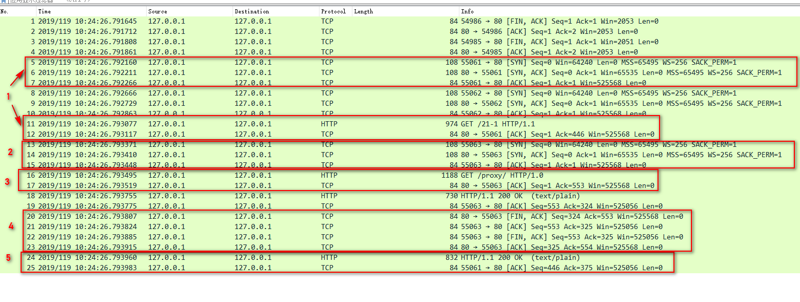

# HTTP 连接管理

## 短连接

HTTP 协议最初（0.9/1.0）是个非常简单的协议，通信过程也采用了简单的“请求-应答”方式。它底层的数据传输基于 TCP/IP，每次发送请求前需要先与服务器建立连接，收到响应报文后会立即关闭连接。因为客户端与服务器的整个连接过程很短暂，不会与服务器保持长时间的连接状态，所以就被称为“短连接”（short-lived connections）。早期的HTTP协议也被称为是“无连接”的协议。

短连接的缺点相当严重，因为在TCP协议里，建立连接和关闭连接都是非常“昂贵”的操作。TCP建立连接要有“三次握手”，发送3个数据包，需要1个RTT；关闭连接是“四次挥手”，4个数据包需要2个RTT。而HTTP的一次简单“请求-响应”通常只需要4个包，如果不算服务器内部的处理时间，最多是2个RTT。这么算下来，浪费的时间就是“3÷5=60%”，有三分之二的时间被浪费掉了，传输效率低得惊人。


## 长连接

针对短连接暴露出的缺点，HTTP 协议就提出了“长连接”的通信方式，也叫“持久连接”（persistent connections）、“连接保活”（keep alive）、“连接复用”（connection reuse）。其实解决办法也很简单，用的就是“成本均摊”的思路，既然TCP的连接和关闭非常耗时间，那么就把这个时间成本由原来的一个“请求-应答”均摊到多个“请求-应答”上。这样虽然不能改善TCP的连接效率，但基于“分母效应”，每个“请求-应答”的无效时间就会降低不少，整体传输效率也就提高了。


在短连接里发送了三次 HTTP “请求-应答”，每次都会浪费60%的RTT时间。而在长连接的情况下，同样发送三次请求，因为只在第一次时建立连接，在最后一次时关闭连接，所以浪费率就是“3÷9≈33%”，降低了差不多一半的时间损耗。显然，如果在这个长连接上发送的请求越多，分母就越大，利用率也就越高。

## 连接相关的头字段

由于长连接对性能的改善效果非常显著，所以在 HTTP/1.1 中的连接都会默认启用长连接。不需要用什么特殊的头字段指定，只要向服务器发送了第一次请求，后续的请求都会重复利用第一次打开的 TCP 连接，也就是长连接，在这个连接上收发数据。当然，我们也可以在请求头里明确地要求使用长连接机制，使用的字段是 Connection，值是 “keep-alive”。

不过不管客户端是否显式要求长连接，如果服务器支持长连接，它总会在响应报文里放一个 “Connection: keep-alive” 字段，告诉客户端：“我是支持长连接的，接下来就用这个 TCP 一直收发数据吧”。

不过长连接也有一些小缺点，因为 TCP 连接长时间不关闭，服务器必须在内存里保存它的状态，这就占用了服务器的资源。如果有大量的空闲长连接只连不发，就会很快耗尽服务器的资源，导致服务器无法为真正有需要的用户提供服务。所以，长连接也需要在恰当的时间关闭，不能永远保持与服务器的连接，这在客户端或者服务器都可以做到。在客户端，可以在请求头里加上 “Connection: close” 字段，告诉服务器：“这次通信后就关闭连接”。服务器看到这个字段，就知道客户端要主动关闭连接，于是在响应报文里也加上这个字段，发送之后就调用 Socket API 关闭 TCP 连接。

服务器端通常不会主动关闭连接，但也可以使用一些策略：

- 设置长连接的超时时间，如果在一段时间内连接上没有任何数据收发就主动断开连接，避免空闲连接占用系统资源
- 设置长连接上可发送的最大请求次数，超过这个最大次数，也会主动断开连接

## 队头阻塞

“队头阻塞”与短连接和长连接无关，而是由 HTTP 基本的“请求-应答”模型所导致的。

因为 HTTP 规定报文必须是“一发一收”，这就形成了一个先进先出的“串行”队列。队列里的请求没有轻重缓急的优先级，只有入队的先后顺序，排在最前面的请求被最优先处理。如果队首的请求因为处理的太慢耽误了时间，那么队列里后面的所有请求也不得不跟着一起等待，结果就是其他的请求承担了不应有的时间成本。


因为“请求-应答”模型不能变，所以“队头阻塞”问题在 HTTP/1.1 里无法解决，只能缓解：

- “并发连接”（concurrent connections），也就是同时对一个域名发起多个长连接，用数量来解决质量的问题。但这种方式也存在缺陷。如果每个客户端都想自己快，建立很多个连接，用户数×并发数就会是个天文数字。服务器的资源根本就扛不住，或者被服务器认为是恶意攻击，反而会造成“拒绝服务”。所以，HTTP协议建议客户端使用并发，但不能“滥用”并发
- "域名分片"，还是用数量来解决质量的思路。多开几个域名，比如，`shard1.chrono.com`、`shard2.chrono.com`，而这些域名都指向同一台服务器 `www.chrono.com`，这样实际长连接的数量就又上去了

# HTTP 传输大文件

## 数据压缩

通常浏览器在发送请求时都会带着 “Accept-Encoding” 头字段，里面是浏览器支持的压缩格式列表，例如：gzip、deflate、br 等，这样服务器就可以从中选择一种压缩算法，放进 “Content-Encoding” 响应头里，再把原数据压缩后发给浏览器。

gzip 等压缩算法通常只对文本文件有较好的压缩率，而图片、音频视频等多媒体数据本身就已经是高度压缩的，再用 gzip 处理也不会变小（甚至还有可能会增大一点），所以它就失效了。

不过数据压缩在处理文本的时候效果还是很好的，所以各大网站的服务器都会使用这个手段作为“保底”。

## 分块传输

如果大文件整体不能变小，那就把它“拆开”，分解成多个小块，把这些小块分批发给浏览器，浏览器收到后再组装复原。这样浏览器和服务器都不用在内存里保存文件的全部，每次只收发一小部分，网络也不会被大文件长时间占用，内存、带宽等资源也就节省下来了。

这种“化整为零”的思路在 HTTP 协议里就是 “chunked” 分块传输编码，在响应报文里用头字段 “Transfer-Encoding: chunked” 来表示，意思是报文里的 body 部分不是一次性发过来的，而是分成了许多的块（chunk）逐个发送。

分块传输也可以用于“流式数据”，例如由数据库动态生成的表单页面，这种情况下body数据的长度是未知的，无法在头字段 “Content-Length” 里给出确切的长度，所以也只能用 chunked 方式分块发送。

“Transfer-Encoding: chunked” 和 “Content-Length” 这两个字段是互斥的，也就是说响应报文里这两个字段不能同时出现，一个响应报文的传输要么是长度已知，要么是长度未知（chunked）。

分块传输的编码规则，其实也很简单，同样采用了明文的方式，很类似响应头：

- 每个分块包含两个部分，长度头和数据块
- 长度头是以 CRLF（回车换行，即\r\n）结尾的一行明文，用 16 进制数字表示长度
- 数据块紧跟在长度头后，最后也用CRLF结尾，但数据不包含 CRLF
- 最后用一个长度为 0 的块表示结束，即“0\r\n\r\n”


##　范围请求

有了分块传输编码，服务器就可以轻松地收发大文件了，但对于上 G 的超大文件，还有一些问题需要考虑。例如想获取一个大文件其中的片段数据，而分块传输并没有这个能力。HTTP协议为了满足这样的需求，提出了“范围请求”（range requests）的概念，允许客户端在请求头里使用专用字段来表示只获取文件的一部分，相当于是客户端的“化整为零”。

范围请求不是 Web 服务器必备的功能，可以实现也可以不实现，所以服务器必须在响应头里使用字段 “Accept-Ranges: bytes” 明确告知客户端：“我是支持范围请求的”。如果不支持的话服务器可以发送 “Accept-Ranges: none”，或者干脆不发送 “Accept-Ranges” 字段，这样客户端就认为服务器没有实现范围请求功能，只能老老实实地收发整块文件了。

请求头 Range 是 HTTP 范围请求的专用字段，格式是“bytes=x-y”，其中的x和y是以字节为单位的数据范围。

假设文件是100个字节，那么：

- “0-9” 表示前 10 个字节
- “0-” 表示从文档起点到文档终点，相当于“0-99”，即整个文件
- “10-” 是从第10个字节开始到文档末尾，相当于“10-99”
- “-1” 是文档的最后一个字节，相当于“99-99”
- “-10” 是从文档末尾倒数10个字节，相当于“90-99”

服务器收到Range字段后，需要做四件事：

- 第一，它必须检查范围是否合法，比如文件只有100个字节，但请求“200-300”，这就是范围越界了。服务器就会返回状态码416，意思是“你的范围请求有误，我无法处理，请再检查一下”
- 第二，如果范围正确，服务器就可以根据Range头计算偏移量，读取文件的片段了，返回状态码“206 Partial Content”，和200的意思差不多，但表示body只是原数据的一部分
- 第三，服务器要添加一个响应头字段Content-Range，告诉片段的实际偏移量和资源的总大小，格式是“bytes x-y/length”，与Range头区别在没有“=”，范围后多了总长度。例如，对于“0-10”的范围请求，值就是“bytes 0-10/100”
- 最后剩下的就是发送数据了，一个范围请求就算是处理完了

有了范围请求之后，HTTP处理大文件就更加轻松了，例如，看视频时可以根据时间点计算出文件的Range，不用下载整个文件，直接精确获取片段所在的数据内容。常用的下载工具里的多段下载、断点续传也是基于它实现的，要点是：

- 先发个 HEAD，看服务器是否支持范围请求，同时获取文件的大小
- 开 N 个线程，每个线程使用 Range 字段划分出各自负责下载的片段，发请求传输数据
- 下载意外中断也不怕，不必重头再来一遍，只要根据上次的下载记录，用 Range 请求剩下的那一部分就可以了

## 多段数据

在 Range 头里使用多个“x-y”，一次性获取多个片段数据。这种情况需要使用一种特殊的MIME类型：“multipart/byteranges”，表示报文的body是由多段字节序列组成的，并且还要用一个参数 “boundary=xxx” 给出段之间的分隔标记。

多段数据的格式与分块传输也比较类似，但它需要用分隔标记boundary来区分不同的片段：


每一个分段必须以 “- -boundary”开始（前面加两个“-”），之后要用 “Content-Type” 和 “Content-Range” 标记这段数据的类型和所在范围，然后就像普通的响应头一样以回车换行结束，再加上分段数据，最后用一个 “- -boundary- -”（前后各有两个“-”）表示所有的分段结束。

# HTTP 的 Cookie 机制 

HTTP 是“无状态”的，这既是优点也是缺点。优点是服务器没有状态差异，可以很容易地组成集群，而缺点就是无法支持需要记录状态的事务操作。好在 HTTP 协议是可扩展的，后来发明的 Cookie 技术，给 HTTP 增加了“记忆能力”。

Cookie 机制相当于是服务器给每个客户端都贴上一张小纸条，上面写了一些只有服务器才能理解的数据，需要的时候客户端把这些信息发给服务器，服务器看到Cookie，就能够认出对方是谁了。

##　Cookie 的工作过程

Cookie 的传递需要用到两个字段：响应头字段 Set-Cookie 和请求头字段 Cookie。

当用户通过浏览器第一次访问服务器的时候，服务器肯定是不知道他的身份的。所以，就要创建一个独特的身份标识数据，格式是 “key=value”，然后放进 Set-Cookie 字段里，随着响应报文一同发给浏览器。浏览器收到响应报文，看到里面有 Set-Cookie，知道这是服务器给的身份标识，于是就保存起来，下次再请求的时候就自动把这个值放进 Cookie 字段里发给服务器。

因为第二次请求里面有了 Cookie 字段，服务器就知道这个用户不是新人，之前来过，就可以拿出 Cookie 里的值，识别出用户的身份，然后提供个性化的服务。不过因为服务器的“记忆能力”实在是太差，，服务器有时会在响应头里添加多个 Set-Cookie，存储多个 “key=value”。但浏览器这边发送时不需要用多个 Cookie 字段，只要在一行里用“;”隔开就行。


Cookie 是由浏览器负责存储的，而不是操作系统。所以，它是“浏览器绑定”的，只能在本浏览器内生效。

## Cookie 的属性

Cookie 就是服务器委托浏览器存储在客户端里的一些数据，而这些数据通常都会记录用户的关键识别信息。所以，就需要在 “key=value” 外再用一些手段来保护，防止外泄或窃取，这些手段就是 Cookie 的属性。

首先应该设置 Cookie 的生存周期，也就是它的有效期，让它只能在一段时间内可用，一旦超过这个期限浏览器就认为是Cookie失效，在存储里删除，也不会发送给服务器。Cookie 的有效期可以使用 Expires  和Max-Age 两个属性来设置：

- “Expires” 俗称“过期时间”，用的是绝对时间点，可以理解为“截止日期”（deadline）。
- “Max-Age” 用的是相对时间，单位是秒，浏览器用收到报文的时间点再加上 Max-Age，就可以得到失效的绝对时间
- Expires 和 Max-Age 可以同时出现，两者的失效时间可以一致，也可以不一致，但浏览器会优先采用 Max-Age计算失效期

其次，我们需要设置 Cookie 的作用域，让浏览器仅发送给特定的服务器 和URI，避免被其他网站盗用。作用域的设置比较简单，“Domain” 和 “Path” 指定了 Cookie 所属的域名和路径，浏览器在发送 Cookie 前会从 URI 中提取出 host 和 path 部分，对比 Cookie 的属性。如果不满足条件，就不会在请求头里发送 Cookie。使用这两个属性可以为不同的域名和路径分别设置各自的 Cookie。

最后要考虑的就是 Cookie 的安全性，尽量不要让服务器以外的人看到：

- 属性 “HttpOnly” 会告诉浏览器，此 Cookie 只能通过浏览器HTTP协议传输，禁止其他方式访问

- 属性 “SameSite” 可以防范“跨站请求伪造”（XSRF）攻击，设置成“SameSite=Strict”可以严格限定Cookie不能随着跳转链接跨站发送，而“SameSite=Lax”则略宽松一点，允许GET/HEAD等安全方法，但禁止POST跨站发送。
- 属性 “Secure” ，表示这个Cookie仅能用HTTPS协议加密传输，明文的HTTP协议会禁止发送。但Cookie本身不是加密的，浏览器里还是以明文的形式存在。

## Cookie 的应用

Cookie 最基本的一个用途就是身份识别，保存用户的登录信息，实现会话事务。比如，你用账号和密码登录某电商，登录成功后网站服务器就会发给浏览器一个 Cookie，内容大概是 “name=yourid”，这样就成功地把身份标签贴在了你身上。之后你在网站里随便访问哪件商品的页面，浏览器都会自动把身份 Cookie 发给服务器，所以服务器总会知道你的身份，一方面免去了重复登录的麻烦，另一方面也能够自动记录你的浏览记录和购物下单。

Cookie 的另一个常见用途是广告跟踪。你上网的时候肯定看过很多的广告图片，这些图片背后都是广告商网站，它会“偷偷地”给你贴上 Cookie 小纸条，这样你上其他的网站，别的广告就能用Cookie读出你的身份，然后做行为分析，再推给你广告。这种Cookie不是由访问的主站存储的，所以又叫“第三方 Cookie”（third-party cookie）。

为了防止滥用 Cookie 搜集用户隐私，互联网组织相继提出了 DNT（Do Not Track）和 P3P（Platform for Privacy Preferences Project），但实际作用不大。

# HTTP 重定向和跳转

“超文本”里含有“超链接”，可以从一个“超文本”跳跃到另一个“超文本”，对线性结构的传统文档是一个根本性的变革。能够使用“超链接”在网络上任意地跳转也是万维网的一个关键特性。它把分散在世界各地的文档连接在一起，形成了复杂的网状结构，用户可以在查看时随意点击链接、转换页面。再加上浏览器又提供了“前进”“后退”“书签”等辅助功能，让用户在文档间跳转时更加方便，有了更多的主动性和交互性。

这样的跳转动作是由浏览器的使用者主动发起的，可以称为“主动跳转”，但还有一类跳转是由服务器来发起的，浏览器使用者无法控制，相对地就可以称为“被动跳转”，这在 HTTP 协议里有个专门的名词，叫做“重定向”（Redirection）。

##　重定向的过程

301　是“永久重定向”，302　是“临时重定向”，浏览器收到这两个状态码就会跳转到新的　URI。

重定向是“用户无感知”的，这里需要新的头字段："Location"。“Location” 字段属于响应字段，必须出现在响应报文里。但只有配合 301/302 状态码才有意义，它标记了服务器要求重定向的URI，例如：“index.html”，这里就是要求浏览器跳转到 “index.html”。浏览器收到 301/302 报文，会检查响应头里有没有 “Location”。如果有，就从字段值里提取出 URI，发出新的 HTTP 请求，相当于自动替我们点击了这个链接。

在 “Location” 里的URI既可以使用绝对 URI，也可以使用相对 URI。所谓“绝对URI”，就是完整形式的 URI，包括 scheme、host:port、path等。所谓“相对URI”，就是省略了 scheme 和 host:port，只有 path 和 query 部分，是不完整的，但可以从请求上下文里计算得到。

## 重定向状态码

常见的重定向状态码就是 301 和 302，另外还有几个不太常见的，例如，303、307、308等。它们最终的效果都差不多，让浏览器跳转到新的URI，但语义上有一些细微的差别，使用的时候要特别注意。

- 301：俗称“永久重定向”（Moved Permanently），意思是原URI已经“永久”性地不存在了，今后的所有请求都必须改用新的URI，浏览器看到301，就知道原来的URI“过时”了，就会做适当的优化。比如历史记录、更新书签，下次可能就会直接用新的URI访问，省去了再次跳转的成本。搜索引擎的爬虫看到301，也会更新索引库，不再使用老的URI
- 302：俗称“临时重定向”（“Moved Temporarily”），意思是原URI处于“临时维护”状态，新的URI是起“顶包”作用的“临时工”，浏览器或者爬虫看到302，会认为原来的URI仍然有效，但暂时不可用，所以只会执行简单的跳转页面，不记录新的URI，也不会有其他的多余动作，下次访问还是用原URI
- 303 See Other：类似302，但要求重定向后的请求改为GET方法，访问一个结果页面，避免POST/PUT重复操作
- 307 Temporary Redirect：类似302，但重定向后请求里的方法和实体不允许变动，含义比302更明确
- 308 Permanent Redirect：类似307，不允许重定向后的请求变动，但它是301“永久重定向”的含义

## 重定向的应用场景

什么时候需要重定向：

- 一个最常见的原因就是“资源不可用”，需要用另一个新的URI来代替
- 另一个原因就是“避免重复”，让多个网址都跳转到一个URI，增加访问入口的同时还不会增加额外的工作量

决定要实行重定向后接下来要考虑的就是“永久”和“临时”的问题：

- 301的含义是“永久”的
  - 如果域名、服务器、网站架构发生了大幅度的改变，比如启用了新域名、服务器切换到了新机房、网站目录层次重构，这些都算是“永久性”的改变。原来的URI已经不能用了，必须用301“永久重定向”，通知浏览器和搜索引擎更新到新地址，这也是搜索引擎优化（SEO）要考虑的因素之一
- 302的含义是“临时”的
  - 原来的URI在将来的某个时间点还会恢复正常，常见的应用场景就是系统维护，把网站重定向到一个通知页面，告诉用户过一会儿再来访问。另一种用法就是“服务降级”，比如在双十一促销的时候，把订单查询、领积分等不重要的功能入口暂时关闭，保证核心服务能够正常运行

## 重定向的相关问题

重定向的用途很多，掌握了重定向，就能够在架设网站时获得更多的灵活性，不过在使用时还需要注意两个问题：

- 第一个问题是“性能损耗”。很明显，重定向的机制决定了一个跳转会有两次请求-应答，比正常的访问多了一次，所以重定向应当适度使用，决不能滥用
- 问题是“循环跳转”。如果重定向的策略设置欠考虑，可能会出现“A=>B=>C=>A”的无限循环，不停地在这个链路里转圈圈，后果可想而知，所以HTTP协议特别规定，浏览器必须具有检测“循环跳转”的能力，在发现这种情况时应当停止发送请求并给出错误提示

# HTTP 缓存控制

由于链路漫长，网络时延不可控，浏览器使用 HTTP 获取资源的成本较高。所以，非常有必要把“来之不易”的数据缓存起来，下次再请求的时候尽可能地复用。这样，就可以避免多次请求-应答的通信成本，节约网络带宽，也可以加快响应速度。

实际上，HTTP 传输的每一个环节基本上都会有缓存，非常复杂。基于“请求-应答”模式的特点，可以大致分为客户端缓存和服务器端缓存。

## 服务器的缓存控制


整个流程翻译成HTTP就是：

- 浏览器发现缓存无数据，于是发送请求，向服务器获取资源
- 服务器响应请求，返回资源，同时标记资源的有效期
- 浏览器缓存资源，等待下次重用

服务器标记资源有效期使用的头字段是 “Cache-Control”，里面的值 “max-age=30” 就是资源的有效时间，相当于告诉浏览器，“这个页面只能缓存 30 秒，之后就算是过期，不能用。这里的 max-age 是“生存时间”（又叫“新鲜度”“缓存寿命”），时间的计算起点是响应报文的创建时刻（即Date字段，也就是离开服务器的时刻），而不是客户端收到报文的时刻，也就是说包含了在链路传输过程中所有节点所停留的时间。

- no_store：不允许缓存，用于某些变化非常频繁的数据，例如，秒杀页面
- no_cache：它的字面含义容易与no_store搞混，实际的意思并不是不允许缓存，而是可以缓存，但在使用之前必须要去服务器验证是否过期，是否有最新的版本
- must-revalidate：又是一个和no_cache相似的词，它的意思是如果缓存不过期就可以继续使用，但过期了如果还想用就必须去服务器验证


##　客户端的缓存控制

其实不止服务器可以发 “Cache-Control”头，浏览器也可以发 “Cache-Control”，也就是说请求-应答的双方都可以用这个字段进行缓存控制，互相协商缓存的使用策略。

当点“刷新”按钮的时候，浏览器会在请求头里加一个 “Cache-Control: max-age=0”。因为 max-age 是“生存时间”，而本地缓存里的数据至少保存了几秒钟，所以浏览器就不会使用缓存，而是向服务器发请求。服务器看到 max-age=0，也就会用一个最新生成的报文回应浏览器。

Ctrl+F5 的“强制刷新”，其实是发了一个 “Cache-Control: no-cache”，含义和 “max-age=0” 基本一样，就看后台的服务器怎么理解，通常两者的效果是相同的。

在“前进”“后退”“跳转”这些重定向动作中浏览器不会“夹带私货”，只用最基本的请求头，没有 “Cache-Control”，所以就会检查缓存，直接利用之前的资源，不再进行网络通信。可以发现 “from disk cache” 的字样，意思是没有发送网络请求，而是读取的磁盘上的缓存。

### 条件请求

浏览器可以用两个连续的请求组成“验证动作”：先是一个 HEAD，获取资源的修改时间等元信息，然后与缓存数据比较，如果没有改动就使用缓存，节省网络流量，否则就再发一个GET请求，获取最新的版本。但这样的两个请求网络成本太高了，所以 HTTP 协议就定义了一系列“If”开头的“条件请求”字段，专门用来检查验证资源是否过期，把两个请求才能完成的工作合并在一个请求里做。而且，验证的责任也交给服务器，浏览器只需“坐享其成”。

条件请求一共有5个头字段，我们最常用的是 “if-Modified-Since” 和 “If-None-Match” 这两个。需要第一次的响应报文预先提供 “Last-modified” 和 “ETag”，然后第二次请求时就可以带上缓存里的原值，验证资源是否是最新的。如果资源没有变，服务器就回应一个 “304 Not Modified”，表示缓存依然有效，浏览器就可以更新一下有效期，然后放心大胆地使用缓存了。 


“Last-modified” 很好理解，就是文件的最后修改时间。

ETag 是“实体标签”（Entity Tag）的缩写，是资源的一个唯一标识，主要是用来解决修改时间无法准确区分文件变化的问题。ETag 还有“强”“弱”之分：强ETag要求资源在字节级别必须完全相符，弱 ETag 在值前有个“W/”标记，只要求资源在语义上没有变化，但内部可能会有部分发生了改变（例如HTML里的标签顺序调整，或者多了几个空格）。

条件请求里其他的三个头字段是 “If-Unmodified-Since”，“If-Match” 和 “If-Range”。

# HTTP 的代理服务

引入 HTTP 代理后，原来简单的双方通信就变复杂了一些，加入了一个或者多个中间人，但整体上来看，还是一个有顺序关系的链条，而且链条里相邻的两个角色仍然是简单的一对一通信，不会出现越级的情况。


链条的起点还是客户端（也就是浏览器），中间的角色被称为代理服务器（proxy server），链条的终点被称为源服务器（origin server），意思是数据的“源头”，“起源”。

## 代理服务

代理就是在客户端和服务器原本的通信链路中插入的一个中间环节，也是一台服务器，但提供的是“代理服务”。所谓的“代理服务”就是指服务本身不生产内容，而是处于中间位置转发上下游的请求和响应，具有双重身份：

- 面向下游的用户时，表现为服务器，代表源服务器响应客户端的请求
- 面向上游的源服务器时，又表现为客户端，代表客户端发送请求

## 代理的作用

由于代理处在 HTTP 通信过程的中间位置，相应地就对上屏蔽了真实客户端，对下屏蔽了真实服务器，简单的说就是“欺上瞒下”。在这个中间层的“小天地”里就可以做很多的事情，为 HTTP 协议增加更多的灵活性，实现客户端和服务器的“双赢”。

代理最基本的一个功能是负载均衡。因为在面向客户端时屏蔽了源服务器，客户端看到的只是代理服务器，源服务器究竟有多少台、是哪些 IP 地址都不知道。于是代理服务器就可以掌握请求分发的“大权”，决定由后面的哪台服务器来响应请求。


在负载均衡的同时，代理服务还可以执行更多的功能，比如：

- 健康检查：使用“心跳”等机制监控后端服务器，发现有故障就及时“踢出”集群，保证服务高可用
- 安全防护：保护被代理的后端服务器，限制IP地址或流量，抵御网络攻击和过载
- 加密卸载：对外网使用 SSL/TLS 加密通信认证，而在安全的内网不加密，消除加解密成本
- 数据过滤：拦截上下行的数据，任意指定策略修改请求或者响应
- 内容缓存：暂存、复用服务器响应

## 代理相关头字段

首先，代理服务器需要用字段 “Via” 标明代理的身份。Via 是一个通用字段，请求头或响应头里都可以出现。每当报文经过一个代理节点，代理服务器就会把自身的信息追加到字段的末尾。如果通信链路中有很多中间代理，就会在 Via 里形成一个链表，这样就可以知道报文究竟走过了多少个环节才到达了目的地。

例如，下图中有两个代理：proxy1 和 proxy2，客户端发送请求会经过这两个代理，依次添加就是 “Via: proxy1, proxy2”，等到服务器返回响应报文的时候就要反过来走，头字段就是 “Via: proxy2, proxy1”。


Via 字段只解决了客户端和源服务器判断是否存在代理的问题，还不能知道对方的真实信息。但服务器的IP地址应该是保密的，关系到企业的内网安全，所以一般不会让客户端知道。不过反过来，通常服务器需要知道客户端的真实 IP 地址，方便做访问控制、用户画像、统计分析。

可惜的是 HTTP 标准里并没有为此定义头字段，但已经出现了很多“事实上的标准”，最常用的两个头字段是 “X-Forwarded-For” 和 “X-Real-IP”。

“X-Forwarded-For” 的字面意思是“为谁而转发”，形式上和 “Via” 差不多，也是每经过一个代理节点就会在字段里追加一个信息。但“Via”追加的是代理主机名（或者域名），而 “X-Forwarded-For” 追加的是请求方的 IP 地址。所以，在字段里最左边的 IP 地址就客户端的地址。

“X-Real-IP” 是另一种获取客户端真实IP的手段，它的作用很简单，就是记录客户端IP地址，没有中间的代理信息，相当于是 “X-Forwarded-For” 的简化版。如果客户端和源服务器之间只有一个代理，那么这两个字段的值就是相同的。




从抓包里就可以清晰地看出代理与客户端、源服务器的通信过程：

- 客户端55061先用三次握手连接到代理的80端口，然后发送GET请求
- 代理不直接生产内容，所以就代表客户端，用55063端口连接到源服务器，也是三次握手
- 代理成功连接源服务器后，发出了一个HTTP/1.0 的GET请求
- 因为HTTP/1.0默认是短连接，所以源服务器发送响应报文后立即用四次挥手关闭连接
- 代理拿到响应报文后再发回给客户端，完成了一次代理服务

“X-Forwarded-Host” 和 “X-Forwarded-Proto”，它们的作用与 “X-Real-IP” 类似，只记录客户端的信息，分别是客户端请求的原始域名和原始协议名。

## 代理协议

“代理协议”（The PROXY protocol），它由知名的代理软件 HAProxy 所定义，也是一个“事实标准”，被广泛采用（注意并不是RFC）。“代理协议”有 v1 和 v2 两个版本，v1 和 HTTP 差不多，也是明文，而 v2 是二进制格式。v1 在 HTTP 报文前增加了一行 ASCII 码文本，相当于又多了一个头。

这一行文本其实非常简单，开头必须是“PROXY”五个大写字母，然后是 “TCP4” 或者 “TCP6”，表示客户端的 IP 地址类型，再后面是请求方地址、应答方地址、请求方端口号、应答方端口号，最后用一个回车换行（\r\n）结束。

例如，下面的这个例子，在 GET 请求行前多出了 PROXY 信息行，客户端的真实 IP 地址是：“1.1.1.1”，端口号是 55555。

```
PROXY TCP4 1.1.1.1 2.2.2.2 55555 80\r\n
GET / HTTP/1.1\r\n
Host: www.xxx.com\r\n
\r\n
```

服务器看到这样的报文，只要解析第一行就可以拿到客户端地址，不需要再去理会后面的 HTTP 数据，省了很多事情。不过代理协议并不支持 “X-Forwarded-For” 的链式地址形式，所以拿到客户端地址后再如何处理就需要代理服务器与后端自行约定。

# HTTP 缓存代理

HTTP 的服务器缓存功能主要由代理服务器来实现（即缓存代理），而源服务器系统内部虽然也经常有各种缓存（如：Memcache、Redis、Varnish 等），但与 HTTP 没有太多关系。

## 缓存代理服务


在没有缓存的时候，代理服务器每次都是直接转发客户端和服务器的报文，中间不会存储任何数据，只有最简单的中转功能。

加入了缓存后就不一样了。代理服务收到源服务器发来的响应数据后需要做两件事。第一个当然是把报文转发给客户端，而第二个就是把报文存入自己的 Cache 里。下一次再有相同的请求，代理服务器就可以直接发送 304 或者缓存数据，不必再从源服务器那里获取。这样就降低了客户端的等待时间，同时节约了源服务器的网络带宽。

在 HTTP 的缓存体系中，缓存代理的身份十分特殊，它“既是客户端，又是服务器”，同时也“既不是客户端，又不是服务器”。但缓存代理也“即不是客户端又不是服务器”，因为它只是一个数据的“中转站”，并不是真正的数据消费者和生产者，所以还需要有一些新的 “Cache-Control” 属性来对它做特别的约束。

## 源服务器的缓存控制

要区分客户端上的缓存和代理上的缓存，可以使用两个新属性 “private” 和 “public”。“private” 表示缓存只能在客户端保存，是用户“私有”的，不能放在代理上与别人共享。而 “public” 的意思就是缓存完全开放，谁都可以存，谁都可以用。 

缓存失效后的重新验证也要区分开（即使用条件请求“Last-modified”和“ETag”），“must-revalidate” 是只要过期就必须回源服务器验证，而新的 “proxy-revalidate” 只要求代理的缓存过期后必须验证，客户端不必回源，只验证到代理这个环节就行了。

缓存的生存时间可以使用新的 “s-maxage”（s是share的意思，注意maxage中间没有“-”），只限定在代理上能够存多久，而客户端仍然使用 “max_age”。

还有一个代理专用的属性 “no-transform”。代理有时候会对缓存下来的数据做一些优化，比如把图片生成 png、webp 等几种格式，方便今后的请求处理，而 “no-transform” 就会禁止这样做，不许“偷偷摸摸搞小动作”。


源服务器在设置完 “Cache-Control” 后必须要为报文加上 “Last-modified” 或 “ETag” 字段。否则，客户端和代理后面就无法使用条件请求来验证缓存是否有效，也就不会有 304 缓存重定向。  

## 客户端的缓存控制

客户端在 HTTP 缓存体系里要面对的是代理和源服务器，也必须区别对待。


关于缓存的生存时间，多了两个新属性 “max-stale” 和 “min-fresh”。

“max-stale” 的意思是如果代理上的缓存过期了也可以接受，但不能过期太多，超过 x 秒也会不要。“min-fresh” 的意思是缓存必须有效，而且必须在 x 秒后依然有效。

有的时候客户端还会发出一个特别的 “only-if-cached” 属性，表示只接受代理缓存的数据，不接受源服务器的响应。如果代理上没有缓存或者缓存过期，就应该给客户端返回一个 504（Gateway Timeout）。

## 其他问题

“Vary” 字段是内容协商的结果，相当于报文的一个版本标记。同一个请求，经过内容协商后可能会有不同的字符集、编码、浏览器等版本。比如，“Vary: Accept-Encoding”，“Vary: User-Agent”，缓存代理必须要存储这些不同的版本。当再收到相同的请求时，代理就读取缓存里的 “Vary”，对比请求头里相应的 “ Accept-Encoding”，“User-Agent” 等字段，如果和上一个请求的完全匹配，比如都是 “gzip”，“Chrome”，就表示版本一致，可以返回缓存的数据。

“Purge”，也就是“缓存清理”，它对于代理也是非常重要的功能，例如：

- 过期的数据应该及时淘汰，避免占用空间
- 源站的资源有更新，需要删除旧版本，主动换成最新版（即刷新）
- 有时候会缓存了一些本不该存储的信息，例如网络谣言或者危险链接，必须尽快把它们删除

清理缓存的方法有很多，比较常用的一种做法是使用自定义请求方法 “PURGE”，发给代理服务器，要求删除 URI 对应的缓存数据。

# HTTP 性能优化

## HTTP服务器

服务器一般运行在 Linux 操作系统上，用 Apache、Nginx 等 Web 服务器软件对外提供服务，所以，性能的含义就是它的服务能力，也就是尽可能多、尽可能快地处理用户的请求。

衡量服务器性能的主要指标有三个：吞吐量（requests per second）、并发数（concurrency）和响应时间（time per request）：

- 吞吐量就是我们常说的 RPS，每秒的请求次数，也有叫 TPS、QPS，它是服务器最基本的性能指标，RPS 越高就说明服务器的性能越好
- 并发数反映的是服务器的负载能力，也就是服务器能够同时支持的客户端数量，当然也是越多越好，能够服务更多的用户
- 响应时间反映的是服务器的处理能力，也就是快慢程度，响应时间越短，单位时间内服务器就能够给越多的用户提供服务，提高吞吐量和并发数

除了上面的三个基本性能指标，服务器还要考虑 CPU、内存、硬盘和网卡等系统资源的占用程度，利用率过高或者过低都可能有问题。

在Linux上，最常用的性能测试工具可能就是ab（Apache Bench）了，比如，下面的命令指定了并发数100，总共发送10000个请求：

```
ab -c 100 -n 10000 'http://www.xxx.com'
```

系统资源监控方面，Linux 自带的工具也非常多，常用的有uptime、top、vmstat、netstat、sar等等。

理解了这些性能指标，我们就知道了服务器的性能优化方向：合理利用系统资源，提高服务器的吞吐量和并发数，降低响应时间。

## HTTP客户端

客户端是信息的消费者，一切数据都要通过网络从服务器获取，所以它最基本的性能指标就是“延迟”（latency）。所谓的“延迟”其实就是“等待”，等待数据到达客户端时所花费的时间。但因为HTTP的传输链路很复杂，所以延迟的原因也就多种多样。

首先，我们必须谨记有一个“不可逾越”的障碍——光速，因为地理距离而导致的延迟是无法克服的，访问数千公里外的网站显然会有更大的延迟。

其次，第二个因素是带宽，它又包括接入互联网时的电缆、WiFi、4G和运营商内部网络、运营商之间网络的各种带宽，每一处都有可能成为数据传输的瓶颈，降低传输速度，增加延迟。

第三个因素是 DNS 查询，如果域名在本地没有缓存，就必须向 DNS 系统发起查询，引发一连串的网络通信成本，而在获取 IP 地址之前客户端只能等待，无法访问网站。

第四个因素是 TCP 握手，你应该对它比较熟悉了吧，必须要经过 SYN、SYN/ACK、ACK 三个包之后才能建立连接，它带来的延迟由光速和带宽共同决定。

建立 TCP 连接之后，就是正常的数据收发了，后面还有解析HTML、执行JavaScript、排版渲染等等，这些也会耗费一些时间。不过它们已经不属于 HTTP 了。

对于 HTTP 性能优化，有一个专门的测试网站 “[WebPageTest](https://www.webpagetest.org)”。它的特点是在世界各地建立了很多的测试点，可以任意选择地理位置、机型、操作系统和浏览器发起测试，非常方便，用法也很简单。

网站测试的最终结果是一个直观的“瀑布图”（Waterfall Chart），清晰地列出了页面中所有资源加载的先后顺序和时间消耗：


Chrome 等浏览器自带的开发者工具也可以很好地观察客户端延迟指标，面板左边有每个URI具体消耗的时间，面板的右边也是类似的瀑布图。点击某个 URI，在 Timing 页里会显示出一个小型的“瀑布图”，是这个资源消耗时间的详细分解，延迟的原因都列的清清楚楚：


- 因为有“队头阻塞”，浏览器对每个域名最多开6个并发连接（HTTP/1.1），当页面里链接很多的时候就必须排队等待（Queued、Queueing），这里它就等待了1.62秒，然后才被浏览器正式处理
- 浏览器要预先分配资源，调度连接，花费了11.56毫秒（Stalled）
- 连接前必须要解析域名，这里因为有本地缓存，所以只消耗了0.41毫秒（DNS Lookup）
- 与网站服务器建立连接的成本很高，总共花费了270.87毫秒，其中有134.89毫秒用于TLS握手，那么TCP握手的时间就是135.98毫秒（Initial connection、SSL）
- 实际发送数据非常快，只用了0.11毫秒（Request sent）
- 之后就是等待服务器的响应，专有名词叫TTFB（Time To First Byte），也就是“首字节响应时间”，里面包括了服务器的处理时间和网络传输时间，花了124.2毫秒
- 接收数据也是非常快的，用了3.58毫秒（Content Dowload）

一次HTTP“请求-响应”的过程中延迟的时间是非常惊人的，总时间415.04毫秒里占了差不多99%。所以，客户端HTTP性能优化的关键就是：降低延迟。

## HTTP传输链路

“第一公里”，“中间一公里”和“最后一公里”（在英语原文中是mile，英里）。


“第一公里”是指网站的出口，也就是服务器接入互联网的传输线路，它的带宽直接决定了网站对外的服务能力，也就是吞吐量等指标。显然，优化性能应该在这“第一公里”加大投入，尽量购买大带宽，接入更多的运营商网络。

“中间一公里”就是由许多小网络组成的实际的互联网，其实它远不止“一公里”，而是非常非常庞大和复杂的网络，地理距离、网络互通都严重影响了传输速度。好在这里面有一个HTTP的“好帮手”——CDN，它可以帮助网站跨越“千山万水”，让这段距离看起来真的就好像只有“一公里”。

“最后一公里”是用户访问互联网的入口，对于固网用户就是光纤、网线，对于移动用户就是WiFi、基站。以前它是客户端性能的主要瓶颈，延迟大带宽小，但随着近几年4G和高速宽带的普及，“最后一公里”的情况已经好了很多，不再是制约性能的主要因素了。

## 开源

开发网站服务器自身的潜力，在现有条件不变的情况下尽量挖掘出更多的服务能力。

首先，我们应该选用高性能的Web服务器，最佳选择当然就是 Nginx/OpenResty了，尽量不要选择基于Java、Python、Ruby的其他服务器，它们用来做后面的业务逻辑服务器更好。利用Nginx强大的反向代理能力实现“动静分离”，动态页面交给Tomcat、Django、Rails，图片、样式表等静态资源交给Nginx。

Nginx 或者 OpenResty 自身也有很多配置参数可以用来进一步调优，举几个例子，比如说禁用负载均衡锁、增大连接池，绑定CPU等等，相关的资料有很多。

特别要说的是，对于 HTTP 协议一定要启用长连接。TCP 和 SSL 建立新连接的成本是非常高的，有可能会占到客户端总延迟的一半以上。长连接虽然不能优化连接握手，但可以把成本“均摊”到多次请求里，这样只有第一次请求会有延迟，之后的请求就不会有连接延迟，总体的延迟也就降低了。

另外，在现代操作系统上都已经支持 TCP 的新特性“TCP Fast Open”（Win10、iOS9、Linux 4.1），它的效果类似 TLS 的 “False Start”，可以在初次握手的时候就传输数据，也就是 0-RTT，所以我们应该尽可能在操作系统和 Nginx 里开启这个特性，减少外网和内网里的握手延迟。

## 节流

“节流”是指减少客户端和服务器之间收发的数据量，在有限的带宽里传输更多的内容。

“节流”最基本的做法就是使用 HTTP 协议内置的“数据压缩”编码，不仅可以选择标准的 gzip，还可以积极尝试新的压缩算法 br，它有更好的压缩效果。不过在数据压缩的时候应当注意选择适当的压缩率，不要追求最高压缩比，否则会耗费服务器的计算资源，增加响应时间，降低服务能力，反而会“得不偿失”。

HTML/CSS/JavaScript 属于纯文本，就可以采用特殊的“压缩”，去掉源码里多余的空格、换行、注释等元素。这样“压缩”之后的文本虽然看起来很混乱，对“人类”不友好，但计算机仍然能够毫无障碍地阅读，不影响浏览器上的运行效果。

图片在 HTTP 传输里占有非常高的比例，虽然它本身已经被压缩过了，不能被 gzip、br 处理，但仍然有优化的空间。比如说，去除图片里的拍摄时间、地点、机型等元数据，适当降低分辨率，缩小尺寸。图片的格式也很关键，尽量选择高压缩率的格式，有损格式应该用 JPEG，无损格式应该用Webp格式。

对于小文本或者小图片，还有一种叫做“资源合并”（Concatenation）的优化方式，就是把许多小资源合并成一个大资源，用一个请求全下载到客户端，然后客户端再用 JavaScript、CSS 切分后使用，好处是节省了请求次数，但缺点是处理比较麻烦。

网站经常会使用Cookie来记录用户的数据，浏览器访问网站时每次都会带上Cookie，冗余度很高。所以应当少使用Cookie，减少Cookie记录的数据量，总使用 domain 和 path 属性限定 Cookie 的作用域，尽可能减少 Cookie 的传输。如果客户端是现代浏览器，还可以使用 HTML5 里定义的 Web Local Storage，避免使用Cookie。

压缩之外，“节流”还有两个优化点，就是域名和重定向。

DNS 解析域名会耗费不少的时间，如果网站拥有多个域名，那么域名解析获取IP地址就是一个不小的成本，所以应当适当“收缩”域名，限制在两三个左右，减少解析完整域名所需的时间，让客户端尽快从系统缓存里获取解析结果。

重定向引发的客户端延迟也很高，它不仅增加了一次请求往返，还有可能导致新域名的DNS解析，是HTTP前端性能优化的“大忌”。除非必要，应当尽量不使用重定向，或者使用Web服务器的“内部重定向”。

## 缓存

在网站系统内部，可以使用 Memcache、Redis、Varnish 等专门的缓存服务，把计算的中间结果和资源存储在内存或者硬盘里，Web服务器首先检查缓存系统，如果有数据就立即返回给客户端，省去了访问后台服务的时间。

在“中间一公里”，缓存更是性能优化的重要手段，CDN 的网络加速功能就是建立在缓存的基础之上的，可以这么说，如果没有缓存，那就没有 CDN。

## HTTP/2

HTTP/2 的很多优点，它消除了应用层的队头阻塞，拥有头部压缩、二进制帧、多路复用、流量控制、服务器推送等许多新特性，大幅度提升了HTTP的传输效率。

实际上这些特性也是在“开源”和“节流”这两点上做文章，但因为这些都已经内置在了协议内，所以只要换上HTTP/2，网站就能够立刻获得显著的性能提升。

不过你要注意，一些在 HTTP/1 里的优化手段到了 HTTP/2 里会有“反效果”。

对于 HTTP/2 来说，一个域名使用一个 TCP 连接才能够获得最佳性能，如果开多个域名，就会浪费带宽和服务器资源，也会降低 HTTP/2 的效率，所以“域名收缩”在 HTTP/2 里是必须要做的。

“资源合并”在 HTTP/1 里减少了多次请求的成本，但在HTTP/2里因为有头部压缩和多路复用，传输小文件的成本很低，所以合并就失去了意义。而且“资源合并”还有一个缺点，就是降低了缓存的可用性，只要一个小文件更新，整个缓存就完全失效，必须重新下载。

所以在现在的大带宽和 CDN 应用场景下，应当尽量少用资源合并（JavaScript、CSS图片合并，数据内嵌），让资源的粒度尽可能地小，才能更好地发挥缓存的作用。


