# 状态码告知从服务器端返回的请求结果  

状态码的职责是当客户端向服务器端发送请求时，描述返回的请求结果。借助状态码，用户可以知道服务器端是正常处理了请求，还是出现了错误。  

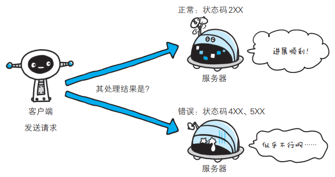

状态码如 200 OK，以 3 位数字和原因短语组成。

数字中的第一位指定了响应类别， 后两位无分类。响应类别有以下5 种：

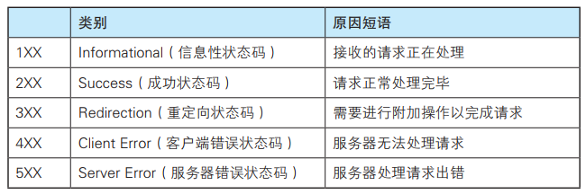

只要遵守状态码类别的定义，即使改变 RFC2616 中定义的状态码，或服务器端自行创建状态码都没问题。  

仅 记 录 在 RFC2616 上 的 HTTP 状 态 码 就 达 40 种， 若 再 加 上 WebDAV（ Web-based Distributed Authoring and Versioning，基于万维网
的分布式创作和版本控制）（ RFC4918、 5842）和附加 HTTP 状态码（ RFC6585）等扩展，数量就达 60 余种。  

# 1XX 信息

1XX 响应结果表示目前是协议处理的中间状态，还需要后续的操作。

## 101 Switching Protocols

该状态码表示客户端使用 Upgrade 头字段，要求在 HTTP 协议的基础上改成其他的协议继续通信。比如：WebSocket。而如果服务器也同意变更协议，就会发送状态码 101，但这之后的数据传输就不会再使用 HTTP 了

# 2XX 成功

2XX 响应结果表明请求被正常处理了。  

## 200 OK  

该状态码表示表示从客户端发来的请求在服务器端被正常处理了。  

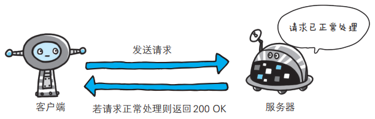

## 204 No Content  

该状态码表示服务器接收的请求已成功处理，但在返回的响应报文中不含实体的主体部分。 

另外，也不允许返回任何实体的主体。比如，当从浏览器发出请求处理后， 返回 204 响应，那么浏览器显示的页面不发生更新。  

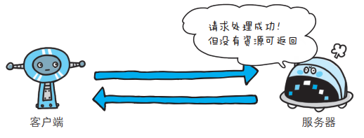

## 206 Partial Content  

该状态码表示客户端进行了范围请求，而服务器成功执行了这部分的 GET 请求。响应报文中包含由 Content-Range 指定范围的实体内容。  

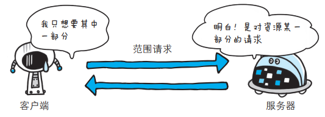

# 3XX 重定向  

3XX 响应结果表明浏览器需要执行某些特殊的处理以正确处理请求。  

## 301 Moved Permanently  

该状态码表示永久性重定向。该状态码表示请求的资源已被分配了新的 URI，以后应使用资源现在所指的 URI。也就是说，如果已经把资源对应的 URI 保存为书签了，这时应该按 Location 首部字段提示的 URI 重新保存。

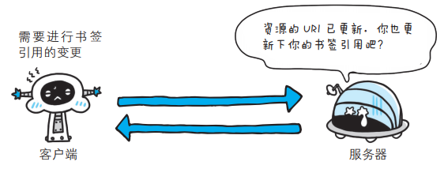

## 302 Found  

该状态码表示临时性重定向，已移动的资源对应的URI 将来还有可能发生改变。  该状态码表示请求的资源已被分配了新的 URI，希望用户（本次）能使用新的 URI 访问。  

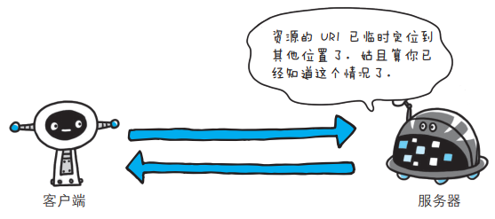

## 303 See Other  

该状态码表示由于请求对应的资源存在着另一个 URI，应使用 GET 方法定向获取请求的资源。  

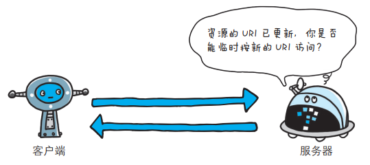

## 304 Not Modified  

该状态码表示客户端发送附带条件的请求 A 时，服务器端允许请求访问资源，但未满足条件的情况。 304 状态码返回时，不包含任何响应的主体部分。 304 虽然被划分在 3XX 类别中，但是和重定向没有关系。  

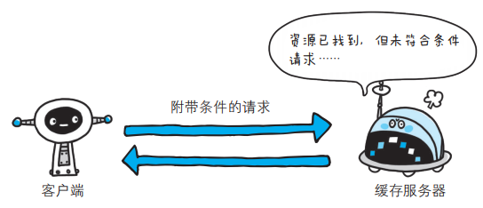

## 307 Temporary Redirect  

临时重定向。该状态码与 302 Found 有着相同的含义。尽管 302 标准禁止 POST 变换成 GET，但实际使用时大家并不遵守。307 会遵照浏览器标准， 不会从 POST 变成 GET。  

# 4XX 客户端错误  

4XX 的响应结果表明客户端是发生错误的原因所在。  

##　400 Bad Request  

该状态码表示请求报文中存在语法错误。当错误发生时，需修改请求的内容后再次发送请求。另外，浏览器会像 200 OK 一样对待该状态码。  

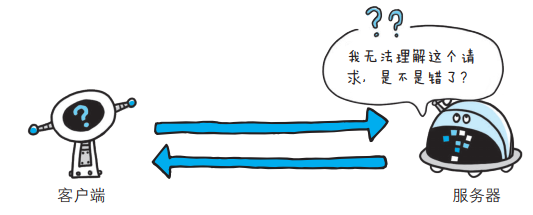

## 401 Unauthorized  

该状态码表示发送的请求需要有通过 HTTP 认证（ BASIC 认证、DIGEST 认证）的认证信息。 另外若之前已进行过 1 次请求，则表示用户认证失败。  

返回含有 401 的响应必须包含一个适用于被请求资源的 WWWAuthenticate 首部用以质询（ challenge）用户信息。当浏览器初次接收到 401 响应，会弹出认证用的对话窗口。  

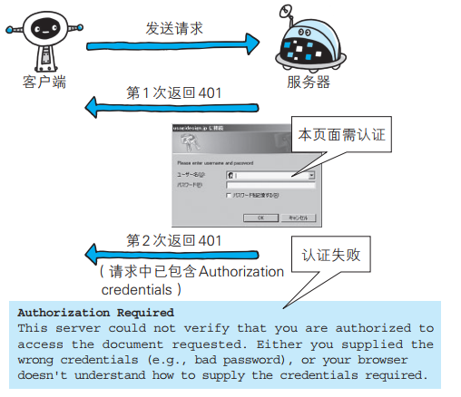

## 403 Forbidden  

该状态码表明对请求资源的访问被服务器拒绝了。服务器端没有必要给出拒绝的详细理由， 但如果想作说明的话，可以在实体的主体部分对原因进行描述，这样就能让用户看到了。  

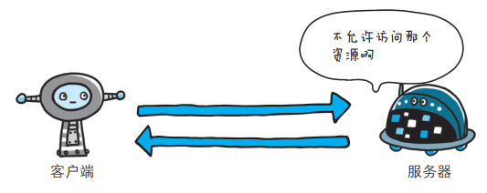

## 404 Not Found  

该状态码表明服务器上无法找到请求的资源。除此之外，也可以在服务器端拒绝请求且不想说明理由时使用。  

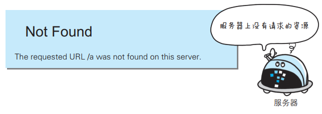

## 其他 4XX

- 405 Method Not Allowed：不允许使用某些方法操作资源
- 406 Not Acceptable：资源无法满足客户端请求的条件
- 408 Request Timeout：请求超时，服务器等待了过长的时间
- 409 Conflict：多个请求发生了冲突，可以理解为多线程并发时的竞态
- 413 Request Entity Too Large：请求报文里的 body 太大
- 414 Request-URI Too Long：请求行里的 URI 太大
- 429 Too Many Requests：客户端发送了太多的请求，通常是由于服务器的限连策略
- 431 Request Header Fields Too Large：请求头某个字段或总体太大

# 5XX 服务器错误  

5XX 的响应结果表明服务器本身发生错误。  

## 500 Internal Server Error  

该状态码表明服务器端在执行请求时发生了错误。也有可能是 Web 应用存在的 bug 或某些临时的故障。  

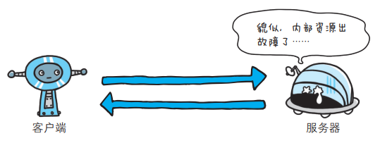

## 503 Service Unavailable  

该状态码表明服务器暂时处于超负载或正在进行停机维护，现在无法处理请求。 如果事先得知解除以上状况需要的时间，最好写入 RetryAfter 首部字段再返回给客户端。

## 其他 5XX

- 501 Not Implemented：表示客户端请求的功能还不支持
- 502 Bad Gateway：通常是服务器作为网关或者代理时返回的错误码，表示服务器自身工作正常，访问后端服务器时发生了错误，但具体的错误原因也是不知道的