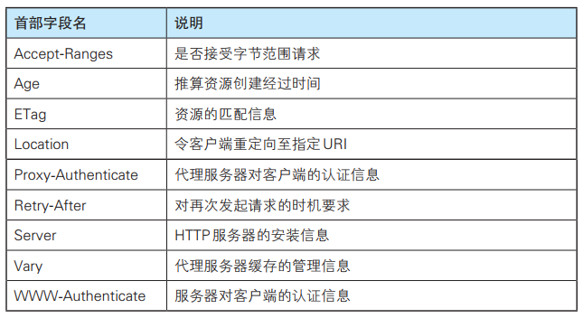

# HTTP 报文首部  

HTTP 报文的结构：


HTTP 协议的请求和响应报文中必定包含 HTTP 首部。  

在请求中， HTTP 报文由方法、 URI、 HTTP 版本、 HTTP 首部字段等部分构成：


在响应中， HTTP 报文由 HTTP 版本、状态码（数字和原因短语）、HTTP 首部字段 3 部分构成：


# HTTP 首部字段  

在客户端与服务器之间以 HTTP 协议进行通信的过程中，无论是请求还是响应都会使用首部字段，它能起到传递额外重要信息的作用。  

HTTP 首部字段是由首部字段名和字段值构成的，中间用冒号“:”分隔：

```
首部字段名: 字段值
```

字段值对应单个 HTTP 首部字段可以有多个值。

## 4 种 HTTP 首部字段类型  

HTTP 首部字段根据实际用途被分为以下 4 种类型：

- **通用首部字段（General Header Fields）**，请求报文和响应报文两方都会使用的首部
- **请求首部字段（Request Header Fields）**，从客户端向服务器端发送请求报文时使用的首部。补充了请求的附加内容、客户端信息、响应内容相关优先级等信息
- **响应首部字段（Response Header Fields）**，从服务器端向客户端返回响应报文时使用的首部。补充了响应的附加内容，也会要求客户端附加额外的内容信息
- **实体首部字段（Entity Header Fields）**，针对请求报文和响应报文的实体部分使用的首部。补充了资源内容更新时间等与实体有关的信息

## HTTP/1.1 首部字段一览  

### 通用首部字段一览


### 请求首部字段一览


### 响应首部字段一览



### 实体首部字段一览


## 非 HTTP/1.1 首部字段  

首部字段，不限于 RFC2616 中定义的 47 种首部字段。还有 Cookie、 Set-Cookie 和 Content-Disposition等在其他 RFC 中定义的首部字段，它们的使用频率也很高。这些非正式的首部字段统一归纳在 RFC4229 HTTP Header Field Registrations 中。  

 ## End-to-end 首部和 Hop-by-hop 首部  

HTTP 首部字段将定义成缓存代理和非缓存代理的行为，分成 2 种类型：

- **端到端首部（End-to-endHeader）**，分在此类别中的首部会转发给请求 / 响应对应的最终接收目标，且必须保存在由缓存生成的响应中，另外规定它必须被转发
- **逐跳首部（Hop-by-hopHeader）**，分在此类别中的首部只对单次转发有效，会因通过缓存或代理而不再转发。 HTTP/1.1 和之后版本中，如果要使用 hop-by-hop 首部，需提供 Connection 首部字段

HTTP/1.1 中，除下面 8 个首部字段之外，其他所有字段都属于端到端首部：

- Connection
- Keep-Alive
- Proxy-Authenticate
- Proxy-Authorization
- Trailer
- TE
- Transfer-Encoding
- Upgrade

# HTTP/1.1 通用首部字段  

通用首部字段是指，请求报文和响应报文双方都会使用的首部。  


