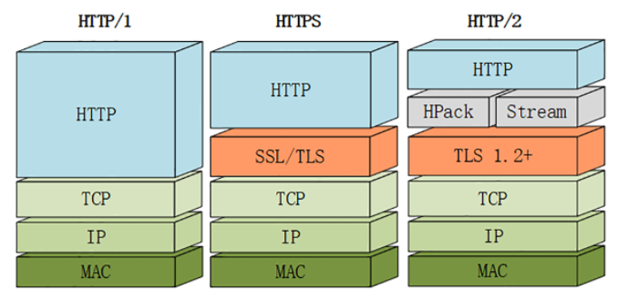

HTTPS通过引入SSL/TLS在安全上达到了“极致”，但在性能提升方面却是乏善可陈，只优化了握手加密的环节，对于整体的数据传输没有提出更好的改进方案，还只能依赖于“长连接”这种“落后”的技术。

由于HTTPS已经在安全方面做的非常好了，所以HTTP/2的唯一目标就是改进性能。

# 兼容HTTP/1

因为必须要保持功能上的兼容，所以HTTP/2把HTTP分解成了“语义”和“语法”两个部分，“语义”层不做改动，与HTTP/1完全一致（即RFC7231）。比如请求方法、URI、状态码、头字段等概念都保留不变，这样就消除了再学习的成本，基于HTTP的上层应用也不需要做任何修改，可以无缝转换到HTTP/2。

HTTP/2没有在URI里引入新的协议名，仍然用“http”表示明文协议，用“https”表示加密协议。

在“语义”保持稳定之后，HTTP/2在“语法”层做了“天翻地覆”的改造，完全变更了HTTP报文的传输格式。

# 头部压缩

由于报文Header一般会携带“User Agent”“Cookie”“Accept”“Server”等许多固定的头字段，多达几百字节甚至上千字节，但Body却经常只有几十字节（比如GET请求、204/301/304响应），成了不折不扣的“大头儿子”。更要命的是，成千上万的请求响应报文里有很多字段值都是重复的，非常浪费，“长尾效应”导致大量带宽消耗在了这些冗余度极高的数据上。

所以，HTTP/2把“头部压缩”作为性能改进的一个重点，优化的方式你也肯定能想到，还是“压缩”。不过HTTP/2并没有使用传统的压缩算法，而是开发了专门的“HPACK”算法，在客户端和服务器两端建立“字典”，用索引号表示重复的字符串，还釆用哈夫曼编码来压缩整数和字符串，可以达到50%~90%的高压缩率。

# 二进制格式

HTTP/2 不再使用肉眼可见的ASCII码，而是向下层的TCP/IP协议“靠拢”，全面采用二进制格式。

这样虽然对人不友好，但却大大方便了计算机的解析。原来使用纯文本的时候容易出现多义性，比如大小写、空白字符、回车换行、多字少字等等，程序在处理时必须用复杂的状态机，效率低，还麻烦。而二进制里只有“0”和“1”，可以严格规定字段大小、顺序、标志位等格式，“对就是对，错就是错”，解析起来没有歧义，实现简单，而且体积小、速度快，做到“内部提效”。

它把TCP协议的部分特性挪到了应用层，把原来的“Header+Body”的消息“打散”为数个小片的二进制“帧”（Frame），用“HEADERS”帧存放头数据、“DATA”帧存放实体数据。

这种做法有点像是“Chunked”分块编码的方式，也是“化整为零”的思路，但HTTP/2数据分帧后“Header+Body”的报文结构就完全消失了，协议看到的只是一个个的“碎片”。


# 虚拟的“流”

消息的“碎片”到达目的地后应该怎么组装起来呢？HTTP/2为此定义了一个“流”（Stream）的概念，它是二进制帧的双向传输序列，同一个消息往返的帧会分配一个唯一的流ID。你可以想象把它成是一个虚拟的“数据流”，在里面流动的是一串有先后顺序的数据帧，这些数据帧按照次序组装起来就是HTTP/1里的请求报文和响应报文。

因为“流”是虚拟的，实际上并不存在，所以HTTP/2就可以在一个TCP连接上用“流”同时发送多个“碎片化”的消息，这就是常说的“多路复用”（ Multiplexing）——多个往返通信都复用一个连接来处理。

在“流”的层面上看，消息是一些有序的“帧”序列，而在“连接”的层面上看，消息却是乱序收发的“帧”。多个请求/响应之间没有了顺序关系，不需要排队等待，也就不会再出现“队头阻塞”问题，降低了延迟，大幅度提高了连接的利用率。


为了更好地利用连接，加大吞吐量，HTTP/2还添加了一些控制帧来管理虚拟的“流”，实现了优先级和流量控制，这些特性也和TCP协议非常相似。

HTTP/2还在一定程度上改变了传统的“请求-应答”工作模式，服务器不再是完全被动地响应请求，也可以新建“流”主动向客户端发送消息。比如，在浏览器刚请求HTML的时候就提前把可能会用到的JS、CSS文件发给客户端，减少等待的延迟，这被称为“服务器推送”（Server Push，也叫Cache Push）。

# 强化安全

出于兼容的考虑，HTTP/2延续了HTTP/1的“明文”特点，可以像以前一样使用明文传输数据，不强制使用加密通信，不过格式还是二进制，只是不需要解密。

但由于HTTPS已经是大势所趋，所以“事实上”的HTTP/2是加密的。也就是说，互联网上通常所能见到的HTTP/2都是使用“https”协议名，跑在TLS上面。

为了区分“加密”和“明文”这两个不同的版本，HTTP/2协议定义了两个字符串标识符：“h2”表示加密的HTTP/2，“h2c”表示明文的HTTP/2，多出的那个字母“c”的意思是“clear text”。

HTTP/2在安全方面做了强化，要求下层的通信协议必须是TLS1.2以上，还要支持前向安全和SNI，并且把几百个弱密码套件列入了“黑名单”，比如DES、RC4、CBC、SHA-1都不能在HTTP/2里使用，相当于底层用的是“TLS1.25”。

# 协议栈

下面的这张图对比了HTTP/1、HTTPS和HTTP/2的协议栈，你可以清晰地看到，HTTP/2是建立在“HPack”“Stream”“TLS1.2”基础之上的，比HTTP/1、HTTPS复杂了一些。



虽然HTTP/2的底层实现很复杂，但它的“语义”还是简单的HTTP/1。

# 内核剖析

## 连接前言

由于HTTP/2“事实上”是基于TLS，所以在正式收发数据之前，会有TCP握手和TLS握手。

TLS握手成功之后，客户端必须要发送一个“连接前言”（connection preface），用来确认建立HTTP/2连接。这个“连接前言”是标准的HTTP/1请求报文，使用纯文本的ASCII码格式，请求方法是特别注册的一个关键字“PRI”，全文只有24个字节：

```
PRI * HTTP/2.0\r\n\r\nSM\r\n\r\n
```

在Wireshark里，HTTP/2的“连接前言”被称为“Magic”，意思就是“不可知的魔法”。

##　头部压缩

确立了连接之后，HTTP/2就开始准备请求报文。

因为语义上它与HTTP/1兼容，所以报文还是由“Header+Body”构成的，但在请求发送前，必须要用“HPACK”算法来压缩头部数据。

“HPACK”算法是专门为压缩HTTP头部定制的算法，与gzip、zlib等压缩算法不同，它是一个“有状态”的算法，需要客户端和服务器各自维护一份“索引表”，也可以说是“字典”，压缩和解压缩就是查表和更新表的操作。

为了方便管理和压缩，HTTP/2废除了原有的起始行概念，把起始行里面的请求方法、URI、状态码等统一转换成了头字段的形式，并且给这些“不是头字段的头字段”起了个特别的名字——“伪头字段”（pseudo-header fields）。而起始行里的版本号和错误原因短语因为没什么大用，顺便也给废除了。

为了与“真头字段”区分开来，这些“伪头字段”会在名字前加一个“:”，比如“:authority” “:method” “:status”，分别表示的是域名、请求方法和状态码。

现在HTTP报文头就简单了，全都是“Key-Value”形式的字段，于是HTTP/2就为一些最常用的头字段定义了一个只读的“静态表”（Static Table）。下面的这个表格列出了“静态表”的一部分，这样只要查表就可以知道字段名和对应的值，比如数字“2”代表“GET”，数字“8”代表状态码200。


但如果表里只有Key没有Value，或者是自定义字段根本找不到该怎么办呢？这就要用到“动态表”（Dynamic Table），它添加在静态表后面，结构相同，但会在编码解码的时候随时更新。

比如说，第一次发送请求时的“user-agent”字段长是一百多个字节，用哈夫曼压缩编码发送之后，客户端和服务器都更新自己的动态表，添加一个新的索引号“65”。那么下一次发送的时候就不用再重复发那么多字节了，只要用一个字节发送编号就好。


随着在HTTP/2连接上发送的报文越来越多，两边的“字典”也会越来越丰富，最终每次的头部字段都会变成一两个字节的代码，原来上千字节的头用几十个字节就可以表示了，压缩效果比gzip要好得多。

## 二进制帧

头部数据压缩之后，HTTP/2就要把报文拆成二进制的帧准备发送。HTTP/2的帧结构有点类似TCP的段或者TLS里的记录，但报头很小，只有9字节，非常地节省。二进制的格式也保证了不会有歧义，而且使用位运算能够非常简单高效地解析。


帧开头是3个字节的长度（但不包括头的9个字节），默认上限是2^14，最大是2^24，也就是说HTTP/2的帧通常不超过16K，最大是16M。

长度后面的一个字节是帧类型，大致可以分成数据帧和控制帧两类，HEADERS帧和DATA帧属于数据帧，存放的是HTTP报文，而SETTINGS、PING、PRIORITY等则是用来管理流的控制帧。

HTTP/2总共定义了10种类型的帧，但一个字节可以表示最多256种，所以也允许在标准之外定义其他类型实现功能扩展。这就有点像TLS里扩展协议的意思了，比如Google的gRPC就利用了这个特点，定义了几种自用的新帧类型。

第5个字节是非常重要的帧标志信息，可以保存8个标志位，携带简单的控制信息。常用的标志位有END_HEADERS表示头数据结束，相当于HTTP/1里头后的空行（“\r\n”），END_STREAM表示单方向数据发送结束（即EOS，End of Stream），相当于HTTP/1里Chunked分块结束标志（“0\r\n\r\n”）。

报文头里最后4个字节是流标识符，也就是帧所属的“流”，接收方使用它就可以从乱序的帧里识别出具有相同流ID的帧序列，按顺序组装起来就实现了虚拟的“流”。流标识符虽然有4个字节，但最高位被保留不用，所以只有31位可以使用，也就是说，流标识符的上限是2^31，大约是21亿。

## 流与多路复用

弄清楚了帧结构后我们就来看HTTP/2的流与多路复用，它是HTTP/2最核心的部分。

要搞明白流，关键是要理解帧头里的流ID。在HTTP/2连接上，虽然帧是乱序收发的，但只要它们都拥有相同的流ID，就都属于一个流，而且在这个流里帧不是无序的，而是有着严格的先后顺序。

在概念上，一个HTTP/2的流就等同于一个HTTP/1里的“请求-应答”。在HTTP/1里一个“请求-响应”报文来回是一次HTTP通信，在HTTP/2里一个流也承载了相同的功能。

HTTP/2的流特点：

- 流是可并发的，一个HTTP/2连接上可以同时发出多个流传输数据，也就是并发多请求，实现“多路复用”
- 客户端和服务器都可以创建流，双方互不干扰
- 流是双向的，一个流里面客户端和服务器都可以发送或接收数据帧，也就是一个“请求-应答”来回
- 流之间没有固定关系，彼此独立，但流内部的帧是有严格顺序的
- 流可以设置优先级，让服务器优先处理，比如先传HTML/CSS，后传图片，优化用户体验
- 流ID不能重用，只能顺序递增，客户端发起的ID是奇数，服务器端发起的ID是偶数
- 在流上发送“RST_STREAM”帧可以随时终止流，取消接收或发送
- 第0号流比较特殊，不能关闭，也不能发送数据帧，只能发送控制帧，用于流量控制


HTTP/2在一个连接上使用多个流收发数据，那么它本身默认就会是长连接，所以永远不需要“Connection”头字段（keepalive或close）。

下载大文件的时候想取消接收，在HTTP/1里只能断开TCP连接重新“三次握手”，成本很高，而在HTTP/2里就可以简单地发送一个“RST_STREAM”中断流，而长连接会继续保持。

因为客户端和服务器两端都可以创建流，而流ID有奇数偶数和上限的区分，所以大多数的流ID都会是奇数，而且客户端在一个连接里最多只能发出2^30，也就是10亿个请求。ID用完了以后，可以再发一个控制帧“GOAWAY”，真正关闭TCP连接。

##　流状态转换

HTTP/2借鉴了TCP，根据帧的标志位实现流状态转换。当然，这些状态也是虚拟的，只是为了辅助理解。


最开始的时候流都是“空闲”（idle）状态，也就是“不存在”，可以理解成是待分配的“号段资源”。

当客户端发送HEADERS帧后，有了流ID，流就进入了“打开”状态，两端都可以收发数据，然后客户端发送一个带“END_STREAM”标志位的帧，流就进入了“半关闭”状态。这个“半关闭”状态很重要，意味着客户端的请求数据已经发送完了，需要接受响应数据，而服务器端也知道请求数据接收完毕，之后就要内部处理，再发送响应数据。

响应数据发完了之后，也要带上“END_STREAM”标志位，表示数据发送完毕，这样流两端就都进入了“关闭”状态，流就结束了。

刚才也说过，流ID不能重用，所以流的生命周期就是HTTP/1里的一次完整的“请求-应答”，流关闭就是一次通信结束。

下一次再发请求就要开一个新流（而不是新连接），流ID不断增加，直到到达上限，发送“GOAWAY”帧开一个新的TCP连接，流ID就又可以重头计数。


