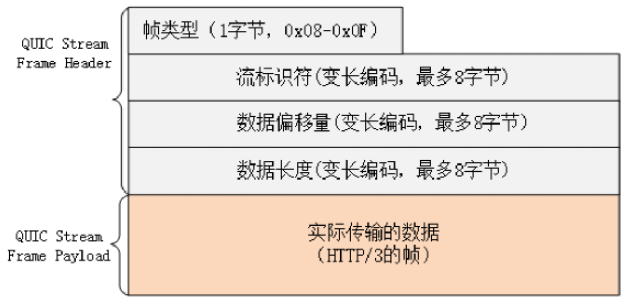

# HTTP/2的“队头阻塞”

这是因为HTTP/2虽然使用“帧”“流”“多路复用”，没有了“队头阻塞”，但这些手段都是在应用层里，而在下层，也就是TCP协议里，还是会发生“队头阻塞”。

在HTTP/2把多个“请求-响应”分解成流，交给TCP后，TCP会再拆成更小的包依次发送（其实在TCP里应该叫segment，也就是“段”）。

在网络良好的情况下，包可以很快送达目的地。但如果网络质量比较差，像手机上网的时候，就有可能会丢包。而TCP为了保证可靠传输，有个特别的“丢包重传”机制，丢失的包必须要等待重新传输确认，其他的包即使已经收到了，也只能放在缓冲区里，上层的应用拿不出来，只能“干着急”。

例如：

客户端用TCP发送了三个包，但服务器所在的操作系统只收到了后两个包，第一个包丢了。那么内核里的TCP协议栈就只能把已经收到的包暂存起来，“停下”等着客户端重传那个丢失的包，这样就又出现了“队头阻塞”。

由于这种“队头阻塞”是TCP协议固有的，所以HTTP/2即使设计出再多的“花样”也无法解决。

Google在推SPDY的时候就已经意识到了这个问题，于是就又发明了一个新的“QUIC”协议，让HTTP跑在QUIC上而不是TCP上。而这个“HTTP over QUIC”就是HTTP协议的下一个大版本，HTTP/3。它在HTTP/2的基础上又实现了质的飞跃，真正“完美”地解决了“队头阻塞”问题。不过HTTP/3目前还处于草案阶段。

# QUIC协议

HTTP/3有一个关键的改变，那就是它把下层的TCP“抽掉”了，换成了UDP。因为UDP是无序的，包之间没有依赖关系，所以就从根本上解决了“队头阻塞”。

UDP是一个简单、不可靠的传输协议，只是对IP协议的一层很薄的包装，和TCP相比，它实际应用的较少。不过正是因为它简单，不需要建连和断连，通信成本低，也就非常灵活、高效，“可塑性”很强。所以，QUIC就选定了UDP，在它之上把TCP的那一套连接管理、拥塞窗口、流量控制等“搬”了过来，“去其糟粕，取其精华”，打造出了一个全新的可靠传输协议，可以认为是“新时代的TCP”。

QUIC最早是由Google发明的，被称为gQUIC。而当前正在由IETF标准化的QUIC被称为iQUIC。两者的差异非常大。gQUIC混合了UDP、TLS、HTTP，是一个应用层的协议。而IETF则对gQUIC做了“清理”，把应用部分分离出来，形成了HTTP/3，原来的UDP部分“下放”到了传输层。

接下来要说的QUIC都是指iQUIC，要记住，它与早期的gQUIC不同，是一个传输层的协议，和TCP是平级的。

# QUIC的特点

QUIC基于UDP，而UDP是“无连接”的，根本就不需要“握手”和“挥手”，所以天生就要比TCP快。

就像TCP在IP的基础上实现了可靠传输一样，QUIC也基于UDP实现了可靠传输，保证数据一定能够抵达目的地。它还引入了类似HTTP/2的“流”和“多路复用”，单个“流”是有序的，可能会因为丢包而阻塞，但其他“流”不会受到影响。

但QUIC并不是建立在TLS之上，而是内部“包含”了TLS。它使用自己的帧“接管”了TLS里的“记录”，握手消息、警报消息都不使用TLS记录，直接封装成QUIC的帧发送，省掉了一次开销。

# QUIC内部细节

QUIC的基本数据传输单位是包（packet）和帧（frame），一个包由多个帧组成，包面向的是“连接”，帧面向的是“流”。

QUIC使用不透明的“连接ID”来标记通信的两个端点，客户端和服务器可以自行选择一组ID来标记自己，这样就解除了TCP里连接对“IP地址+端口”（即常说的四元组）的强绑定，支持“连接迁移”（Connection Migration）。

QUIC的帧里有多种类型，PING、ACK等帧用于管理连接，而STREAM帧专门用来实现流。QUIC里的流与HTTP/2的流非常相似，也是帧的序列。

QUIC帧普遍采用变长编码，最少只要1个字节，最多有8个字节。流ID的最大可用位数是62，数量上比HTTP/2的2^31大大增加。

流ID还保留了最低两位用作标志，第1位标记流的发起者，0表示客户端，1表示服务器；第2位标记流的方向，0表示双向流，1表示单向流。所以QUIC流ID的奇偶性质和HTTP/2刚好相反，客户端的ID是偶数，从0开始计数。

# HTTP/3协议

因为QUIC本身就已经支持了加密、流和多路复用，所以HTTP/3的工作减轻了很多，把流控制都交给QUIC去做。调用的不再是TLS的安全接口，也不是Socket API，而是专门的QUIC函数。不过这个“QUIC函数”还没有形成标准，必须要绑定到某一个具体的实现库。

HTTP/3里仍然使用流来发送“请求-响应”，但它自身不需要像HTTP/2那样再去定义流，而是直接使用QUIC的流，相当于做了一个“概念映射”。HTTP/3里的“双向流”可以完全对应到HTTP/2的流，而“单向流”在HTTP/3里用来实现控制和推送，近似地对应HTTP/2的0号流。

由于流管理被“下放”到了QUIC，所以HTTP/3里帧的结构也变简单了。帧头只有两个字段：类型和长度，而且同样都采用变长编码，最小只需要两个字节。

HTTP/3里的帧仍然分成数据帧和控制帧两类，HEADERS帧和DATA帧传输数据，但其他一些帧因为在下层的QUIC里有了替代，所以在HTTP/3里就都消失了，比如RST_STREAM、WINDOW_UPDATE、PING等。

头部压缩算法在HTTP/3里升级成了“QPACK”，使用方式上也做了改变。虽然也分成静态表和动态表，但在流上发送HEADERS帧时不能更新字段，只能引用，索引表的更新需要在专门的单向流上发送指令来管理，解决了HPACK的“队头阻塞”问题。

另外，QPACK的字典也做了优化，静态表由之前的61个增加到了98个，而且序号从0开始，也就是说“:authority”的编号是0。

# HTTP/3服务发现

HTTP/3没有指定默认的端口号，也就是说不一定非要在UDP的80或者443上提供HTTP/3服务。

那么，该怎么“发现”HTTP/3呢？这就要用到HTTP/2里的“扩展帧”了。浏览器需要先用HTTP/2协议连接服务器，然后服务器可以在启动HTTP/2连接后发送一个“Alt-Svc”帧，包含一个“h3=host:port”的字符串，告诉浏览器在另一个端点上提供等价的HTTP/3服务。浏览器收到“Alt-Svc”帧，会使用QUIC异步连接指定的端口，如果连接成功，就会断开HTTP/2连接，改用新的HTTP/3收发数据。