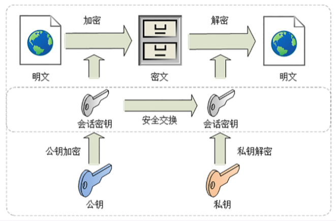
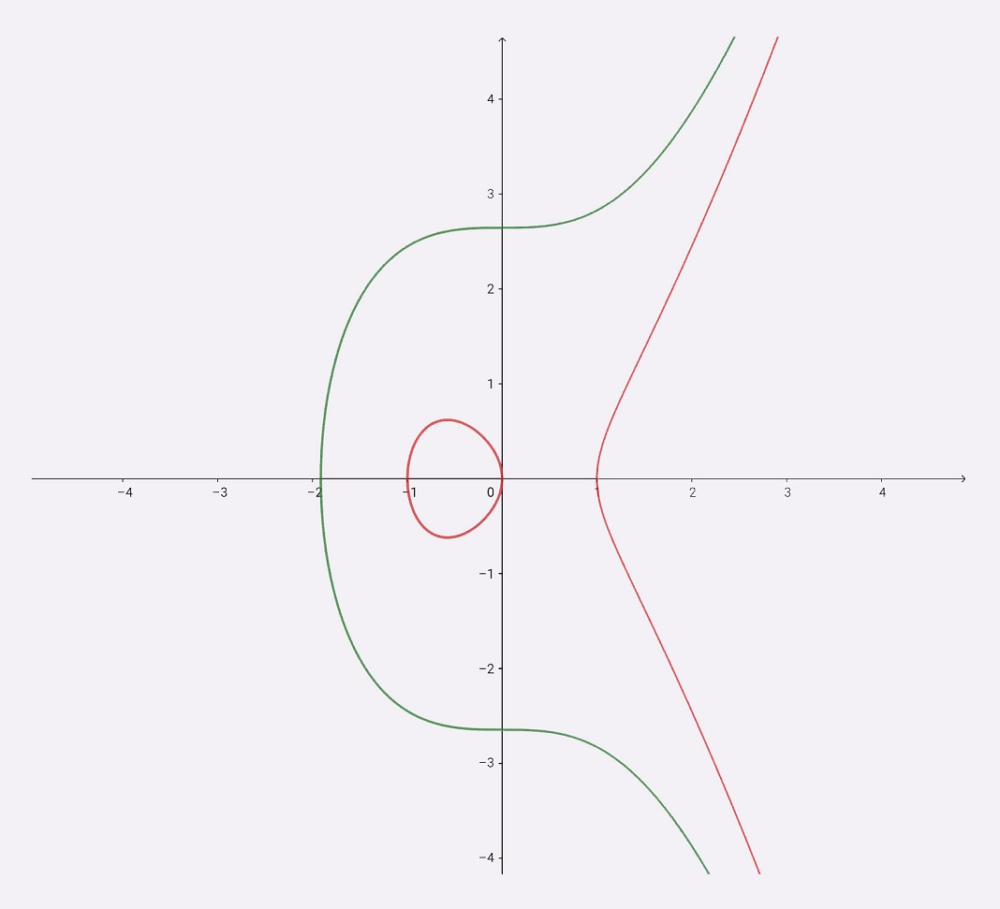
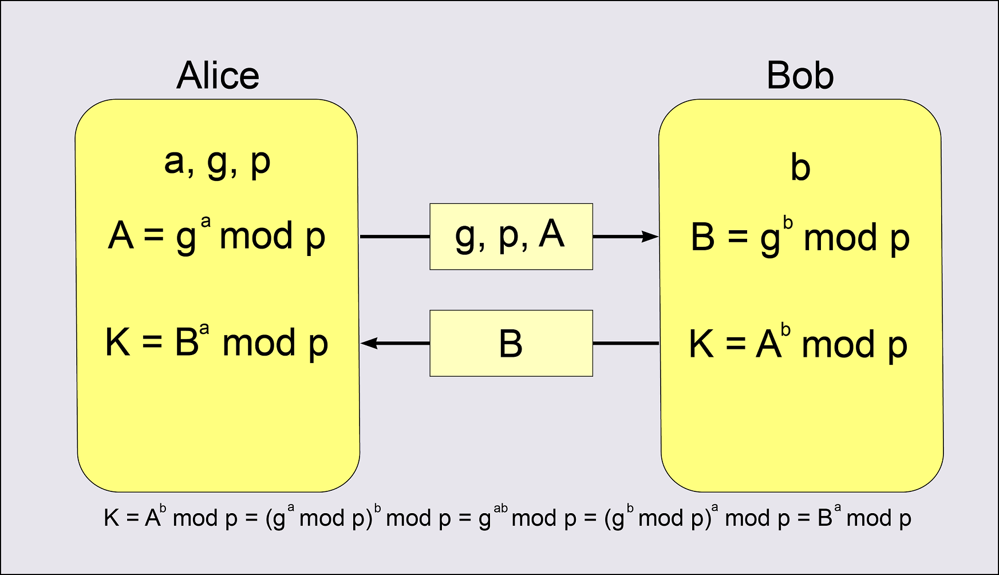

# 加密

实现机密性最常用的手段是“加密”（encrypt），就是把消息用某种方式转换成谁也看不懂的乱码，只有掌握特殊“钥匙”的人才能再转换出原始文本。这里的“钥匙”就叫做“密钥”（key），加密前的消息叫“明文”（plain text/clear text），加密后的乱码叫“密文”（cipher text），使用密钥还原明文的过程叫“解密”（decrypt），是加密的反操作，加密解密的操作过程就是“加密算法”。所有的加密算法都是公开的，任何人都可以去分析研究，而算法使用的“密钥”则必须保密。

按照密钥的使用方式，加密可以分为两大类：对称加密和非对称加密。


## 对称加密

“对称加密”很好理解，就是指加密和解密时使用的密钥都是同一个，是“对称”的。

举个例子，你想要登录某网站，只要事先和它约定好使用一个对称密码，通信过程中传输的全是用密钥加密后的密文，只有你和网站才能解密。黑客即使能够窃听，看到的也只是乱码，因为没有密钥无法解出明文，所以就实现了机密性。


TLS 里有非常多的对称加密算法可供选择，比如：RC4、DES、3DES、AES、ChaCha20等，但前三种算法都被认为是不安全的，通常都禁止使用，目前常用的只有 AES 和 ChaCha20。

AES 的意思是“高级加密标准”（Advanced Encryption Standard），密钥长度可以是128、192 或 256。它是 DES 算法的替代者，安全强度很高，性能也很好，而且有的硬件还会做特殊优化，所以非常流行，是应用最广泛的对称加密算法。

ChaCha20 是 Google 设计的另一种加密算法，密钥长度固定为 256 位，纯软件运行性能要超过 AES，曾经在移动客户端上比较流行，但 ARMv8 之后也加入了 AES 硬件优化，所以现在不再具有明显的优势，但仍然算得上是一个不错算法。

对称算法还有一个“分组模式”的概念，它可以让算法用固定长度的密钥加密任意长度的明文，把小秘密（即密钥）转化为大秘密（即密文）。最早有 ECB、CBC、CFB、OFB 等几种分组模式，但都陆续被发现有安全漏洞，所以现在基本都不怎么用了。最新的分组模式被称为AEAD（Authenticated Encryption with Associated Data），在加密的同时增加了认证的功能，常用的是 GCM、CCM 和 Poly1305。

把上面这些组合起来，就可以得到 TLS 密码套件中定义的对称加密算法。比如，AES128-GCM，意思是密钥长度为 128 位的 AES 算法，使用的分组模式是 GCM；ChaCha20-Poly1305 的意思是 ChaCha20 算法，使用的分组模式是 Poly1305。

## 非对称加密

对称加密中如何把密钥安全地传递给对方，术语叫“密钥交换”。因为在对称加密算法中只要持有密钥就可以解密。如果你和网站约定的密钥在传递途中被黑客窃取，那他就可以在之后随意解密收发的数据，通信过程也就没有机密性可言了。

非对称加密（也叫公钥加密算法）有两个密钥，一个叫“公钥”（public key），一个叫“私钥”（private key）。两个密钥是不同的，“不对称”，公钥可以公开给任何人使用，而私钥必须严格保密。公钥和私钥有个特别的“单向”性，虽然都可以用来加密解密，但公钥加密后只能用私钥解密，反过来，私钥加密后也只能用公钥解密。

网站秘密保管私钥，在网上任意分发公钥，你想要登录网站只要用公钥加密就行了，密文只能由私钥持有者才能解密。而黑客因为没有私钥，所以就无法破解密文。


非对称加密算法的设计要比对称算法难得多，在 TLS 里只有很少的几种，比如：DH、DSA、RSA、ECC 等。

RSA 可能是其中最著名的一个，几乎可以说是非对称加密的代名词，它的安全性基于“整数分解”的数学难题，使用两个超大素数的乘积作为生成密钥的材料，想要从公钥推算出私钥是非常困难的。10年前RSA密钥的推荐长度是1024，但随着计算机运算能力的提高，现在1024 已经不安全，普遍认为至少要 2048 位。

ECC（Elliptic Curve Cryptography）是非对称加密里的“后起之秀”，它基于“椭圆曲线离散对数”的数学难题，使用特定的曲线方程和基点生成公钥和私钥，子算法 ECDHE 用于密钥交换，ECDSA 用于数字签名。目前比较常用的两个曲线是 P-256（secp256r1，在OpenSSL称为 prime256v1）和 x25519。P-256 是 NIST（美国国家标准技术研究所）和 NSA（美国国家安全局）推荐使用的曲线，而 x25519 被认为是最安全、最快速的曲线。

ECC 名字里的“椭圆”经常会引起误解，其实它的曲线并不是椭圆形，只是因为方程很类似计算椭圆周长的公式，实际的形状更像抛物线，比如下面的图就展示了两个简单的椭圆曲线。


比起 RSA，ECC 在安全强度和性能上都有明显的优势。160 位的 ECC 相当于1024 位的 RSA，而 224 位的ECC则相当于 2048 位的 RSA。因为密钥短，所以相应的计算量、消耗的内存和带宽也就少，加密解密的性能就上去了，对于现在的移动互联网非常有吸引力。

## 混合加密

虽然非对称加密没有“密钥交换”的问题，但因为它们都是基于复杂的数学难题，运算速度很慢，即使是 ECC 也要比 AES 差上好几个数量级。如果仅用非对称加密，虽然保证了安全，但通信速度太慢，实用性就降低了。于是就出现了把对称加密和非对称加密结合起来的混合加密方式：

- 在通信刚开始的时候使用非对称算法，比如：RSA、ECDHE 首先解决密钥交换的问题
- 然后用随机数产生对称算法使用的“会话密钥”（session key），再用公钥加密。因为会话密钥很短，通常只有 16 字节或 32 字节，所以慢一点也无所谓
- 对方拿到密文后用私钥解密，取出会话密钥。这样，双方就实现了对称密钥的安全交换，后续就不再使用非对称加密，全都使用对称加密



# HTTP 的缺点

## 通信安全四个特性

通常认为，如果通信过程具备了四个特性，就可以认为是“安全”的，这四个特性是：机密性、完整性，身份认证和不可否认。

- 机密性，机密性（Secrecy/Confidentiality）是指对数据的“保密”，只能由可信的人访问，对其他人是不可见的“秘密”，简单来说就是不能让不相关的人看到不该看的东西

- 完整性，完整性（Integrity，也叫一致性）是指数据在传输过程中没有被窜改，不多也不少，“完完整整”地保持着原状

- 身份认证，身份认证（Authentication）是指确认对方的真实身份，也就是“证明你真的是你”，保证消息只能发送给可信的人

- 不可否认，不可否认（Non-repudiation/Undeniable），也叫不可抵赖，意思是不能否认已经发生过的行为，不能“说话不算数”“耍赖皮”

## Http 的主要不足

-  通信使用明文（不加密），内容可能会被窃听
- 不验证通信方的身份，因此有可能遭遇伪装
- 无法证明报文的完整性，所以有可能已遭篡改

### 通信使用明文可能会被窃听  

互联网上的任何角落都存在通信内容被窃听的风险：


防止窃听保护信息的几种对策中，最为普及的就是加密技术。加密的对象可以有：

- 通信的加密
- 内容的加密

#### 通信的加密

HTTP 协议中没有加密机制，但可以通过和 SSL（ Secure Socket Layer，安全套接层）或 TLS（ Transport Layer Security，安全层传输协议）的组合使用，加密 HTTP 的通信内容。  

用 SSL 建立安全通信线路之后，就可以在这条线路上进行 HTTP 通信了。与 SSL 组合使用的 HTTP 被称为 HTTPS（ HTTP Secure，超文本传输安全协议）或 HTTP over SSL。  


####　内容的加密

即把 HTTP 报文里所含的内容进行加密处理。  


为了做到有效的内容加密，前提是要求客户端和服务器同时具备加密和解密机制。 主要应用在 Web 服务中。有一点必须引起注意，由于该方式不同于 SSL 或 TLS 将整个通信线路加密处理，所以内容仍有被篡改的风险。  

### 不验证通信方的身份就可能遭遇伪装  

HTTP 协议中的请求和响应不会对通信方进行确认。也就是说存在“服务器是否就是发送请求中 URI 真正指定的主机，返回的响应是否真的返回到实际提出请求的客户端”等类似问题。  

#### 任何人都可发起请求  

在 HTTP 协议通信时，由于不存在确认通信方的处理步骤，任何人都可以发起请求。 另外，服务器只要接收到请求，不管对方是谁都会返回一个响应（但也仅限于发送端的 IP 地址和端口号没有被 Web 服务器设定限制访问的前提下）。  


- 无法确定请求发送至目标的 Web 服务器是否是按真实意图返回响应的那台服务器。有可能是已伪装的 Web 服务器
- 无法确定响应返回到的客户端是否是按真实意图接收响应的那个客户端。有可能是已伪装的客户端
- 无法确定正在通信的对方是否具备访问权限。因为某些 Web 服务器上保存着重要的信息，只想发给特定用户通信的权限  
- 无法判定请求是来自何方、出自谁手
- 即使是无意义的请求也会照单全收。无法阻止海量请求下的 DoS 攻击（Denial of Service，拒绝服务攻击）  

#### 查明对手的证书

虽然使用 HTTP 协议无法确定通信方，但如果使用 SSL 则可以。SSL 不仅提供加密处理， 而且还使用了一种被称为证书的手段，可用于确定方。  

证书由值得信任的第三方机构颁发， 用以证明服务器和客户端是实际存在的。  


### 无法证明报文完整性，可能已遭篡改  

所谓完整性是指信息的准确度。若无法证明其完整性，通常也就意味着无法判断信息是否准确。  

#### 接收到的内容可能有误  

没有任何办法确认，发出的请求/响应和接收到的请求/响应是前后相同的。  


像这样，请求或响应在传输途中，遭攻击者拦截并篡改内容的攻击称为中间人攻击（ Man-in-the-Middle attack， MITM）。  


#### 如何防止篡改  

虽然有使用 HTTP 协议确定报文完整性的方法，但并不便捷、可靠。其中常用的是 MD5 和 SHA-1 等散列值校验的方法，以及用来确认文件的数字签名方法。  

# HTTPS  

**HTTP+ 加密 + 认证 + 完整性保护 = HTTPS**，把添加了加密及认证机制的 HTTP 称为 HTTPS（ HTTP Secure）。  


## HTTPS 是身披 SSL 外壳的 HTTP  

HTTPS 并非是应用层的一种新协议。只是 HTTP 通信接口部分用 SSL（ Secure Socket Layer）和 TLS（ Transport Layer Security）协议代替而已。  


在采用 SSL 后， HTTP 就拥有了 HTTPS 的加密、证书和完整性保护这些功能。  

SSL 是独立于 HTTP 的协议，所以不光是 HTTP 协议，其他运行在应用层的 SMTP 和 Telnet 等协议均可配合 SSL 协议使用。  

## 相互交换密钥的公开密钥加密技术

SSL 采用一种叫做公开密钥加密（ Public-key cryptography）的加密处理方式。近代的加密方法中加密算法是公开的， 而密钥却是保密的。通过这
种方式得以保持加密方法的安全性。

加密和解密都会用到密钥。 没有密钥就无法对密码解密，反过来说，任何人只要持有密钥就能解密了。 如果密钥被攻击者获得，那加密也就失去了意义。  

### 共享密钥加密的困境  

加密和解密同用一个密钥的方式称为共享密钥加密（ Common key crypto system），也被叫做对称密钥加密。  

以共享密钥方式加密时必须将密钥也发给对方。  在互联网上转发密钥时，如果通信被监听那么密钥就可会落入攻击者之手， 同时也就失去了加密的意义。另外还得设法安全地保管接收到的密钥。  


### 使用两把密钥的公开密钥加密  

公开密钥加密使用一对非对称的密钥。 一把叫做私有密钥（ privatekey），另一把叫做公开密钥（ public key）。私有密钥不能让其他任何人知道，而公开密钥则可以随意发布，任何人都可以获得。  

使用公开密钥加密方式， 发送密文的一方使用对方的公开密钥进行加密处理，对方收到被加密的信息后，再使用自己的私有密钥进行解密。 利用这种方式， 不需要发送用来解密的私有密钥，也不必担心密钥被攻击者窃听而盗走。  

要想根据密文和公开密钥，恢复到信息原文是异常困难的，因为解密过程就是在对离散对数进行求值， 这并非轻而易举就能办到。退一步讲，如果能对一个非常大的整数做到快速地因式分解，那么密码破解还是存在希望的。但就目前的技术来看是不太现实的。  


### HTTPS 采用混合加密机制  

HTTPS 采用共享密钥加密和公开密钥加密两者并用的混合加密机制。若密钥能够实现安全交换， 那么有可能会考虑仅使用公开密钥加密来通信。但是公开密钥加密与共享密钥加密相比，其处理速度要慢。所以应充分利用两者各自的优势， 将多种方法组合起来用于通信。在交换密钥环节使用公开密钥加密方式，之后的建立通信交换报文阶段则使用共享密钥加密方式。


### 证明公开密钥正确性的证书  

公开密钥加密方式还是存在一些问题的。那就是无法证明公开密钥本身就是货真价实的公开密钥。 比如，正准备和某台服务器建立公开密钥加密方式下的通信时，如何证明收到的公开密钥就是原本预想的那台服务器发行的公开密钥。 或许在公开密钥传输途中，真正的公开密钥已经被攻击者替换掉了。  

为了解决上述问题，可以使用由数字证书认证机构（ CA， Certificate Authority）和其相关机关颁发的公开密钥证书。  

数字证书认证机构处于客户端与服务器双方都可信赖的第三方机构的立场上。  

- 服务器的运营人员向数字证书认证机构提出公开密钥的申请
- 数字证书认证机构在判明提出申请者的身份之后， 会对已申请的公开密钥做数字签名，然后分配这个已签名的公开密钥， 并将该公开密钥放入公钥证书后绑定在一起
- 服务器会将这份由数字证书认证机构颁发的公钥证书发送给客户端，以进行公开密钥加密方式通信。 公钥证书也可叫做数字证书或直接称为证书
- 接到证书的客户端可使用数字证书认证机构的公开密钥， 对那张证书上的数字签名进行验证， 一旦验证通过，客户端便可明确两件事：
  - 认证服务器的公开密钥的是真实有效的数字证书认证机构
  - 服务器的公开密钥是值得信赖的

认证机关的公开密钥必须安全地转交给客户端。 使用通信方式时，如何安全转交是一件很困难的事， 因此，多数浏览器开发商发布版本时，会事先在内部植入常用认证机关的公开密钥。  


### 可证明组织真实性的EV SSL证书  

证书的一个作用是用来证明作为通信一方的服务器是否规范，另外一个作用是可确认对方服务器背后运营的企业是否真实存在。 拥有该特性的证书就是 EV SSL 证书（ Extended Validation SSL Certificate）。  

EV SSL 证书是基于国际标准的认证指导方针颁发的证书。其严格规定了对运营组织是否真实的确认方针， 因此，通过认证的 Web 网站能够获得更高的认可度。  

### 用以确认客户端的客户端证书

HTTPS 中还可以使用客户端证书。以客户端证书进行客户端认证，证明服务器正在通信的对方始终是预料之内的客户端， 其作用跟服务器证书如出一辙。  

但客户端证书仍存在几处问题点：

- 证书的获取及发布：想获取证书时， 用户得自行安装客户端证书，这需要费用和一定的技术基础
- 客户端证书毕竟只能用来证明客户端实际存在， 而不能用来证明用户本人的真实有效性，也就是说，只要获得了安装有客户端证书的计算机的使用权限， 也就意味着同时拥有了客户端证书的使用权限  

### 认证机构信誉第一  

虽然存在可将证书无效化的证书吊销列表（ Certificate Revocation List， CRL）机制， 以及从客户端删除根证书颁发机构（ Root Certificate Authority， RCA）的对策， 但是距离生效还需要一段时间，而在这段时间内，到底会有多少用户的利益蒙受损失就不得而知了。  

### 由自认证机构颁发的证书称为自签名证书  

使用 OpenSSL 这套开源程序，每个人都可以构建一套属于自己的认证机构， 从而自己给自己颁发服务器证书。但该服务器证书在互联网上不可作为证书使用。  

独立构建的认证机构叫做自认证机构， 由自认证机构颁发的“无用”证书也被戏称为自签名证书。浏览器访问该服务器时， 会显示“无法确认连接安全性”或“该网站的安全证书存在问题”等警告消息。  


由自认证机构颁发的服务器证书之所以不起作用，是因为它无法消除伪装的可能性。   

### 中级认证机构的证书可能会变成自认证证书  

多数浏览器内预先已植入备受信赖的认证机构的证书，但也有一小部分浏览器会植入中级认证机构的证书。

对于中级认证机构颁发的服务器证书， 某些浏览器会以正规的证书来对待，可有的浏览器会当作自签名证书。  

## HTTPS 的安全通信机制  

HTTPS 的通信步骤：


- 客户端通过发送 Client Hello 报文开始 SSL 通信。报文中包含客户端支持的 SSL 的指定版本、加密组件（ Cipher Suite）列表（所使用的加密算法及密钥长度等）
- 服务器可进行 SSL 通信时，会以 Server Hello 报文作为应答。和客户端一样，在报文中包含 SSL 版本以及加密组件。服务器的加密组件内容是从接收到的客户端加密组件内筛选出来的
- 之后服务器发送 Certificate 报文。报文中包含公开密钥证书
- 最后服务器发送 Server Hello Done 报文通知客户端，最初阶段的 SSL 握手协商部分结束
- SSL 第一次握手结束之后，客户端以 Client Key Exchange 报文作为回应。报文中包含通信加密中使用的一种被称为 Pre-master secret 的随机密码串。该报文已用步骤 3 中的公开密钥进行加密
- 接着客户端继续发送 Change Cipher Spec 报文。该报文会提示服务器，在此报文之后的通信会采用 Pre-master secret 密钥加密
- 客户端发送 Finished 报文。该报文包含连接至今全部报文的整体校验值。这次握手协商是否能够成功，要以服务器是否能够正确解密该报文作为判定标准
- 服务器同样发送 Change Cipher Spec 报文
- 服务器同样发送 Finished 报文
- 服务器和客户端的 Finished 报文交换完毕之后， SSL 连接就算建立完成。当然，通信会受到 SSL 的保护。从此处开始进行应用层协议的通信，即发送 HTTP 请求
- 应用层协议通信，即发送 HTTP 响应
- 最后由客户端断开连接。断开连接时，发送 close_notify  报文。这步之后再发送 TCP FIN 报文来关闭与 TCP 的通信

在以上流程中， 应用层发送数据时会附加一种叫做 MAC（ Message Authentication Code）的报文摘要。 MAC 能够查知报文是否遭到篡改，从而保护报文的完整性。  


### SSL和TLS

HTTPS 使 用 SSL（ Secure Socket Layer） 和 TLS（ Transport Layer Security）这两个协议。  

SSL 技术最初是由浏览器开发商网景通信公司率先倡导的，开发过 SSL3.0 之前的版本。  TSL 是以 SSL 为原型开发的协议，有时会统一称该协议为 SSL。当前
主流的版本是 SSL3.0 和 TLS1.0。  

### SSL速度慢吗  

HTTPS 也存在一些问题，那就是当使用 SSL 时，它的处理速度会变慢。


SSL 的慢分两种：

- 一种是指通信慢

- 另一种是指由于大量消耗 CPU 及内存等资源，导致处理速度变慢

和使用 HTTP 相比，网络负载可能会变慢 2 到 100 倍。除去和 TCP  连接、发送 HTTP 请求-响应以外，还必须进行 SSL 通信，因此整体上处理通信量不可避免会增加。  

另一点是 SSL 必须进行加密处理。在服务器和客户端都需要进行加密和解密的运算处理。 因此从结果上讲，比起 HTTP 会更多地消耗服务器和客户端的硬件资源，导致负载增强。  

针对速度变慢这一问题， 并没有根本性的解决方案，我们会使用SSL 加速器这种（专用服务器）硬件来改善该问题。该硬件为 SSL 通信专用硬件，相对软件来讲，能够提高数倍 SSL 的计算速度。仅在 SSL 处理时发挥 SSL 加速器的功效，以分担负载。  


HTTPS 默认端口号443，至于其他的什么请求-应答模式、报文结构、请求方法、URI、头字段、连接管理等等都完全沿用HTTP，没有任何新的东西。也就是说，除了协议名“http”和端口号80这两点不同，HTTPS协议在语法、语义上和HTTP完全一样，优缺点也“照单全收”（当然要除去“明文”和“不安全”）。

HTTPS  将 HTTP 下层的传输协议由TCP/IP换成了SSL/TLS，由“**HTTP over TCP/IP**”变成了“**HTTP over SSL/TLS**”，让HTTP运行在了安全的SSL/TLS协议上，收发报文不再使用Socket API，而是调用专门的安全接口。


# TLS 1.2

## TLS 协议的组成

TLS包含几个子协议，你也可以理解为它是由几个不同职责的模块组成，比较常用的有记录协议、警报协议、握手协议、变更密码规范协议等：

- 记录协议（Record Protocol）规定了 TLS 收发数据的基本单位：记录（record）。它有点像是 TCP 里的 segment，所有的其他子协议都需要通过记录协议发出。但多个记录数据可以在一个 TCP 包里一次性发出，也并不需要像 TCP 那样返回 ACK
- 警报协议（Alert Protocol）的职责是向对方发出警报信息，有点像是 HTTP 协议里的状态码。比如，protocol_version 就是不支持旧版本，bad_certificate 就是证书有问题，收到警报后另一方可以选择继续，也可以立即终止连接
- 握手协议（Handshake Protocol）是 TLS 里最复杂的子协议，要比 TCP 的 SYN/ACK 复杂的多，浏览器和服务器会在握手过程中协商 TLS 版本号、随机数、密码套件等信息，然后交换证书和密钥参数，最终双方协商得到会话密钥，用于后续的混合加密系统
- 变更密码规范协议（Change Cipher Spec Protocol），它非常简单，就是一个“通知”，告诉对方，后续的数据都将使用加密保护。那么反过来，在它之前，数据都是明文的


## ECDHE 握手过程




在TCP建立连接之后，浏览器会首先发一个“Client Hello”消息，也就是跟服务器“打招呼”。里面有客户端的版本号、支持的密码套件，还有一个随机数（Client Random），用于后续生成会话密钥。


服务器收到“Client Hello”后，会返回一个“Server Hello”消息。把版本号对一下，也给出一个随机数（Server Random），然后从客户端的列表里选一个作为本次通信使用的密码套件。


接下来是一个关键的操作，因为服务器选择了ECDHE算法，所以它会在证书后发送“Server Key Exchange”消息，里面是椭圆曲线的公钥（Server Params），用来实现密钥交换算法，再加上自己的私钥签名认证。


之后是“Server Hello Done”消息：


这样第一个消息往返就结束了（两个TCP包），结果是客户端和服务器通过明文共享了三个信息：Client Random、Server Random和Server Params。之后开始走证书链逐级验证，确认证书的真实性，再用证书公钥验证签名，就确认了服务器的身份。

然后，客户端按照密码套件的要求，也生成一个椭圆曲线的公钥（Client Params），用“Client Key Exchange”消息发给服务器。


现在客户端和服务器手里都拿到了密钥交换算法的两个参数（Client Params、Server Params），就用ECDHE算法一阵算，算出了一个新的东西，叫“Pre-Master”，其实也是一个随机数。算法可以保证即使黑客截获了之前的参数，也是绝对算不出这个随机数的。现在客户端和服务器手里有了三个随机数：Client Random、Server Random 和 Pre-Master。用这三个作为原始材料，就可以生成用于加密会话的主密钥，叫“Master Secret”。而黑客因为拿不到“Pre-Master”，所以也就得不到主密钥。为了保证真正的“完全随机”“不可预测”，把三个不可靠的随机数混合起来，那么“随机”的程度就非常高了，足够让黑客难以猜测。

有了主密钥和派生的会话密钥，握手就快结束了。客户端发一个 “Change Cipher Spec”，然后再发一个 “Finished” 消息，把之前所有发送的数据做个摘要，再加密一下，让服务器做个验证。服务器也是同样的操作，发 “Change Cipher Spec” 和 “Finished” 消息，双方都验证加密解密 OK，握手正式结束，后面就收发被加密的HTTP 请求和响应了。

## RSA握手过程

刚才说的其实是如今主流的 TLS 握手过程，这与传统的握手有两点不同：

- 第一个，使用 ECDHE 实现密钥交换，而不是 RSA，所以会在服务器端发出“Server Key Exchange”消息
- 第二个，因为使用了 ECDHE，客户端可以不用等到服务器发回 “Finished” 确认握手完毕，立即就发出 HTTP 报文，省去了一个消息往返的时间浪费。这个叫 “TLS False Start”，意思就是“抢跑”，和 “TCP Fast Open” 有点像，都是不等连接完全建立就提前发应用数据，提高传输的效率

传统的RSA密钥交换：


# TLS 1.3

TLS1.2 已经是10年前（2008年）的“老”协议了，在安全、性能等方面已经跟不上如今的互联网了。TLS1.3 终于在 2018 年“粉墨登场”，再次确立了信息安全领域的新标准。

## 最大化兼容性

为了保证这些被广泛部署的“老设备”能够继续使用，避免新协议带来的“冲击”，TLS1.3 不得不做出妥协，保持现有的记录格式不变，通过“伪装”来实现兼容，使得TLS1.3 看上去“像是” TLS1.2。

这要用到一个新的扩展协议（Extension Protocol），通过在记录末尾添加一系列的“扩展字段”来增加新的功能，老版本的 TLS 不认识它可以直接忽略，这就实现了“后向兼容”。在记录头的 Version 字段被兼容性“固定”的情况下，只要是 TLS1.3 协议，握手的 “Hello” 消息后面就必须有 “supported_versions” 扩展，它标记了 TLS 的版本号，使用它就能区分新旧协议：

```
Handshake Protocol: Client Hello
    Version: TLS 1.2 (0x0303)
    Extension: supported_versions (len=11)
        Supported Version: TLS 1.3 (0x0304)
        Supported Version: TLS 1.2 (0x0303)
```

TLS1.3 利用扩展实现了许多重要的功能，比如：“supported_groups”，“key_share”，“signature_algorithms”，“server_name” 等。

## 强化安全

TLS1.2 在十来年的应用中获得了许多宝贵的经验，陆续发现了很多的漏洞和加密算法的弱点，所以 TLS1.3 就在协议里修补了这些不安全因素。比如：

- 伪随机数函数由PRF升级为HKDF（HMAC-based Extract-and-Expand Key Derivation Function）
- 明确禁止在记录协议里使用压缩
- 废除了 RC4、DES 对称加密算法
- 废除了 ECB、CBC 等传统分组模式
- 废除了 MD5、SHA1、SHA-224 摘要算法
- 废除了 RSA、DH 密钥交换算法和许多命名曲线

TLS1.3 里只保留了 AES、ChaCha20 对称加密算法，分组模式只能用 AEAD的GCM、CCM 和 Poly1305，摘要算法只能用 SHA256、SHA384 密钥交换算法只有 ECDHE 和 DHE，椭圆曲线也被“砍”到只剩 P-256 和 x25519 等 5 种。现在的 TLS1.3 里只有 5个 套件，无论是客户端还是服务器都不会再犯“选择困难症”了：


浏览器默认会使用 ECDHE 而不是 RSA 做密钥交换，这是因为它不具有“前向安全”（Forward Secrecy）。假设有这么一个很有耐心的黑客，一直在长期收集混合加密系统收发的所有报文。如果加密系统使用服务器证书里的 RSA 做密钥交换，一旦私钥泄露或被破解，那么黑客就能够使用私钥解密出之前所有报文的 “Pre-Master”，再算出会话密钥，破解所有密文。

而 ECDHE 算法在每次握手时都会生成一对临时的公钥和私钥，每次通信的密钥对都是不同的，也就是“一次一密”，即使黑客花大力气破解了这一次的会话密钥，也只是这次通信被攻击，之前的历史消息不会受到影响，仍然是安全的。所以现在主流的服务器和浏览器在握手阶段都已经不再使用 RSA，改用 ECDHE，而 TLS1.3 在协议里明确废除 RSA 和 DH 则在标准层面保证了“前向安全”。

## 提升性能

HTTPS 建立连接时除了要做 TCP 握手，还要做 TLS 握手，在 1.2 中会多花两个消息往返（2-RTT），可能导致几十毫秒甚至上百毫秒的延迟，在移动网络中延迟还会更严重。现在因为密码套件大幅度简化，也就没有必要再像以前那样走复杂的协商流程了。TLS1.3 压缩了以前的“Hello”协商过程，删除了 “Key Exchange” 消息，把握手时间减少到了 “1-RTT”，效率提高了一倍。

客户端在 “Client Hello” 消息里直接用 “supported_groups” 带上支持的曲线，比如：P-256、x25519，用 “key_share” 带上曲线对应的客户端公钥参数，用“signature_algorithms” 带上签名算法。服务器收到后在这些扩展里选定一个曲线和参数，再用 “key_share” 扩展返回服务器这边的公钥参数，就实现了双方的密钥交换，后面的流程就和1.2 基本一样了。


## 握手分析


在TCP建立连接之后，浏览器首先还是发一个 “Client Hello”。

因为 1.3 的消息兼容 1.2，所以开头的版本号、支持的密码套件和随机数（Client Random）结构都是一样的：

```
Handshake Protocol: Client Hello
    Version: TLS 1.2 (0x0303)
    Random: cebeb6c05403654d66c2329…
    Cipher Suites (18 suites)
        Cipher Suite: TLS_AES_128_GCM_SHA256 (0x1301)
        Cipher Suite: TLS_CHACHA20_POLY1305_SHA256 (0x1303)
        Cipher Suite: TLS_AES_256_GCM_SHA384 (0x1302)
    Extension: supported_versions (len=9)
        Supported Version: TLS 1.3 (0x0304)
        Supported Version: TLS 1.2 (0x0303)
    Extension: supported_groups (len=14)
        Supported Groups (6 groups)
            Supported Group: x25519 (0x001d)
            Supported Group: secp256r1 (0x0017)
    Extension: key_share (len=107)
        Key Share extension
            Client Key Share Length: 105
            Key Share Entry: Group: x25519
            Key Share Entry: Group: secp256r1
```

注意 “Client Hello” 里的扩展，“supported_versions” 表示这是 TLS1.3，“supported_groups” 是支持的曲线，“key_share” 是曲线对应的参数。

服务器收到 “Client Hello” 同样返回 “Server Hello” 消息，还是要给出一个随机数（Server Random）和选定密码套件。

```
Handshake Protocol: Server Hello
    Version: TLS 1.2 (0x0303)
    Random: 12d2bce6568b063d3dee2…
    Cipher Suite: TLS_AES_128_GCM_SHA256 (0x1301)
    Extension: supported_versions (len=2)
        Supported Version: TLS 1.3 (0x0304)
    Extension: key_share (len=36)
        Key Share extension
            Key Share Entry: Group: x25519, Key Exchange length: 32
```

表面上看和 TLS1.2 是一样的，重点是后面的扩展。“supported_versions” 里确认使用的是 TLS1.3，然后在 “key_share” 扩展带上曲线和对应的公钥参数。

这时只交换了两条消息，客户端和服务器就拿到了四个共享信息：Client Random 和 Server Random、Client Params 和 Server Params，两边就可以各自用 ECDHE 算出 “Pre-Master”，再用 HKDF 生成主密钥 “Master Secret”，效率比 TLS1.2 提高了一大截。

在算出主密钥后，服务器立刻发出 “Change Cipher Spec” 消息，比 TLS1.2 提早进入加密通信，后面的证书等就都是加密的了，减少了握手时的明文信息泄露。

这里 TLS1.3 还有一个安全强化措施，多了个 “Certificate Verify” 消息，用服务器的私钥把前面的曲线、套件、参数等握手数据加了签名，作用和 “Finished” 消息差不多。但由于是私钥签名，所以强化了身份认证和和防窜改。

这两个 “Hello” 消息之后，客户端验证服务器证书，再发 “Finished” 消息，就正式完成了握手，开始收发 HTTP 报文。

# HTTPS 的优化

HTTPS 连接大致上可以划分为两个部分：

- 第一个是建立连接时的非对称加密握手
- 第二个是握手后的对称加密报文传输

由于目前流行的 AES、ChaCha20 性能都很好，还有硬件优化，报文传输的性能损耗可以说是非常地小，小到几乎可以忽略不计了。所以，通常所说的“HTTPS连接慢”指的就是刚开始建立连接的那段时间。

在TCP建连之后，正式数据传输之前，HTTPS 比 HTTP 增加了一个 TLS 握手的步骤，这个步骤最长可以花费两个消息往返，也就是 2-RTT。而且在握手消息的网络耗时之外，还会有其他的一些“隐形”消耗，比如：

- 产生用于密钥交换的临时公私钥对（ECDHE）
- 验证证书时访问CA获取CRL或者OCSP
- 非对称加密解密处理“Pre-Master”

在最差的情况下，也就是不做任何的优化措施，HTTPS 建立连接可能会比HTTP慢上几百毫秒甚至几秒，这其中既有网络耗时，也有计算耗时。但是现在已经有了很多行之有效的 HTTPS 优化手段，运用得好可以把连接的额外耗时降低到几十毫秒甚至是“零”。


## 硬件优化

HTTPS 连接是计算密集型，而不是 I/O 密集型。所以，如果你花大价钱去买网卡、带宽、SSD存储就是“南辕北辙”了，起不到优化的效果。

- 可以选择更快的CPU，最好还内建 AES 优化，这样即可以加速握手，也可以加速传输
- 可以选择“SSL加速卡”，加解密时调用它的API，让专门的硬件来做非对称加解密，分担CPU的计算压力。不过“SSL加速卡”也有一些缺点，比如升级慢、支持算法有限，不能灵活定制解决方案等
- “SSL加速服务器”，用专门的服务器集群来彻底“卸载”TLS握手时的加密解密计算，性能自然要比单纯的“加速卡”要强大的多

## 软件优化

软件方面的优化还可以再分成两部分：一个是软件升级，一个是协议优化。

- 软件升级实施起来比较简单，就是把现在正在使用的软件尽量升级到最新版本，比如把 Linux 内核由 2.x 升级到 4.x，把 Nginx 由 1.6 升级到 1.16，把OpenSSL 由 1.0.1 升级到 1.1.0/1.1.1。由于这些软件在更新版本的时候都会做性能优化、修复错误，只要运维能够主动配合，这种软件优化是最容易做的，也是最容易达成优化效果的
- 但对于很多大中型公司来说，硬件升级或软件升级都是个棘手的问题，有成千上万台各种型号的机器遍布各个机房，逐一升级不仅需要大量人手，而且有较高的风险，可能会影响正常的线上服务。所以，在软硬件升级都不可行的情况下，我们最常用的优化方式就是在现有的环境下挖掘协议自身的潜力

## 协议优化

如果有可能，应当尽量采用 TLS1.3，它大幅度简化了握手的过程，完全握手只要 1-RTT，而且更加安全。

如果暂时不能升级到1.3，只能用1.2，那么握手时使用的密钥交换协议应当尽量选用椭圆曲线的 ECDHE 算法。它不仅运算速度快，安全性高，还支持“False Start”，能够把握手的消息往返由 2-RTT 减少到 1-RTT，达到与 TLS1.3 类似的效果。

另外，椭圆曲线也要选择高性能的曲线，最好是 x25519，次优选择是 P-256。对称加密算法方面，也可以选用 “AES_128_GCM”，它能比“AES_256_GCM”略快一点点。

## 证书优化

除了密钥交换，握手过程中的证书验证也是一个比较耗时的操作，服务器需要把自己的证书链全发给客户端，然后客户端接收后再逐一验证。

这里就有两个优化点，一个是证书传输，一个是证书验证。

服务器的证书可以选择椭圆曲线（ECDSA）证书而不是RSA证书，因为224位的ECC相当于2048位的RSA，所以椭圆曲线证书的“个头”要比RSA小很多，即能够节约带宽也能减少客户端的运算量，可谓“一举两得”。

客户端的证书验证其实是个很复杂的操作，除了要公钥解密验证多个证书签名外，因为证书还有可能会被撤销失效，客户端有时还会再去访问CA，下载CRL或者OCSP数据，这又会产生DNS查询、建立连接、收发数据等一系列网络通信，增加好几个RTT。

CRL（Certificate revocation list，证书吊销列表）由CA定期发布，里面是所有被撤销信任的证书序号，查询这个列表就可以知道证书是否有效。但 CRL 因为是“定期”发布，就有“时间窗口”的安全隐患，而且随着吊销证书的增多，列表会越来越大，一个 CRL 经常会上MB。想象一下，每次需要预先下载几 M 的“无用数据”才能连接网站，实用性实在是太低了。所以，现在 CRL 基本上不用了，取而代之的是 OCSP（在线证书状态协议，Online Certificate Status Protocol），向 CA 发送查询请求，让 CA 返回证书的有效状态。

但 OCSP 也要多出一次网络请求的消耗，而且还依赖于 CA 服务器，如果 CA 服务器很忙，那响应延迟也是等不起的。于是又出来了一个“补丁”，叫“OCSP Stapling”（OCSP装订），它可以让服务器预先访问 CA 获取 OCSP 响应，然后在握手时随着证书一起发给客户端，免去了客户端连接 CA 服务器查询的时间。

## 会话复用

HTTPS 建立连接的过程：先是 TCP 三次握手，然后是 TLS一次握手。这后一次握手的重点是算出主密钥“Master Secret”，而主密钥每次连接都要重新计算，未免有点太浪费了，如果能够把“辛辛苦苦”算出来的主密钥缓存一下“重用”。这种做法就叫“会话复用”（TLS session resumption），和 HTTP Cache 一样，也是提高HTTPS性能的“大杀器”，被浏览器和服务器广泛应用。

会话复用分两种，第一种叫“Session ID”，就是客户端和服务器首次连接后各自保存一个会话的ID号，内存里存储主密钥和其他相关的信息。当客户端再次连接时发一个ID过来，服务器就在内存里找，找到就直接用主密钥恢复会话状态，跳过证书验证和密钥交换，只用一个消息往返就可以建立安全通信。

服务器在“ServerHello”消息后直接发送了“Change Cipher Spec”和“Finished”消息，复用会话完成了握手：


## 会话票证

“Session ID” 是最早出现的会话复用技术，也是应用最广的，但它也有缺点，服务器必须保存每一个客户端的会话数据，对于拥有百万、千万级别用户的网站来说存储量就成了大问题，加重了服务器的负担。于是，又出现了第二种 “Session Ticket” 方案。

它有点类似 HTTP 的 Cookie，存储的责任由服务器转移到了客户端，服务器加密会话信息，用 “New Session Ticket” 消息发给客户端，让客户端保存。重连的时候，客户端使用扩展 “session_ticket” 发送 “Ticket” 而不是 “Session ID”，服务器解密后验证有效期，就可以恢复会话，开始加密通信。

不过 “Session Ticket” 方案需要使用一个固定的密钥文件（ticket_key）来加密 Ticket，为了防止密钥被破解，保证“前向安全”，密钥文件需要定期轮换，比如设置为一小时或者一天。

## 预共享密钥

“False Start”“Session ID”“Session Ticket ”等方式只能实现 1-RTT，而 TLS1.3 更进一步实现了 “0-RTT”，原理和 “Session Ticket” 差不多，但在发送 Ticket 的同时会带上应用数据（Early Data），免去了 1.2 里的服务器确认步骤，这种方式叫 “Pre-shared Key”，简称为“PSK”。


但 “PSK” 也不是完美的，它为了追求效率而牺牲了一点安全性，容易受到“重放攻击”（Replay attack）的威胁。黑客可以截获 “PSK” 的数据，像复读机那样反复向服务器发送。解决的办法是只允许安全的 GET/HEAD 方法，在消息里加入时间戳、“nonce” 验证，或者“一次性票证”限制重放。

# 迁移到 HTTPS

“迁移到 HTTPS ”已经不是“要不要做”的问题，而是“要怎么做”的问题了。HTTPS 的大潮无法阻挡，如果还是死守着 HTTP，那么无疑会被冲刷到互联网的角落里。

## 迁移的顾虑

阻碍HTTPS实施的因素有：“慢、贵、难”。

- 所谓“慢”，是指惯性思维，拿以前的数据来评估 HTTPS 的性能，认为 HTTPS 会增加服务器的成本，增加客户端的时延，影响用户体验。其实现在服务器和客户端的运算能力都已经有了很大的提升，性能方面完全没有担心的必要，而且还可以应用很多的优化解决方案
- 所谓“贵”，主要是指证书申请和维护的成本太高，网站难以承担。但现在就不一样了，为了推广 HTTPS，很多云服务厂商都提供了一键申请、价格低廉的证书，而且还出现了专门颁发免费证书的 CA，其中最著名的就是 “Let’s Encrypt”
- 所谓的“难”，是指 HTTPS 涉及的知识点太多、太复杂，有一定的技术门槛，不能很快上手。HTTPS 背后关联到了密码学、TLS、PKI 等许多领域

## 申请证书

大型网站出于信誉、公司形象的考虑，通常会选择向传统的 CA 申请证书，例如：DigiCert、GlobalSign，而中小型网站完全可以选择使用 “Let’s Encrypt” 这样的免费证书，效果也完全不输于那些收费的证书。

“Let’s Encrypt”一直在推动证书的自动化部署，为此还实现了专门的ACME协议（RFC8555）。有很多的客户端软件可以完成申请、验证、下载、更新的“一条龙”操作，比如：Certbot、acme.sh等等。

需要注意的有：

- 第一，申请证书时应当同时申请 RSA 和 ECDSA 两种证书
- 第二，如果申请 RSA 证书，私钥至少要 2048 位，摘要算法应该选用 SHA-2，例如：SHA256、SHA384 等
- 第三，出于安全的考虑，“Let’s Encrypt” 证书的有效期很短，只有 90 天，时间一到就会过期失效，所以必须要定期更新。你可以在 crontab 里加个每周或每月任务，发送更新请求，不过很多 ACME 客户端会自动添加这样的定期任务，完全不用你操心

## 服务器名称指示

在 HTTP 协议里，多个域名可以同时在一个 IP 地址上运行，这就是“虚拟主机”，Web 服务器会使用请求头里的 Host 字段来选择。但在 HTTPS 里，因为请求头只有在 TLS 握手之后才能发送，在握手时就必须选择“虚拟主机”对应的证书，TLS 无法得知域名的信息，就只能用 IP 地址来区分。所以，最早的时候每个 HTTPS 域名必须使用独立的 IP 地址，非常不方便。

为了解决这个问题还是得用到 TLS 的“扩展”，给协议加个 SNI（Server Name Indication）的“补充条款”。它的作用和Host字段差不多，客户端会在“Client Hello”时带上域名信息，这样服务器就可以根据名字而不是IP地址来选择证书。

```
Extension: server_name (len=19)
    Server Name Indication extension
        Server Name Type: host_name (0)
        Server Name: www.chrono.com
```

##　重定向跳转

现在有了 HTTPS 服务，但原来的 HTTP 站点也不能马上弃用，还是会有很多网民习惯在地址栏里直接敲域名（或者是旧的书签、超链接），默认使用 HTTP 协议访问。所以就需要使用“重定向跳转”技术了，把不安全的 HTTP 网址用 301 或 302 “重定向”到新的 HTTPS 网站

但这种方式有两个问题。一个是重定向增加了网络成本，多出了一次请求；另一个是存在安全隐患，重定向的响应可能会被“中间人”窜改，实现“会话劫持”，跳转到恶意网站。

有一种叫 “HSTS”（HTTP严格传输安全，HTTP Strict Transport Security）的技术可以消除这种安全隐患。HTTPS 服务器需要在发出的响应头里添加一个“Strict-Transport-Security”的字段，再设定一个有效期，例如：

```
Strict-Transport-Security: max-age=15768000; includeSubDomains
```

这相当于告诉浏览器：我这个网站必须严格使用 HTTPS 协议，在半年之内（182.5天）都不允许用 HTTP，你以后就自己做转换吧，不要再来麻烦我了。有了 “HSTS” 的指示，以后浏览器再访问同样的域名的时候就会自动把 URI 里的 “http” 改成 “https”，直接访问安全的 HTTPS 网站。这样“中间人”就失去了攻击的机会，而且对于客户端来说也免去了一次跳转，加快了连接速度。

ECDHE就是“短暂-椭圆曲线-迪菲-赫尔曼”算法（ephemeral Elliptic Curve Diffie–Hellman），里面的关键字是“短暂”“椭圆曲线”和“迪菲-赫尔曼”。

# 算法原理

## 离散对数

DH 算法是一种非对称加密算法，只能用于密钥交换，它的数学基础是“离散对数”（Discrete logarithm）。

离散对数里的一个核心操作是模运算，也就是取余数。假设有模数17，底数5，那么“5的3次方再对17取余数得6”（5 ^ 3 % 17 = 6）就是在离散整数域上的一次指数运算（5 ^ 3 (mod 17) = 6）。反过来，以5为底，17为模数，6的离散对数就是3（Ind(5, 6) = 3 ( mod 17)）。

这里的（17，5）是离散对数的公共参数，6是真数，3是对数。知道了对数，就可以用幂运算很容易地得到真数，但反过来，知道真数却很难推断出对数，于是就形成了一个“单向函数”。

在这个例子里，选择的模数17很小，使用穷举法从1到17暴力破解也能够计算得到6的离散对数是3。但如果我们选择的是一个非常非常大的数，比如说是有1024位的超大素数，那么暴力破解的成本就非常高了，几乎没有什么有效的方法能够快速计算出离散对数，这就是DH算法的数学基础。

## DH 算法

假设 Alice 和 Bob 约定使用 DH 算法来交换密钥。基于离散对数，Alice 和 Bob 需要首先确定模数和底数作为算法的参数，这两个参数是公开的，用P和G来代称，简单起见我们还是用17和5（P=17，G=5）。

然后 Alice 和 Bob 各自选择一个随机整数作为私钥（必须在1和P-2之间），严格保密。比如Alice选择a=10，Bob选择b=5。有了DH的私钥，Alice和Bob再计算幂作为公钥，也就是A = (G ^ a % P) = 9，B = (G ^ b % P) = 14，这里的A和B完全可以公开，因为根据离散对数的原理，从真数反向计算对数a和b是非常困难的。

交换DH公钥之后，Alice手里有五个数：P=17，G=5，a=10，A=9，B=14，然后执行一个运算：(B ^ a % P)= 8。因为离散对数的幂运算有交换律，B ^ a = (G ^ b ) ^ a = (G ^ a) ^ b = A ^ b，所以Bob计算A ^ b % P也会得到同样的结果8，这个就是Alice和Bob之间的共享秘密，可以作为会话密钥使用，也就是TLS里的Pre-Master。



整个通信过程中，Alice和Bob公开了4个信息：P、G、A、B，其中P、G是算法的参数，A和B是公钥，而a、b是各自秘密保管的私钥，无法获取，所以黑客只能从已知的P、G、A、B下手，计算9或14的离散对数。

由离散对数的性质就可以知道，如果P非常大，那么他很难在短时间里破解出私钥a、b，所以Alice和Bob的通信是安全的。

## DHE 算法

DH 算法有两种实现形式，一种是已经被废弃的DH算法，也叫 static DH 算法，另一种是现在常用的 DHE 算法（有时候也叫EDH）。

static DH 算法里有一方的私钥是静态的，通常是服务器方固定，即 a 不变。而另一方（也就是客户端）随机选择私钥，即b采用随机数。

于是DH交换密钥时就只有客户端的公钥会变，而服务器公钥不变，在长期通信时就增加了被破解的风险，使得拥有海量计算资源的攻击者获得了足够的时间，最终能够暴力破解出服务器私钥，然后计算得到所有的共享秘密Pre-Master，不具有“前向安全”。

而DHE算法的关键在于“E”表示的临时性上（ephemeral），每次交换密钥时双方的私钥都是随机选择、临时生成的，用完就扔掉，下次通信不会再使用，相当于“一次一密”。

所以，即使攻击者破解了某一次的私钥，其他通信过程的私钥仍然是安全的，不会被解密，实现了“前向安全”。

## ECDHE 算法

ECDHE 算法，就是把 DHE 算法里整数域的离散对数，替换成了椭圆曲线上的离散对数。


原来 DHE 算法里的是任意整数，而 ECDHE 则是把连续的椭圆曲线给“离散化”成整数，用椭圆曲线上的“倍运算”替换了 DHE 里的幂运算。

在 ECDHE 里，算法的公开参数是椭圆曲线 C、基点 G 和模数 P，私钥是倍数 x，公钥是倍点 xG，已知倍点 xG 要想计算出离散对数x是非常困难的。

在通信时 Alice 和 Bob 各自随机选择两个数字a和b作为私钥，计算 A=aG、B=bG 作为公钥，然后互相交换，用与 DHE 相同的算法，计算得到 aB=abG=Ab，就是共享秘密Pre-Master。

因为椭圆曲线离散对数的计算难度比普通的离散对数更大，所以 ECDHE 的安全性比 DHE 还要高，更能够抵御黑客的攻击。


