# HTTP 版本

- HTTP 协议始于三十年前蒂姆·伯纳斯-李的一篇论文
- HTTP/0.9是个简单的文本协议，只能获取文本资源
- HTTP/1.0确立了大部分现在使用的技术，但它不是正式标准
- HTTP/1.1是目前互联网上使用最广泛的协议，功能也非常完善
- HTTP/2 基于Google的 SPDY 协议，注重性能改善，但还未普及
- HTTP/3 基于Google的 QUIC 协议，是将来的发展方向

# HTTP 特点

## 用于客户端和服务器端之间的通信  

应用 HTTP 协议时，必定是一端担任客户端角色，另一端担任服务器端角色 。

## 通过请求和响应的交换达成通信  

HTTP 协议规定，请求从客户端发出，最后服务器端响应该请求并返回。  

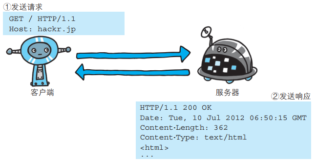

## HTTP 是不保存状态的协议  

HTTP 是一种不保存状态，即无状态（ stateless）协议。 HTTP 协议自身不对请求和响应之间的通信状态进行保存。 也就是说在 HTTP 这个级别，协议对于发送过的请求或响应都不做持久化处理。  

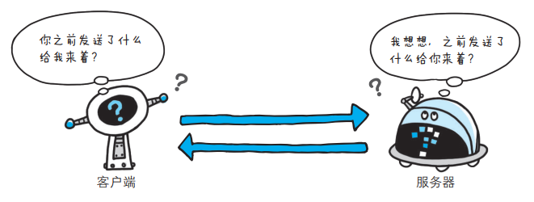

**无状态的好处：**

- 因为服务器没有“记忆能力”，所以就不需要额外的资源来记录状态信息，不仅实现上会简单一些，而且还能减轻服务器的负担
- 无状态也表示服务器都是相同的，没有状态的差异，所以可以很容易地组成集群，让负载均衡把请求转发到任意一台服务器，不会因为状态不一致导致处理出错，使用“堆机器”的“笨办法”轻松实现高并发高可用

**无状态的坏处：**

- 无法支持需要连续多个步骤的“事务”操作。例如，电商购物，首先要登录，然后添加购物车，再下单、结算、支付，这一系列操作都需要知道用户的身份才行，但“无状态”服务器是不知道这些请求是相互关联的，每次都得问一遍身份信息，不仅麻烦，而且还增加了不必要的数据传输量

## 请求 URI 定位资源  

HTTP 协议使用 URI 定位互联网上的资源。正是因为 URI 的特定功能，在互联网上任意位置的资源都能访问到。  

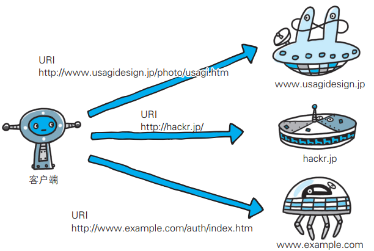

## 持久连接节省通信量  

HTTP 协议的初始版本中，每进行一次 HTTP 通信就要断开一次 TCP 连接。  

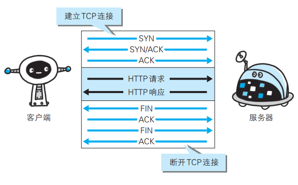

每次的请求都会造成无谓的 TCP 连接建立和断开，增加通信量的开销。  

HTTP/1.1 和一部分的 HTTP/1.0 提出了持久连接（ HTTP Persistent Connections，也称为 HTTP keep-alive 或HTTP connection reuse）的方法。持久连接的特点是，只要任意一端没有明确提出断开连接，则保持 TCP 连接状态。  

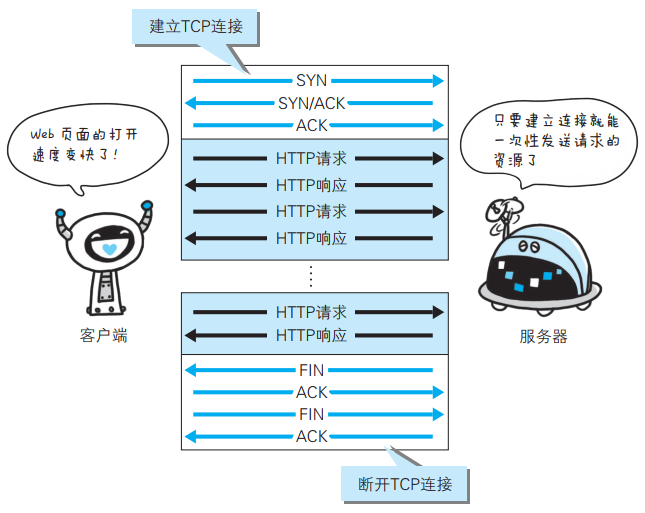

在 HTTP/1.1 中， 所有的连接默认都是持久连接，但在 HTTP/1.0 内并未标准化。 虽然有一部分服务器通过非标准的手段实现了持久连接， 但服务器端不一定能够支持持久连接。毫无疑问，除了服务器端，客户端也需要支持持久连接。   

### 管线化

持久连接使得多数请求以管线化（ pipelining）方式发送成为可能。从前发送请求后需等待并收到响应， 才能发送下一个请求。管线化技术
出现后，不用等待响应亦可直接发送下一个请求。这样就能够做到同时并行发送多个请求， 而不需要一个接一个地等待响应了。  

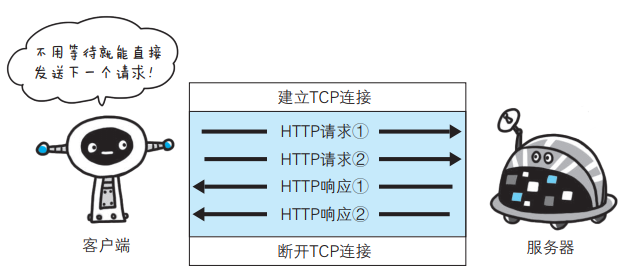

## 使用 Cookie 的状态管理  

Cookie 技术通过在请求和响应报文中写入 Cookie 信息来控制客户端的状态。

Cookie 会根据从服务器端发送的响应报文内的一个叫做 Set-Cookie的首部字段信息， 通知客户端保存 Cookie。当下次客户端再往该服务器
发送请求时，客户端会自动在请求报文中加入 Cookie 值后发送出去。

服务器端发现客户端发送过来的 Cookie 后， 会去检查究竟是从哪一个客户端发来的连接请求， 然后对比服务器上的记录，最后得到之前的状态信息。  

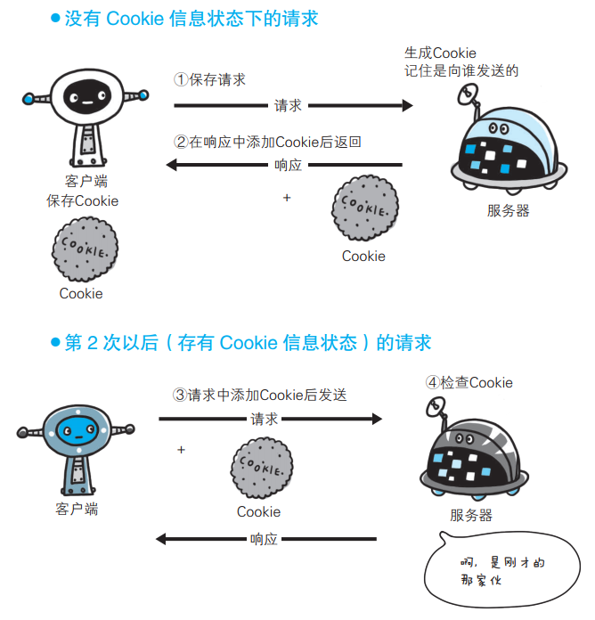

## 告知服务器意图的 HTTP 方法  

向请求 URI 指定的资源发送请求报文时，采用称为方法的命令。方法的作用在于， 可以指定请求的资源按期望产生某种行为。  

## 简单、灵活、易于扩展

HTTP 协议里的请求方法、URI、状态码、原因短语、头字段等每一个核心组成要素都没有被写死，允许开发者任意定制、扩充或解释。

“灵活、易于扩展”的特性还表现在HTTP对“可靠传输”的定义上，它不限制具体的下层协议，不仅可以使用TCP、UNIX Domain Socket，还可以使用SSL/TLS，甚至是基于UDP的QUIC，下层可以随意变化，而上层的语义则始终保持稳定。

## 明文

Http 采用明文传输。明文意思就是协议里的报文（准确地说是header部分）不使用二进制数据，而是用简单可阅读的文本形式。

- 优点：不需要借助任何外部工具，直接用肉眼就可以很容易地查看或者修改，为我们的开发调试工作带来极大的便利
- 缺点：HTTP 报文的所有信息都会暴露在“光天化日之下”，在漫长的传输链路的每一个环节上都毫无隐私可言

## 不安全

安全有很多的方面，明文只是“机密”方面的一个缺点，在“身份认证”和“完整性校验”这两方面 HTTP 也是欠缺的。

HTTP 没有提供有效的手段来确认通信双方的真实身份。虽然协议里有一个基本的认证机制，但因为刚才所说的明文传输缺点，这个机制几乎没啥作用。

HTTP 协议也不支持“完整性校验”，数据在传输过程中容易被窜改而无法验证真伪。

## 性能

HTTP 的性能，可以用六个字来概括：“不算差，不够好”。

“请求-应答”模式则加剧了 HTTP 的性能问题，这就是著名的“队头阻塞”（Head-of-line blocking），当顺序发送的请求序列中的一个请求因为某种原因被阻塞时，在后面排队的所有请求也一并被阻塞，会导致客户端迟迟收不到数据。

# HTTP 方法

##  标准方法

HTTP 1.0/1.1 支持的方法：

### GET

GET 方法用来请求访问已被 URI 识别的资源。指定的资源经服务器端解析后返回响应内容。 也就是说，如果请求的资源是文本，那就保
持原样返回； 如果是像 CGI（ Common Gateway Interface，通用网关接口）那样的程序，则返回经过执行后的输出结果。  

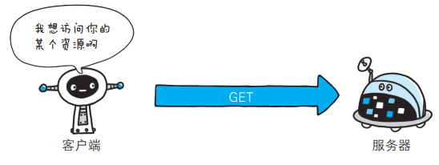

### POST

POST 方法用来传输实体的主体。  

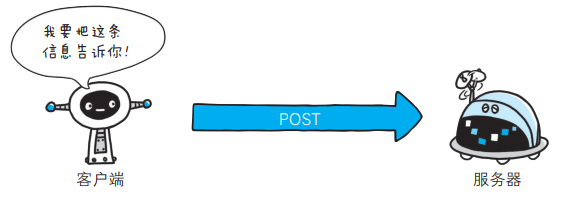

### PUT

PUT 方法用来传输文件。就像 FTP 协议的文件上传一样，要求在请求报文的主体中包含文件内容，然后保存到请求 URI 指定的位置。  

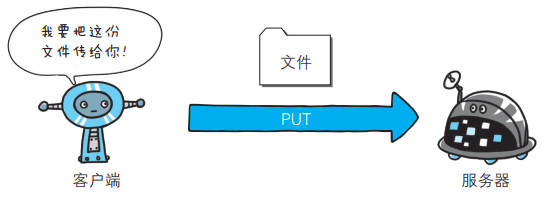

### HEAD

HEAD 方法和 GET 方法一样，只是不返回报文主体部分。用于确认URI 的有效性及资源更新的日期时间等。  

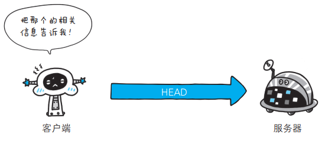

###　DELETE

DELETE 方法用来删除文件，是与 PUT 相反的方法。 DELETE 方法按请求 URI 删除指定的资源。  

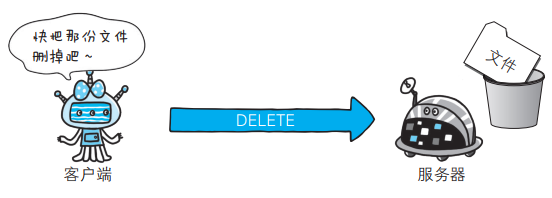

### OPTIONS

OPTIONS 方法用来查询针对请求 URI 指定的资源支持的方法。  

### TRACE

TRACE 方法是让 Web 服务器端将之前的请求通信环回给客户端的方法。  

客户端通过 TRACE 方法可以查询发送出去的请求是怎样被加工修改 / 篡改的。这是因为，请求想要连接到源目标服务器可能会通过代理中转， TRACE 方法就是用来确认连接过程中发生的一系列操作。  

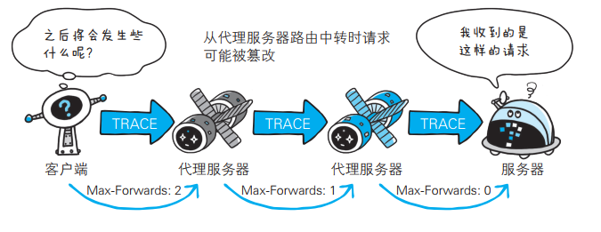

发送请求时， 在 Max-Forwards 首部字段中填入数值，每经过一个服务器端就将该数字减 1， 当数值刚好减到 0 时，就停止继续传输，最后接收到请求的服务器端则返回状态码 200 OK 的响应。  

### CONNECT

CONNECT 方法要求在与代理服务器通信时建立隧道，实现用隧道协议进行 TCP 通信。主要使用 SSL（ Secure Sockets Layer，安全套接
层）和 TLS（ Transport Layer Security，传输层安全）协议把通信内容加密后经网络隧道传输。

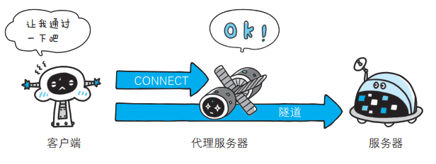

## 扩展方法

可以任意添加请求动作，只要请求方和响应方都能理解就行。

例如，MKCOL、COPY、MOVE、LOCK、UNLOCK、PATCH 等。如果有合适的场景，你也可以把它们应用到自己的系统里：

- 用 LOCK 方法锁定资源暂时不允许修改
- 用 PATCH 方法给资源打个小补丁，部分更新数据

也完全可以根据实际需求，自己发明新的方法，比如“PULL”拉取某些资源到本地，“PURGE” 清理某个目录下的所有缓存数据。

## 安全与幂等

在 HTTP 协议里，所谓的“安全”是指请求方法不会“破坏”服务器上的资源，即不会对服务器上的资源造成实质的修改。

- 只有 GET 和 HEAD 方法是“安全”的，因为它们是“只读”操作，只要服务器不故意曲解请求方法的处理方式，无论 GET 和 HEAD 操作多少次，服务器上的数据都是“安全的”
- POST/PUT/DELETE 操作会修改服务器上的资源，增加或删除数据，所以是“不安全”的

所谓的“幂等”实际上是一个数学用语，被借用到了HTTP协议里，意思是多次执行相同的操作，结果也都是相同的，即多次“幂”后结果“相等”。

- GET 和 HEAD 既是安全的也是幂等的
- DELETE 可以多次删除同一个资源，效果都是“资源不存在”，所以也是幂等的
- POST 是“新增或提交数据”，多次提交数据会创建多个资源，所以不是幂等的
- PUT 是“替换或更新数据”，多次更新一个资源，资源还是会第一次更新的状态，所以是幂等的

