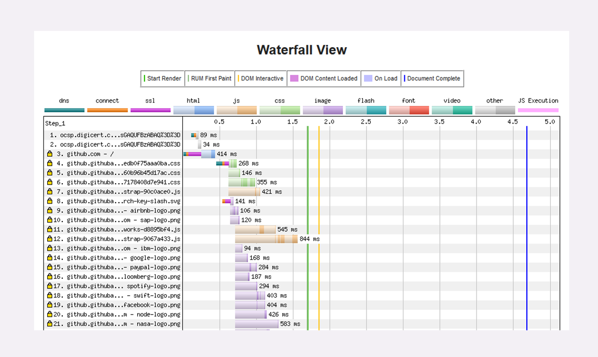
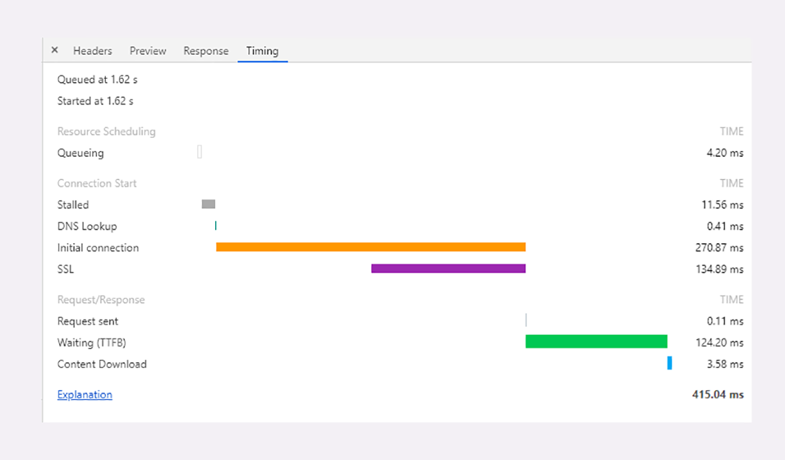
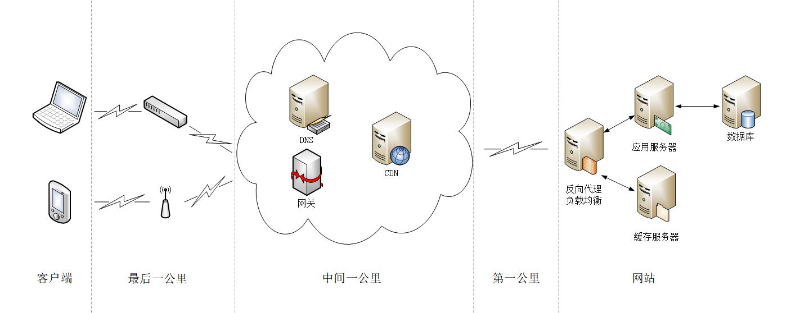

# HTTP服务器

服务器一般运行在Linux操作系统上，用Apache、Nginx等Web服务器软件对外提供服务，所以，性能的含义就是它的服务能力，也就是尽可能多、尽可能快地处理用户的请求。

衡量服务器性能的主要指标有三个：吞吐量（requests per second）、并发数（concurrency）和响应时间（time per request）：

- 吞吐量就是我们常说的RPS，每秒的请求次数，也有叫TPS、QPS，它是服务器最基本的性能指标，RPS越高就说明服务器的性能越好
- 并发数反映的是服务器的负载能力，也就是服务器能够同时支持的客户端数量，当然也是越多越好，能够服务更多的用户
- 响应时间反映的是服务器的处理能力，也就是快慢程度，响应时间越短，单位时间内服务器就能够给越多的用户提供服务，提高吞吐量和并发数

除了上面的三个基本性能指标，服务器还要考虑CPU、内存、硬盘和网卡等系统资源的占用程度，利用率过高或者过低都可能有问题。

在Linux上，最常用的性能测试工具可能就是ab（Apache Bench）了，比如，下面的命令指定了并发数100，总共发送10000个请求：

```
ab -c 100 -n 10000 'http://www.xxx.com'
```

系统资源监控方面，Linux自带的工具也非常多，常用的有uptime、top、vmstat、netstat、sar等等。

理解了这些性能指标，我们就知道了服务器的性能优化方向：合理利用系统资源，提高服务器的吞吐量和并发数，降低响应时间。

# HTTP客户端

客户端是信息的消费者，一切数据都要通过网络从服务器获取，所以它最基本的性能指标就是“延迟”（latency）。所谓的“延迟”其实就是“等待”，等待数据到达客户端时所花费的时间。但因为HTTP的传输链路很复杂，所以延迟的原因也就多种多样。

首先，我们必须谨记有一个“不可逾越”的障碍——光速，因为地理距离而导致的延迟是无法克服的，访问数千公里外的网站显然会有更大的延迟。

其次，第二个因素是带宽，它又包括接入互联网时的电缆、WiFi、4G和运营商内部网络、运营商之间网络的各种带宽，每一处都有可能成为数据传输的瓶颈，降低传输速度，增加延迟。

第三个因素是DNS查询，如果域名在本地没有缓存，就必须向DNS系统发起查询，引发一连串的网络通信成本，而在获取IP地址之前客户端只能等待，无法访问网站，

第四个因素是TCP握手，你应该对它比较熟悉了吧，必须要经过SYN、SYN/ACK、ACK三个包之后才能建立连接，它带来的延迟由光速和带宽共同决定。

建立TCP连接之后，就是正常的数据收发了，后面还有解析HTML、执行JavaScript、排版渲染等等，这些也会耗费一些时间。不过它们已经不属于HTTP了。

对于HTTP性能优化，有一个专门的测试网站“[WebPageTest](https://www.webpagetest.org)”。它的特点是在世界各地建立了很多的测试点，可以任意选择地理位置、机型、操作系统和浏览器发起测试，非常方便，用法也很简单。

网站测试的最终结果是一个直观的“瀑布图”（Waterfall Chart），清晰地列出了页面中所有资源加载的先后顺序和时间消耗：



Chrome等浏览器自带的开发者工具也可以很好地观察客户端延迟指标，面板左边有每个URI具体消耗的时间，面板的右边也是类似的瀑布图。点击某个URI，在Timing页里会显示出一个小型的“瀑布图”，是这个资源消耗时间的详细分解，延迟的原因都列的清清楚楚：



- 因为有“队头阻塞”，浏览器对每个域名最多开6个并发连接（HTTP/1.1），当页面里链接很多的时候就必须排队等待（Queued、Queueing），这里它就等待了1.62秒，然后才被浏览器正式处理
- 浏览器要预先分配资源，调度连接，花费了11.56毫秒（Stalled）
- 连接前必须要解析域名，这里因为有本地缓存，所以只消耗了0.41毫秒（DNS Lookup）
- 与网站服务器建立连接的成本很高，总共花费了270.87毫秒，其中有134.89毫秒用于TLS握手，那么TCP握手的时间就是135.98毫秒（Initial connection、SSL）
- 实际发送数据非常快，只用了0.11毫秒（Request sent）
- 之后就是等待服务器的响应，专有名词叫TTFB（Time To First Byte），也就是“首字节响应时间”，里面包括了服务器的处理时间和网络传输时间，花了124.2毫秒
- 接收数据也是非常快的，用了3.58毫秒（Content Dowload）

一次HTTP“请求-响应”的过程中延迟的时间是非常惊人的，总时间415.04毫秒里占了差不多99%。所以，客户端HTTP性能优化的关键就是：降低延迟。

# HTTP传输链路

“第一公里”，“中间一公里”和“最后一公里”（在英语原文中是mile，英里）。



“第一公里”是指网站的出口，也就是服务器接入互联网的传输线路，它的带宽直接决定了网站对外的服务能力，也就是吞吐量等指标。显然，优化性能应该在这“第一公里”加大投入，尽量购买大带宽，接入更多的运营商网络。

“中间一公里”就是由许多小网络组成的实际的互联网，其实它远不止“一公里”，而是非常非常庞大和复杂的网络，地理距离、网络互通都严重影响了传输速度。好在这里面有一个HTTP的“好帮手”——CDN，它可以帮助网站跨越“千山万水”，让这段距离看起来真的就好像只有“一公里”。

“最后一公里”是用户访问互联网的入口，对于固网用户就是光纤、网线，对于移动用户就是WiFi、基站。以前它是客户端性能的主要瓶颈，延迟大带宽小，但随着近几年4G和高速宽带的普及，“最后一公里”的情况已经好了很多，不再是制约性能的主要因素了。

# 开源

开发网站服务器自身的潜力，在现有条件不变的情况下尽量挖掘出更多的服务能力。

首先，我们应该选用高性能的Web服务器，最佳选择当然就是Nginx/OpenResty了，尽量不要选择基于Java、Python、Ruby的其他服务器，它们用来做后面的业务逻辑服务器更好。利用Nginx强大的反向代理能力实现“动静分离”，动态页面交给Tomcat、Django、Rails，图片、样式表等静态资源交给Nginx。

Nginx或者OpenResty自身也有很多配置参数可以用来进一步调优，举几个例子，比如说禁用负载均衡锁、增大连接池，绑定CPU等等，相关的资料有很多。

特别要说的是，对于HTTP协议一定要启用长连接。TCP和SSL建立新连接的成本是非常高的，有可能会占到客户端总延迟的一半以上。长连接虽然不能优化连接握手，但可以把成本“均摊”到多次请求里，这样只有第一次请求会有延迟，之后的请求就不会有连接延迟，总体的延迟也就降低了。

另外，在现代操作系统上都已经支持TCP的新特性“TCP Fast Open”（Win10、iOS9、Linux 4.1），它的效果类似TLS的“False Start”，可以在初次握手的时候就传输数据，也就是0-RTT，所以我们应该尽可能在操作系统和Nginx里开启这个特性，减少外网和内网里的握手延迟。

# 节流

“节流”是指减少客户端和服务器之间收发的数据量，在有限的带宽里传输更多的内容。

“节流”最基本的做法就是使用HTTP协议内置的“数据压缩”编码，不仅可以选择标准的gzip，还可以积极尝试新的压缩算法br，它有更好的压缩效果。不过在数据压缩的时候应当注意选择适当的压缩率，不要追求最高压缩比，否则会耗费服务器的计算资源，增加响应时间，降低服务能力，反而会“得不偿失”。

HTML/CSS/JavaScript属于纯文本，就可以采用特殊的“压缩”，去掉源码里多余的空格、换行、注释等元素。这样“压缩”之后的文本虽然看起来很混乱，对“人类”不友好，但计算机仍然能够毫无障碍地阅读，不影响浏览器上的运行效果。

图片在HTTP传输里占有非常高的比例，虽然它本身已经被压缩过了，不能被gzip、br处理，但仍然有优化的空间。比如说，去除图片里的拍摄时间、地点、机型等元数据，适当降低分辨率，缩小尺寸。图片的格式也很关键，尽量选择高压缩率的格式，有损格式应该用JPEG，无损格式应该用Webp格式。

对于小文本或者小图片，还有一种叫做“资源合并”（Concatenation）的优化方式，就是把许多小资源合并成一个大资源，用一个请求全下载到客户端，然后客户端再用JavaScript、CSS切分后使用，好处是节省了请求次数，但缺点是处理比较麻烦。

网站经常会使用Cookie来记录用户的数据，浏览器访问网站时每次都会带上Cookie，冗余度很高。所以应当少使用Cookie，减少Cookie记录的数据量，总使用domain和path属性限定Cookie的作用域，尽可能减少Cookie的传输。如果客户端是现代浏览器，还可以使用HTML5里定义的Web Local Storage，避免使用Cookie。

压缩之外，“节流”还有两个优化点，就是域名和重定向。

DNS解析域名会耗费不少的时间，如果网站拥有多个域名，那么域名解析获取IP地址就是一个不小的成本，所以应当适当“收缩”域名，限制在两三个左右，减少解析完整域名所需的时间，让客户端尽快从系统缓存里获取解析结果。

重定向引发的客户端延迟也很高，它不仅增加了一次请求往返，还有可能导致新域名的DNS解析，是HTTP前端性能优化的“大忌”。除非必要，应当尽量不使用重定向，或者使用Web服务器的“内部重定向”。

# 缓存

在网站系统内部，可以使用Memcache、Redis、Varnish等专门的缓存服务，把计算的中间结果和资源存储在内存或者硬盘里，Web服务器首先检查缓存系统，如果有数据就立即返回给客户端，省去了访问后台服务的时间。

在“中间一公里”，缓存更是性能优化的重要手段，CDN的网络加速功能就是建立在缓存的基础之上的，可以这么说，如果没有缓存，那就没有CDN。

# HTTP/2

HTTP/2的很多优点，它消除了应用层的队头阻塞，拥有头部压缩、二进制帧、多路复用、流量控制、服务器推送等许多新特性，大幅度提升了HTTP的传输效率。

实际上这些特性也是在“开源”和“节流”这两点上做文章，但因为这些都已经内置在了协议内，所以只要换上HTTP/2，网站就能够立刻获得显著的性能提升。

不过你要注意，一些在HTTP/1里的优化手段到了HTTP/2里会有“反效果”。

对于HTTP/2来说，一个域名使用一个TCP连接才能够获得最佳性能，如果开多个域名，就会浪费带宽和服务器资源，也会降低HTTP/2的效率，所以“域名收缩”在HTTP/2里是必须要做的。

“资源合并”在HTTP/1里减少了多次请求的成本，但在HTTP/2里因为有头部压缩和多路复用，传输小文件的成本很低，所以合并就失去了意义。而且“资源合并”还有一个缺点，就是降低了缓存的可用性，只要一个小文件更新，整个缓存就完全失效，必须重新下载。

所以在现在的大带宽和CDN应用场景下，应当尽量少用资源合并（JavaScript、CSS图片合并，数据内嵌），让资源的粒度尽可能地小，才能更好地发挥缓存的作用。


