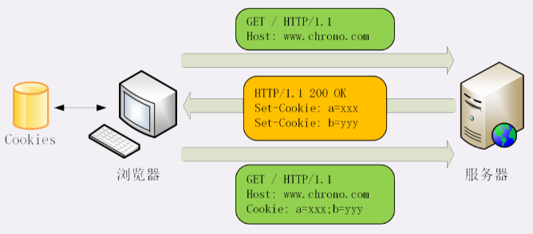

HTTP是“无状态”的，这既是优点也是缺点。优点是服务器没有状态差异，可以很容易地组成集群，而缺点就是无法支持需要记录状态的事务操作。好在HTTP协议是可扩展的，后来发明的Cookie技术，给HTTP增加了“记忆能力”。

# 什么是Cookie？

Cookie 机制相当于是服务器给每个客户端都贴上一张小纸条，上面写了一些只有服务器才能理解的数据，需要的时候客户端把这些信息发给服务器，服务器看到Cookie，就能够认出对方是谁了。

# Cookie的工作过程

Cookie 的传递需要用到两个字段：响应头字段 Set-Cookie 和请求头字段 Cookie。

当用户通过浏览器第一次访问服务器的时候，服务器肯定是不知道他的身份的。所以，就要创建一个独特的身份标识数据，格式是“key=value”，然后放进Set-Cookie字段里，随着响应报文一同发给浏览器。浏览器收到响应报文，看到里面有Set-Cookie，知道这是服务器给的身份标识，于是就保存起来，下次再请求的时候就自动把这个值放进Cookie字段里发给服务器。

因为第二次请求里面有了Cookie字段，服务器就知道这个用户不是新人，之前来过，就可以拿出Cookie里的值，识别出用户的身份，然后提供个性化的服务。不过因为服务器的“记忆能力”实在是太差，，服务器有时会在响应头里添加多个Set-Cookie，存储多个“key=value”。但浏览器这边发送时不需要用多个Cookie字段，只要在一行里用“;”隔开就行。

Cookie是由浏览器负责存储的，而不是操作系统。所以，它是“浏览器绑定”的，只能在本浏览器内生效。

# Cookie的属性

Cookie就是服务器委托浏览器存储在客户端里的一些数据，而这些数据通常都会记录用户的关键识别信息。所以，就需要在“key=value”外再用一些手段来保护，防止外泄或窃取，这些手段就是Cookie的属性。

首先应该设置Cookie的生存周期，也就是它的有效期，让它只能在一段时间内可用，一旦超过这个期限浏览器就认为是Cookie失效，在存储里删除，也不会发送给服务器。Cookie的有效期可以使用Expires和Max-Age两个属性来设置：

- “Expires”俗称“过期时间”，用的是绝对时间点，可以理解为“截止日期”（deadline）。
- “Max-Age”用的是相对时间，单位是秒，浏览器用收到报文的时间点再加上Max-Age，就可以得到失效的绝对时间

Expires和Max-Age可以同时出现，两者的失效时间可以一致，也可以不一致，但浏览器会优先采用Max-Age计算失效期。

其次，我们需要设置Cookie的作用域，让浏览器仅发送给特定的服务器和URI，避免被其他网站盗用。

作用域的设置比较简单，“Domain”和“Path”指定了Cookie所属的域名和路径，浏览器在发送Cookie前会从URI中提取出host和path部分，对比Cookie的属性。如果不满足条件，就不会在请求头里发送Cookie。使用这两个属性可以为不同的域名和路径分别设置各自的Cookie。

最后要考虑的就是Cookie的安全性，尽量不要让服务器以外的人看到，属性“HttpOnly”会告诉浏览器，此Cookie只能通过浏览器HTTP协议传输，禁止其他方式访问。

属性“SameSite”可以防范“跨站请求伪造”（XSRF）攻击，设置成“SameSite=Strict”可以严格限定Cookie不能随着跳转链接跨站发送，而“SameSite=Lax”则略宽松一点，允许GET/HEAD等安全方法，但禁止POST跨站发送。

属性“Secure”，表示这个Cookie仅能用HTTPS协议加密传输，明文的HTTP协议会禁止发送。但Cookie本身不是加密的，浏览器里还是以明文的形式存在。

# Cookie的应用

Cookie最基本的一个用途就是身份识别，保存用户的登录信息，实现会话事务。比如，你用账号和密码登录某电商，登录成功后网站服务器就会发给浏览器一个Cookie，内容大概是“name=yourid”，这样就成功地把身份标签贴在了你身上。之后你在网站里随便访问哪件商品的页面，浏览器都会自动把身份Cookie发给服务器，所以服务器总会知道你的身份，一方面免去了重复登录的麻烦，另一方面也能够自动记录你的浏览记录和购物下单。

Cookie的另一个常见用途是广告跟踪。你上网的时候肯定看过很多的广告图片，这些图片背后都是广告商网站，它会“偷偷地”给你贴上Cookie小纸条，这样你上其他的网站，别的广告就能用Cookie读出你的身份，然后做行为分析，再推给你广告。这种Cookie不是由访问的主站存储的，所以又叫“第三方Cookie”（third-party cookie）。

为了防止滥用Cookie搜集用户隐私，互联网组织相继提出了DNT（Do Not Track）和P3P（Platform for Privacy Preferences Project），但实际作用不大。