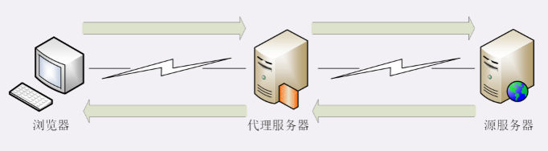
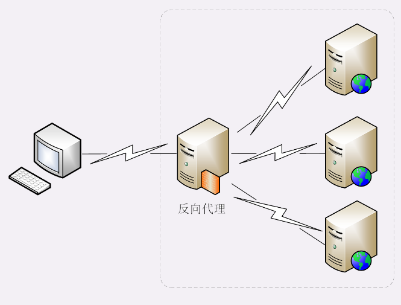
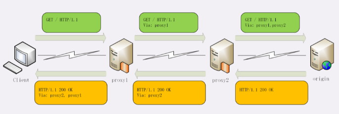
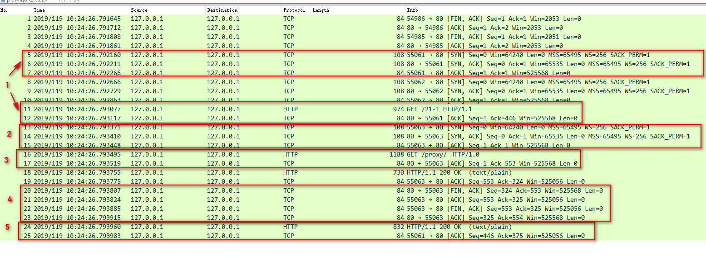
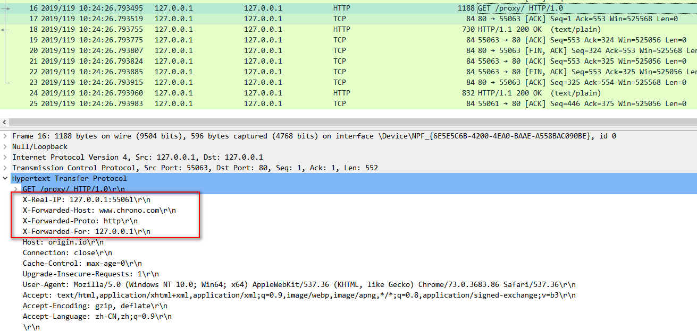

引入HTTP代理后，原来简单的双方通信就变复杂了一些，加入了一个或者多个中间人，但整体上来看，还是一个有顺序关系的链条，而且链条里相邻的两个角色仍然是简单的一对一通信，不会出现越级的情况。



链条的起点还是客户端（也就是浏览器），中间的角色被称为代理服务器（proxy server），链条的终点被称为源服务器（origin server），意思是数据的“源头”“起源”。

# 代理服务

代理就是在客户端和服务器原本的通信链路中插入的一个中间环节，也是一台服务器，但提供的是“代理服务”。所谓的“代理服务”就是指服务本身不生产内容，而是处于中间位置转发上下游的请求和响应，具有双重身份：面向下游的用户时，表现为服务器，代表源服务器响应客户端的请求；而面向上游的源服务器时，又表现为客户端，代表客户端发送请求。

#　代理的作用

由于代理处在HTTP通信过程的中间位置，相应地就对上屏蔽了真实客户端，对下屏蔽了真实服务器，简单的说就是“欺上瞒下”。在这个中间层的“小天地”里就可以做很多的事情，为HTTP协议增加更多的灵活性，实现客户端和服务器的“双赢”。

代理最基本的一个功能是负载均衡。因为在面向客户端时屏蔽了源服务器，客户端看到的只是代理服务器，源服务器究竟有多少台、是哪些IP地址都不知道。于是代理服务器就可以掌握请求分发的“大权”，决定由后面的哪台服务器来响应请求。



在负载均衡的同时，代理服务还可以执行更多的功能，比如：

- 健康检查：使用“心跳”等机制监控后端服务器，发现有故障就及时“踢出”集群，保证服务高可用；
- 安全防护：保护被代理的后端服务器，限制IP地址或流量，抵御网络攻击和过载；
- 加密卸载：对外网使用SSL/TLS加密通信认证，而在安全的内网不加密，消除加解密成本；
- 数据过滤：拦截上下行的数据，任意指定策略修改请求或者响应；
- 内容缓存：暂存、复用服务器响应

# 代理相关头字段

首先，代理服务器需要用字段“Via”标明代理的身份。Via是一个通用字段，请求头或响应头里都可以出现。每当报文经过一个代理节点，代理服务器就会把自身的信息追加到字段的末尾。如果通信链路中有很多中间代理，就会在Via里形成一个链表，这样就可以知道报文究竟走过了多少个环节才到达了目的地。

例如，下图中有两个代理：proxy1和proxy2，客户端发送请求会经过这两个代理，依次添加就是“Via: proxy1, proxy2”，等到服务器返回响应报文的时候就要反过来走，头字段就是“Via: proxy2, proxy1”。



Via字段只解决了客户端和源服务器判断是否存在代理的问题，还不能知道对方的真实信息。但服务器的IP地址应该是保密的，关系到企业的内网安全，所以一般不会让客户端知道。不过反过来，通常服务器需要知道客户端的真实IP地址，方便做访问控制、用户画像、统计分析。

可惜的是HTTP标准里并没有为此定义头字段，但已经出现了很多“事实上的标准”，最常用的两个头字段是“X-Forwarded-For”和“X-Real-IP”。

“X-Forwarded-For”的字面意思是“为谁而转发”，形式上和“Via”差不多，也是每经过一个代理节点就会在字段里追加一个信息。但“Via”追加的是代理主机名（或者域名），而“X-Forwarded-For”追加的是请求方的IP地址。所以，在字段里最左边的IP地址就客户端的地址。

“X-Real-IP”是另一种获取客户端真实IP的手段，它的作用很简单，就是记录客户端IP地址，没有中间的代理信息，相当于是“X-Forwarded-For”的简化版。如果客户端和源服务器之间只有一个代理，那么这两个字段的值就是相同的。





从抓包里就可以清晰地看出代理与客户端、源服务器的通信过程：

- 客户端55061先用三次握手连接到代理的80端口，然后发送GET请求
- 代理不直接生产内容，所以就代表客户端，用55063端口连接到源服务器，也是三次握手
- 代理成功连接源服务器后，发出了一个HTTP/1.0 的GET请求
- 因为HTTP/1.0默认是短连接，所以源服务器发送响应报文后立即用四次挥手关闭连接
- 代理拿到响应报文后再发回给客户端，完成了一次代理服务

“X-Forwarded-Host”和“X-Forwarded-Proto”，它们的作用与“X-Real-IP”类似，只记录客户端的信息，分别是客户端请求的原始域名和原始协议名。

# 代理协议

“代理协议”（The PROXY protocol），它由知名的代理软件HAProxy所定义，也是一个“事实标准”，被广泛采用（注意并不是RFC）。“代理协议”有v1和v2两个版本，v1和HTTP差不多，也是明文，而v2是二进制格式。v1 在HTTP报文前增加了一行ASCII码文本，相当于又多了一个头。

这一行文本其实非常简单，开头必须是“PROXY”五个大写字母，然后是“TCP4”或者“TCP6”，表示客户端的IP地址类型，再后面是请求方地址、应答方地址、请求方端口号、应答方端口号，最后用一个回车换行（\r\n）结束。

例如下面的这个例子，在GET请求行前多出了PROXY信息行，客户端的真实IP地址是“1.1.1.1”，端口号是55555。

```
PROXY TCP4 1.1.1.1 2.2.2.2 55555 80\r\n
GET / HTTP/1.1\r\n
Host: www.xxx.com\r\n
\r\n
```

服务器看到这样的报文，只要解析第一行就可以拿到客户端地址，不需要再去理会后面的HTTP数据，省了很多事情。

不过代理协议并不支持“X-Forwarded-For”的链式地址形式，所以拿到客户端地址后再如何处理就需要代理服务器与后端自行约定。