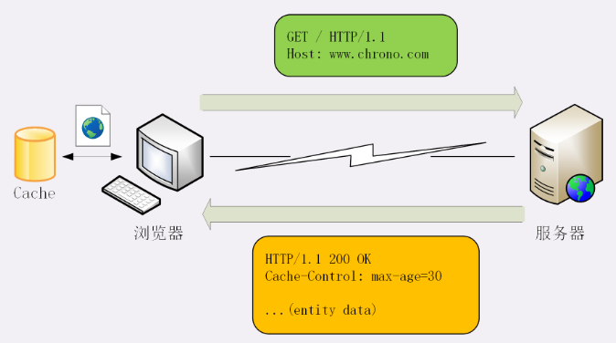
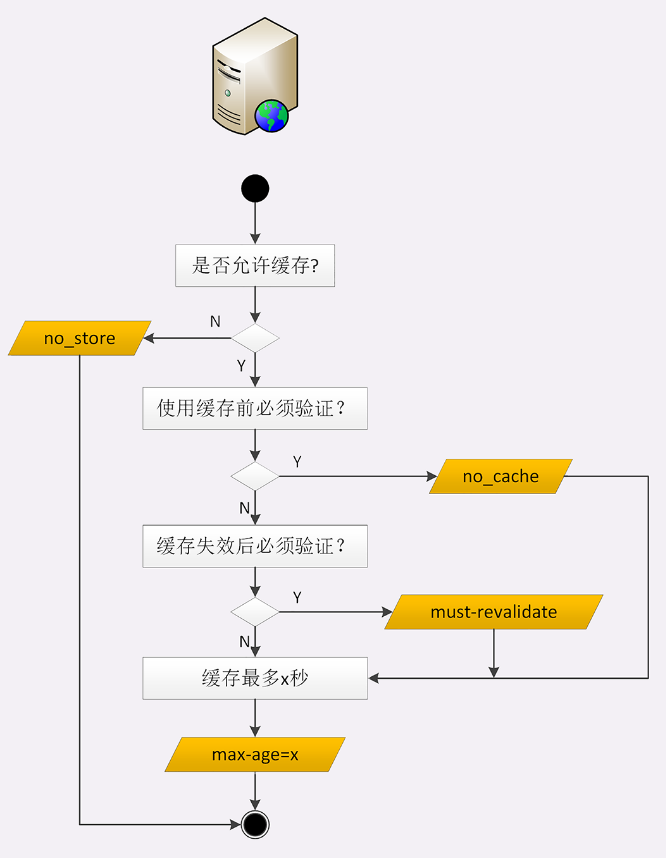
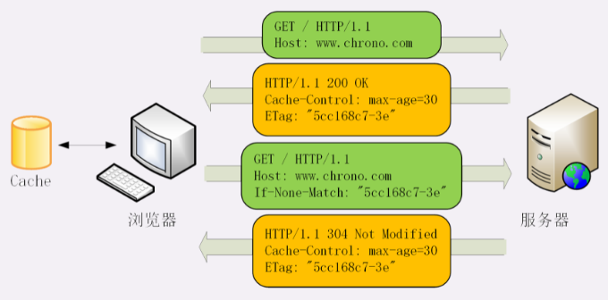

由于链路漫长，网络时延不可控，浏览器使用HTTP获取资源的成本较高。所以，非常有必要把“来之不易”的数据缓存起来，下次再请求的时候尽可能地复用。这样，就可以避免多次请求-应答的通信成本，节约网络带宽，也可以加快响应速度。

实际上，HTTP传输的每一个环节基本上都会有缓存，非常复杂。基于“请求-应答”模式的特点，可以大致分为客户端缓存和服务器端缓存。

#　服务器的缓存控制

整个流程翻译成HTTP就是：

- 浏览器发现缓存无数据，于是发送请求，向服务器获取资源
- 服务器响应请求，返回资源，同时标记资源的有效期
- 浏览器缓存资源，等待下次重用

服务器标记资源有效期使用的头字段是“Cache-Control”，里面的值“max-age=30”就是资源的有效时间，相当于告诉浏览器，“这个页面只能缓存30秒，之后就算是过期，不能用。这里的max-age是“生存时间”（又叫“新鲜度”“缓存寿命”），时间的计算起点是响应报文的创建时刻（即Date字段，也就是离开服务器的时刻），而不是客户端收到报文的时刻，也就是说包含了在链路传输过程中所有节点所停留的时间。

- no_store：不允许缓存，用于某些变化非常频繁的数据，例如，秒杀页面
- no_cache：它的字面含义容易与no_store搞混，实际的意思并不是不允许缓存，而是可以缓存，但在使用之前必须要去服务器验证是否过期，是否有最新的版本
- must-revalidate：又是一个和no_cache相似的词，它的意思是如果缓存不过期就可以继续使用，但过期了如果还想用就必须去服务器验证

# 客户端的缓存控制

其实不止服务器可以发“Cache-Control”头，浏览器也可以发“Cache-Control”，也就是说请求-应答的双方都可以用这个字段进行缓存控制，互相协商缓存的使用策略。

当点“刷新”按钮的时候，浏览器会在请求头里加一个“Cache-Control: max-age=0”。因为max-age是“生存时间”，而本地缓存里的数据至少保存了几秒钟，所以浏览器就不会使用缓存，而是向服务器发请求。服务器看到max-age=0，也就会用一个最新生成的报文回应浏览器。

Ctrl+F5的“强制刷新”，其实是发了一个“Cache-Control: no-cache”，含义和“max-age=0”基本一样，就看后台的服务器怎么理解，通常两者的效果是相同的。

在“前进”“后退”“跳转”这些重定向动作中浏览器不会“夹带私货”，只用最基本的请求头，没有“Cache-Control”，所以就会检查缓存，直接利用之前的资源，不再进行网络通信。可以发现“from disk cache”的字样，意思是没有发送网络请求，而是读取的磁盘上的缓存。

## 条件请求

浏览器可以用两个连续的请求组成“验证动作”：先是一个HEAD，获取资源的修改时间等元信息，然后与缓存数据比较，如果没有改动就使用缓存，节省网络流量，否则就再发一个GET请求，获取最新的版本。但这样的两个请求网络成本太高了，所以HTTP协议就定义了一系列“If”开头的“条件请求”字段，专门用来检查验证资源是否过期，把两个请求才能完成的工作合并在一个请求里做。而且，验证的责任也交给服务器，浏览器只需“坐享其成”。

条件请求一共有5个头字段，我们最常用的是“if-Modified-Since”和“If-None-Match”这两个。需要第一次的响应报文预先提供“Last-modified”和“ETag”，然后第二次请求时就可以带上缓存里的原值，验证资源是否是最新的。如果资源没有变，服务器就回应一个“304 Not Modified”，表示缓存依然有效，浏览器就可以更新一下有效期，然后放心大胆地使用缓存了。

“Last-modified”很好理解，就是文件的最后修改时间。

ETag是“实体标签”（Entity Tag）的缩写，是资源的一个唯一标识，主要是用来解决修改时间无法准确区分文件变化的问题。

ETag还有“强”“弱”之分：强ETag要求资源在字节级别必须完全相符，弱ETag在值前有个“W/”标记，只要求资源在语义上没有变化，但内部可能会有部分发生了改变（例如HTML里的标签顺序调整，或者多了几个空格）。

条件请求里其他的三个头字段是“If-Unmodified-Since”“If-Match”和“If-Range”。

