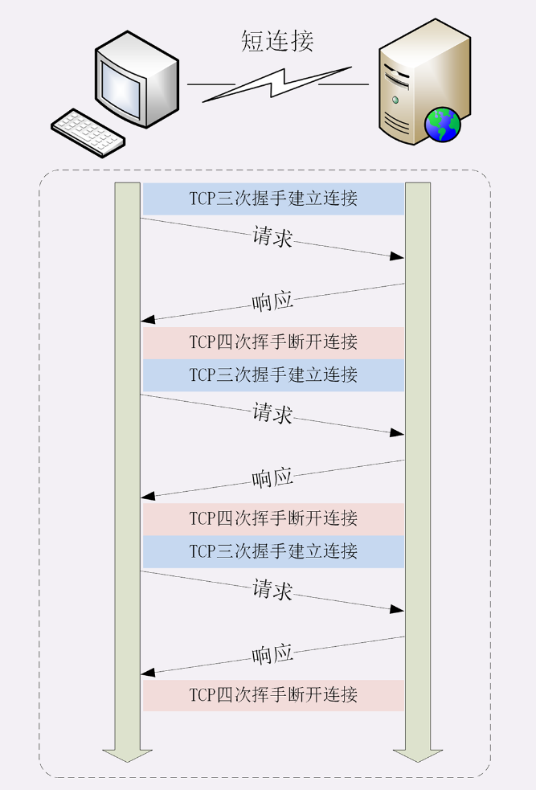
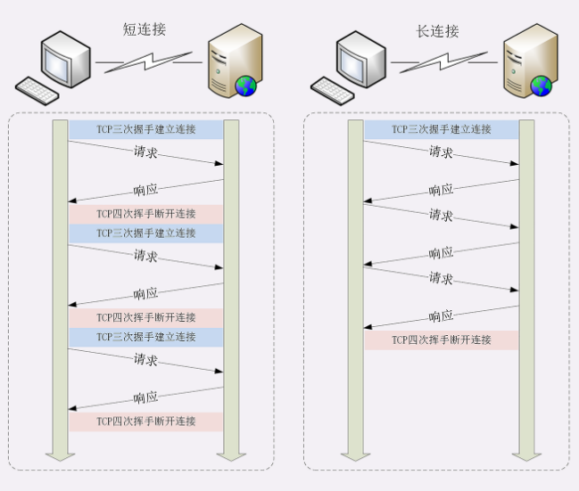
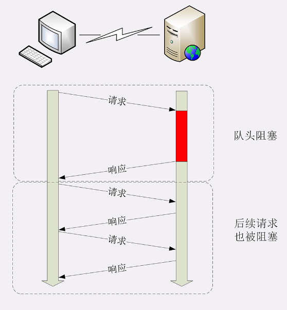

# 短连接

HTTP协议最初（0.9/1.0）是个非常简单的协议，通信过程也采用了简单的“请求-应答”方式。

它底层的数据传输基于TCP/IP，每次发送请求前需要先与服务器建立连接，收到响应报文后会立即关闭连接。

因为客户端与服务器的整个连接过程很短暂，不会与服务器保持长时间的连接状态，所以就被称为“短连接”（short-lived connections）。早期的HTTP协议也被称为是“无连接”的协议。

短连接的缺点相当严重，因为在TCP协议里，建立连接和关闭连接都是非常“昂贵”的操作。TCP建立连接要有“三次握手”，发送3个数据包，需要1个RTT；关闭连接是“四次挥手”，4个数据包需要2个RTT。而HTTP的一次简单“请求-响应”通常只需要4个包，如果不算服务器内部的处理时间，最多是2个RTT。这么算下来，浪费的时间就是“3÷5=60%”，有三分之二的时间被浪费掉了，传输效率低得惊人。

# 长连接

针对短连接暴露出的缺点，HTTP协议就提出了“长连接”的通信方式，也叫“持久连接”（persistent connections）、“连接保活”（keep alive）、“连接复用”（connection reuse）。其实解决办法也很简单，用的就是“成本均摊”的思路，既然TCP的连接和关闭非常耗时间，那么就把这个时间成本由原来的一个“请求-应答”均摊到多个“请求-应答”上。这样虽然不能改善TCP的连接效率，但基于“分母效应”，每个“请求-应答”的无效时间就会降低不少，整体传输效率也就提高了。

在短连接里发送了三次HTTP“请求-应答”，每次都会浪费60%的RTT时间。而在长连接的情况下，同样发送三次请求，因为只在第一次时建立连接，在最后一次时关闭连接，所以浪费率就是“3÷9≈33%”，降低了差不多一半的时间损耗。显然，如果在这个长连接上发送的请求越多，分母就越大，利用率也就越高。

# 连接相关的头字段

由于长连接对性能的改善效果非常显著，所以在HTTP/1.1中的连接都会默认启用长连接。不需要用什么特殊的头字段指定，只要向服务器发送了第一次请求，后续的请求都会重复利用第一次打开的TCP连接，也就是长连接，在这个连接上收发数据。当然，我们也可以在请求头里明确地要求使用长连接机制，使用的字段是Connection，值是“keep-alive”。

不过不管客户端是否显式要求长连接，如果服务器支持长连接，它总会在响应报文里放一个“Connection: keep-alive”字段，告诉客户端：“我是支持长连接的，接下来就用这个TCP一直收发数据吧”。

不过长连接也有一些小缺点，因为TCP连接长时间不关闭，服务器必须在内存里保存它的状态，这就占用了服务器的资源。如果有大量的空闲长连接只连不发，就会很快耗尽服务器的资源，导致服务器无法为真正有需要的用户提供服务。

所以，长连接也需要在恰当的时间关闭，不能永远保持与服务器的连接，这在客户端或者服务器都可以做到。

在客户端，可以在请求头里加上“Connection: close”字段，告诉服务器：“这次通信后就关闭连接”。服务器看到这个字段，就知道客户端要主动关闭连接，于是在响应报文里也加上这个字段，发送之后就调用Socket API关闭TCP连接。

服务器端通常不会主动关闭连接，但也可以使用一些策略：

- 设置长连接的超时时间，如果在一段时间内连接上没有任何数据收发就主动断开连接，避免空闲连接占用系统资源
- 设置长连接上可发送的最大请求次数，超过这个最大次数，也会主动断开连接

#　队头阻塞

“队头阻塞”与短连接和长连接无关，而是由HTTP基本的“请求-应答”模型所导致的。

因为HTTP规定报文必须是“一发一收”，这就形成了一个先进先出的“串行”队列。队列里的请求没有轻重缓急的优先级，只有入队的先后顺序，排在最前面的请求被最优先处理。

如果队首的请求因为处理的太慢耽误了时间，那么队列里后面的所有请求也不得不跟着一起等待，结果就是其他的请求承担了不应有的时间成本。

## 性能优化

因为“请求-应答”模型不能变，所以“队头阻塞”问题在HTTP/1.1里无法解决，只能缓解。

这在HTTP里就是“并发连接”（concurrent connections），也就是同时对一个域名发起多个长连接，用数量来解决质量的问题。

但这种方式也存在缺陷。如果每个客户端都想自己快，建立很多个连接，用户数×并发数就会是个天文数字。服务器的资源根本就扛不住，或者被服务器认为是恶意攻击，反而会造成“拒绝服务”。所以，HTTP协议建议客户端使用并发，但不能“滥用”并发。

还有一种方法称为 "域名分片"，还是用数量来解决质量的思路。多开几个域名，比如，`shard1.chrono.com`、`shard2.chrono.com`，而这些域名都指向同一台服务器 `www.chrono.com`，这样实际长连接的数量就又上去了。

