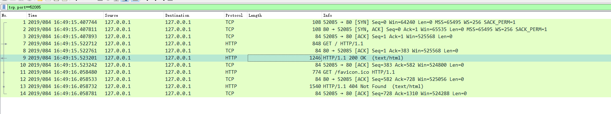
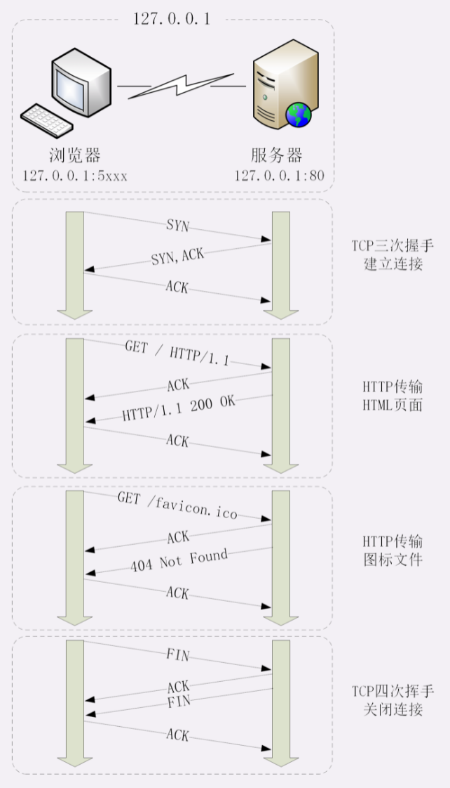
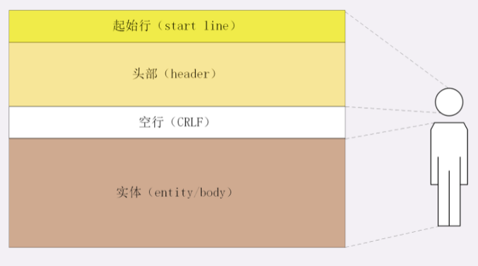
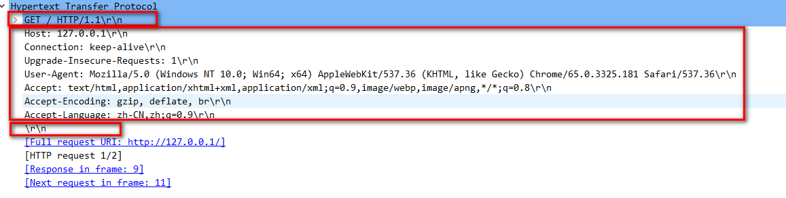
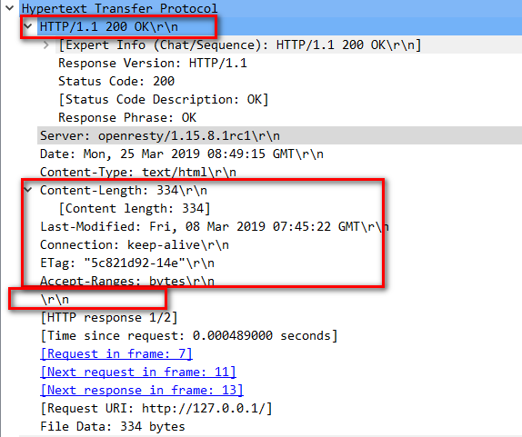
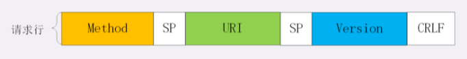
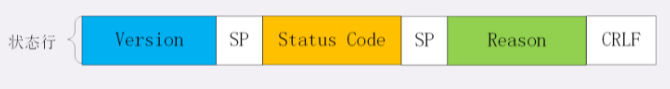
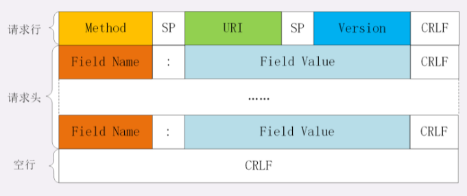
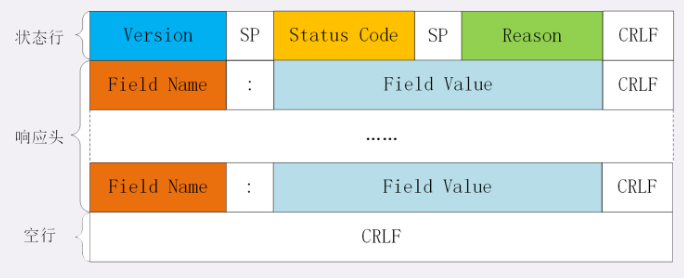

# Http 协议用于客户端和服务端通信

使用 Wireshark 抓包：



- 最开始的三个抓包，浏览器使用的端口是 52085，服务器使用的端口是 80，经过 SYN、SYN/ACK、ACK 的三个包之后，浏览器与服务器的 TCP 连接就建立起来了
- 有了可靠的 TCP 连接通道后，HTTP 协议就可以开始工作了。于是，浏览器按照HTTP协议规定的格式，通过 TCP 发送了一个 “GET / HTTP/1.1” 请求报文，也就是第四个包
- Web 服务器回复了第五个包，在 TCP 协议层面确认：“刚才的报文我已经收到了”，不过这个 TCP 包 HTTP 协议是看不见的
- Web 服务器收到报文后在内部就要处理这个请求。同样也是依据HTTP协议的规定，解析报文，浏览器请求的是根目录下的默认文件，于是从磁盘上把那个文件全读出来，再拼成符合 HTTP 格式的报文发回去，这就是 Wireshark 里的第六个包 “HTTP/1.1 200 OK”，底层走的还是 TCP 协议
- 同样的，浏览器也要给服务器回复一个 TCP 的 ACK 确认，即第七个包
- 之后还有两个来回，共四个包，重复了相同的步骤
- TCP关闭连接的 “四次挥手” 在抓包里没有出现，这是因为HTTP/1.1长连接特性，默认不会立即关闭连接



简述一下这次简单的浏览器HTTP请求过程：

- 浏览器从地址栏的输入中获得服务器的 IP 地址和端口号
- 浏览器用 TCP 的三次握手与服务器建立连接
- 浏览器向服务器发送拼好的报文
- 服务器收到报文后处理请求，同样拼好报文再发给浏览器
- 浏览器解析报文，渲染输出页面

# Http 报文结构

HTTP 协议也是与 TCP/UDP 类似，同样也需要在实际传输的数据前附加一些头数据，不过与 TCP/UDP 不同的是，它是一个“纯文本”的协议，所以头数据都是 ASCII 码的文本，可以很容易阅读。

HTTP 协议的请求报文和响应报文的结构基本相同，由三大部分组成：

- 起始行（start line）：描述请求或响应的基本信息
- 头部字段集合（header）：使用 key-value 形式更详细地说明报文
- 消息正文（entity）：实际传输的数据，它不一定是纯文本，可以是图片、视频等二进制数据

这其中前两部分起始行和头部字段经常又合称为“请求头”或“响应头”，消息正文又称为“实体”，但与“header”对应，很多时候就直接称为“body”。

HTTP 协议规定报文必须有 header，但可以没有 body，而且在 header 之后必须要有一个“空行”，也就是“CRLF”，十六进制的“0D0A”。所以，一个完整的HTTP报文就像是下图的这个样子，注意在header和body之间有一个“空行”：



在很多时候，特别是浏览器发送 GET 请求的时候都是这样，HTTP 报文经常是只有 header 而没 body，Wireshark 抓包：



- 第一行 “GET / HTTP/1.1” 就是请求行
- 后面的 “Host”，“Connection” 等等都属于 header
- 报文的最后是一个空白行结束，没有body



## 起始行

### 请求行

请求行（request line），它简要地描述了客户端想要如何操作服务器端的资源。

请求行由三部分构成：

- 请求方法：是一个动词，如 GET/POST，表示对资源的操作
- 请求目标：通常是一个 URI，标记了请求方法要操作的资源
- 版本号：表示报文使用的 HTTP 协议版本

这三个部分通常使用空格来分隔，最后要用 CRLF 换行表示结束。




Wireshark 抓包的数据：

```
GET / HTTP/1.1
```

- “GET” 是请求方法
- “/” 是请求目标，表示想要获取网站根目录下的默认文件
- “HTTP/1.1” 是版本号，表示协议版本号是1.1

### 状态行

响应报文里的起始行称为“状态行”（status line），意思是服务器响应的状态。

状态行也是由三部分构成：

- 版本号：表示报文使用的HTTP协议版本
- 状态码：一个三位数，用代码的形式表示处理的结果，比如200是成功，500是服务器错误
- 原因：作为数字状态码补充，是更详细的解释文字，帮助人理解原因



Wireshark 抓包的数据：

```
HTTP/1.1 200 OK
```

这个报文使用的协议版本号是 1.1，状态码是 200，一切 OK。

## 头部字段

请求行或状态行再加上头部字段集合就构成了HTTP报文里完整的请求头或响应头：





请求头和响应头的结构是基本一样的，唯一的区别是起始行。

头部字段是 key-value 的形式，key 和 value 之间用 “:” 分隔，最后用 CRLF 换行表示字段结束。比如在 “Host: 127.0.0.1” 这一行里 key 就是 “Host”，value 就是 “127.0.0.1”。

HTTP 头字段非常灵活，不仅可以使用标准里的 Host、Connection 等已有头，也可以任意添加自定义头，这就给 HTTP 协议带来了无限的扩展可能。

不过使用头字段需要注意下面几点：

- 字段名不区分大小写，例如，“Host”也可以写成“host”，但首字母大写的可读性更好
- 字段名里不允许出现空格，可以使用连字符“-”，但不能使用下划线“_”。例如，“test-name”是合法的字段名，而“test name”，“test_name”是不正确的字段名
- 字段名后面必须紧接着“:”，不能有空格，而“:”后的字段值前可以有多个空格
- 字段的顺序是没有意义的，可以任意排列不影响语义
- 字段原则上不能重复，除非这个字段本身的语义允许，例如，Set-Cookie

###　常用头字段

HTTP 协议规定了非常多的头部字段，实现各种各样的功能，但基本上可以分为四大类：

- 通用字段：在请求头和响应头里都可以出现
- 请求字段：仅能出现在请求头里，进一步说明请求信息或者额外的附加条件
- 响应字段：仅能出现在响应头里，补充说明响应报文的信息
- 实体字段：它实际上属于通用字段，但专门描述 body 的额外信息

对 HTTP 报文的解析和处理实际上主要就是对头字段的处理，理解了头字段也就理解了 HTTP 报文。

- **Host**：属于请求字段，只能出现在请求头里，它同时也是唯一一个 HTTP/1.1 规范里要求必须出现的字段，也就是说，如果请求头里没有 Host，那这就是一个错误的报文，Host 字段告诉服务器这个请求应该由哪个主机来处理，当一台计算机上托管了多个虚拟主机的时候，服务器端就需要用 Host 字段来选择
- **User-Agent**：属于请求字段，只出现在请求头里。它使用一个字符串来描述发起 HTTP 请求的客户端，服务器可以依据它来返回最合适此浏览器显示的页面
- **Date**：是一个通用字段，但通常出现在响应头里，表示HTTP报文创建的时间，客户端可以使用这个时间再搭配其他字段决定缓存策略
- **Server**：是响应字段，只能出现在响应头里。它告诉客户端当前正在提供 Web 服务的软件名称和版本号，Server 字段也不是必须要出现的，因为这会把服务器的一部分信息暴露给外界

实体字段里**Content-Length**，它表示报文里 body 的长度，也就是请求头或响应头空行后面数据的长度。服务器看到这个字段，就知道了后续有多少数据，可以直接接收。如果没有这个字段，那么 body 就是不定长的，需要使用 chunked 方式分段传输。


