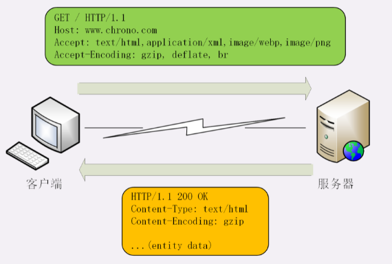
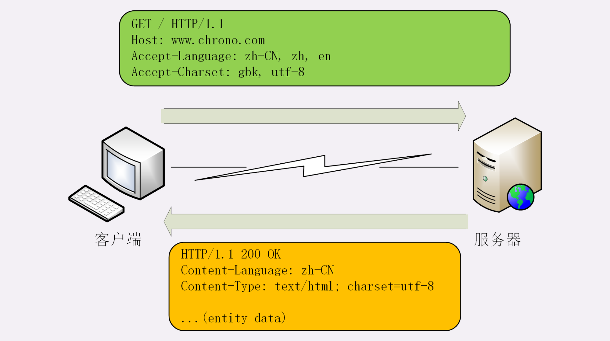
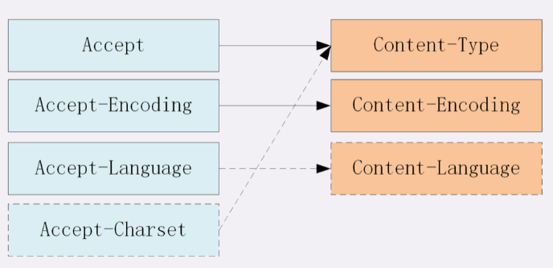

# 数据类型与编码

MIME(Multipurpose Internet Mail Extensions)，多用途互联网邮件扩展，MIME 是一个很大的标准规范，但 HTTP 只取了其中的一部分，用来标记 body 的数据类型，这就是 “MIME type”。MIME 把数据分成了八大类，每个大类下再细分出多个子类，形式是 “type/subtype” 的字符串，巧得很，刚好也符合了 HTTP 明文的特点，所以能够很容易地纳入 HTTP 头字段里。

HTTP 里经常遇到的几个类别：

- **text**：即文本格式的可读数据，常见的有 text/html(超文本文档)，text/plain(纯文本)，text/css(样式表)
- **image**：即图像文件，常见的有 image/gif、image/jpeg、image/png 等
- **audio/video**：音频和视频数据，常见的有 audio/mpeg、video/mp4 等
- **application**：数据格式不固定，可能是文本也可能是二进制，必须由上层应用程序来解释。常见的有：application/json，application/javascript、application/pdf 等，另外，如果实在是不知道数据是什么类型，就会是 application/octet-stream，即不透明的二进制数据

MIME type 还不够，因为 HTTP 在传输时为了节约带宽，有时候还会压缩数据，还需要有一个 “Encoding type”，告诉数据是用的什么编码格式，这样对方才能正确解压缩，常用的有：

- **gzip**：GNU zip 压缩格式，也是互联网上最流行的压缩格式
- **deflate**：zlib（deflate）压缩格式，流行程度仅次于gzip
- **br**：一种专门为 HTTP 优化的新压缩算法（Brotli）

## 数据类型使用的头字段

有了 MIME type 和 Encoding type，无论是浏览器还是服务器就都可以轻松识别出body的类型，也就能够正确处理数据了。

HTTP 协议为此定义了两个 Accept 请求头字段和两个 Content 实体头字段，用于客户端和服务器进行“内容协商”

- 客户端用 Accept 头告诉服务器希望接收什么样的数据
- 服务器用 Content 头告诉客户端实际发送了什么样的数据



Accept 字段标记的是客户端可理解的 MIME type，可以用“,”做分隔符列出多个类型，让服务器有更多的选择余地，例如下面的这个头：

```
Accept: text/html,application/xml,image/webp,image/png
```

相应的，服务器会在响应报文里用头字段 Content-Type 告诉实体数据的真实类型：

```
Content-Type: text/html
Content-Type: image/png
```

Accept-Encoding 字段标记的是客户端支持的压缩格式，例如上面说的gzip、deflate等，同样也可以用“,”列出多个，服务器可以选择其中一种来压缩数据，实际使用的压缩格式放在响应头字段 Content-Encoding 里：

```
Accept-Encoding: gzip, deflate, br
Content-Encoding: gzip
```

不过这两个字段是可以省略的，如果请求报文里没有 Accept-Encoding 字段，就表示客户端不支持压缩数据；如果响应报文里没有 Content-Encoding 字段，就表示响应数据没有被压缩。

# 语言类型与编码

所谓的“语言类型”就是人类使用的自然语言，例如英语、汉语、日语等，而这些自然语言可能还有下属的地区性方言，所以在需要明确区分的时候也要使用“type-subtype”的形式，不过这里的格式与数据类型不同，分隔符不是“/”，而是“-”。

en 表示任意的英语，en-US 表示美式英语，en-GB 表示英式英语，而 zh-CN 表示汉语。

UTF-8 是互联网上的标准字符集，把世界上所有的语言都容纳在一种编码方案里。

## 语言类型使用的头字段

HTTP 协议也使用 Accept 请求头字段和 Content 实体头字段，用于客户端和服务器就语言与编码进行“内容协商”。

Accept-Language 字段标记了客户端可理解的自然语言，也允许用“,”做分隔符列出多个类型，例如：

```
Accept-Language: zh-CN, zh, en
```

相应的，服务器应该在响应报文里用头字段Content-Language告诉客户端实体数据使用的实际语言类型：

```
Content-Language: zh-CN
```

字符集在HTTP里使用的请求头字段是Accept-Charset，但响应头里却没有对应的Content-Charset，而是在Content-Type字段的数据类型后面用“charset=xxx”来表示，这点需要特别注意。例如，浏览器请求GBK或UTF-8的字符集，然后服务器返回的是UTF-8编码，就是下面这样：

```
Accept-Charset: gbk, utf-8
Content-Type: text/html; charset=utf-8
```

不过现在的浏览器都支持多种字符集，通常不会发送Accept-Charset，而服务器也不会发送Content-Language，因为使用的语言完全可以由字符集推断出来，所以在请求头里一般只会有Accept-Language字段，响应头里只会有Content-Type字段。



# 内容协商的质量值

在HTTP协议里用Accept、Accept-Encoding、Accept-Language等请求头字段进行内容协商的时候，还可以用一种特殊的“q”参数表示权重来设定优先级，这里的“q”是“quality factor”的意思。

权重的最大值是1，最小值是0.01，默认值是1，如果值是0就表示拒绝。具体的形式是在数据类型或语言代码后面加一个“;”，然后是“q=value”。

```
Accept: text/html,application/xml;q=0.9,*/*;q=0.8
```

它表示浏览器最希望使用的是HTML文件，权重是1，其次是XML文件，权重是0.9，最后是任意数据类型，权重是0.8。服务器收到请求头后，就会计算权重，再根据自己的实际情况优先输出HTML或者XML。

## 内容协商的结果

内容协商的过程是不透明的，每个Web服务器使用的算法都不一样。但有的时候，服务器会在响应头里多加一个Vary字段，记录服务器在内容协商时参考的请求头字段，给出一点信息，例如：

```
Vary: Accept-Encoding,User-Agent,Accept
```

这个Vary字段表示服务器依据了Accept-Encoding、User-Agent和Accept这三个头字段，然后决定了发回的响应报文。

# 小结




