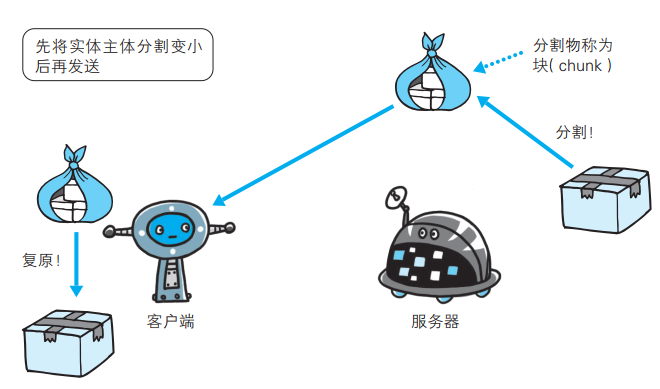
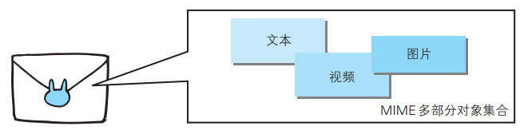
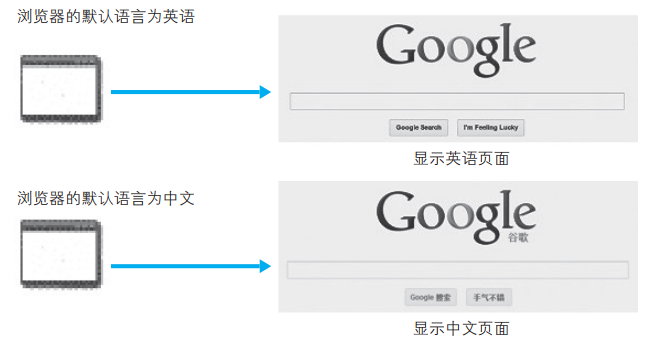

# HTTP 报文  

用于 HTTP 协议交互的信息被称为 HTTP 报文：

- 请求端（客户端）的HTTP 报文叫做请求报文
- 响应端（服务器端）的叫做响应报文
- HTTP 报文本身是由多行（用 CR+LF 作换行符）数据构成的字符串文本
- HTTP 报文大致可分为报文首部和报文主体两块，两者由空行（ CR+LF）来划分 ，通常，并不一定要有报文主体  


# 请求报文及响应报文的结构  


请求报文和响应报文的首部内容由以下数据组成：

- 请求行，包含用于请求的方法，请求 URI 和 HTTP 版本
- 状态行，包含表明响应结果的状态码，原因短语和 HTTP 版本
- 首部字段，包含表示请求和响应的各种条件和属性的各类首部，一般有 4 种首部，分别是：
  - 通用首部
  - 请求首部
  - 响应首部
  - 实体首部
- 其他， 可能包含 HTTP 的 RFC 里未定义的首部（ Cookie 等）

# 编码提升传输速率  

HTTP 在传输数据时可以按照数据原貌直接传输，但也可以在传输过程中通过编码提升传输速率。 通过在传输时编码，能有效地处理大量的访问请求。 但是，编码的操作需要计算机来完成，因此会消耗更多的CPU 等资源。  

## 报文主体和实体主体的差异  

HTTP 报文的主体用于传输请求或响应的实体主体。

通常，报文主体等于实体主体。只有当传输中进行编码操作时，实体主体的内容发生变化，才导致它和报文主体产生差异。  

### 报文（message） 

是 HTTP 通信中的基本单位，由 8 位组字节流（ octet sequence，其中 octet 为 8 个比特）组成，通过 HTTP 通信传输。  

### 实体（entity） 
作为请求或响应的有效载荷数据（补充项）被传输，其内容由实体首部和实体主体组成。  

## 压缩传输的内容编码  

HTTP 协议中有一种被称为内容编码的功能，内容编码指明应用在实体内容上的编码格式， 并保持实体信息原样压缩。内容编码后的实体由客户端接收并负责解码。   


常用的内容编码有以下几种：

- gzip（GNU zip）
- compress（UNIX 系统的标准压缩）
- deflate（zlib）
- identity（不进行编码）

## 分割发送的分块传输编码  

在 HTTP 通信过程中，请求的编码实体资源尚未全部传输完成之前，浏览器无法显示请求页面。 在传输大容量数据时，通过把数据分割成多块，能够让浏览器逐步显示页面。

这种把实体主体分块的功能称为分块传输编码（ Chunked TransferCoding）。  



- 分块传输编码会将实体主体分成多个部分（块）。每一块都会用十六进制来标记块的大小， 而实体主体的最后一块会使用“0(CR+LF)”来标记
- 使用分块传输编码的实体主体会由接收的客户端负责解码， 恢复到编码前的实体主体

# 发送多种数据的多部分对象集合



右键中采用了 MIME（ Multipurpose Internet Mail Extensions，多用途因特网邮件扩展）机制， 它允许邮件处理文本、图片、视频等多个不同类型的数据。  MIME 扩展中会使用一种称为多部分对象集合（ Multipart）的方法，来容纳多份不同类型的数据。  

HTTP 协议中也采纳了多部分对象集合，发送的一份报文主体内可含有多类型实体。通常是在图片或文本文件等上传时使用。  

- 多部分对象集合包含的对象：multipart/form-data  
- 在 Web 表单文件上传时：multipart/byteranges    

状态码 206（ Partial Content，部分内容）响应报文包含了多个范围的内容时使用。  

多部分对象集合的每个部分类型中， 都可以含有首部字段。另外，可以在某个部分中嵌套使用多部分对象集合。   

# 获取部分内容的范围请求  

指定范围发送的请求叫做范围请求（ Range Request）。  

对一份 10 000 字节大小的资源，如果使用范围请求，可以只请求 5001~10 000 字节内的资源：


执行范围请求时，会用到首部字段 Range 来指定资源的 byte 范围：

```
Range: bytes=5001-10000       		 # 5001~10000 字节
Range: bytes=5001-			 		# 从 5001 字节之后全部的字节
Range: bytes=-3000, 5000-7000		 # 从一开始到 3000字节和 5000~7000 字节的多重范围
```

针对范围请求，响应会返回状态码为 206 Partial Content 的响应报文。另外，对于多重范围的范围请求，响应会在首部字段 Content-Type
标明 multipart/byteranges 后返回响应报文。

如果服务器端无法响应范围请求， 则会返回状态码 200 OK 和完整的实体内容。  

# 内容协商返回最合适的内容  

同一个 Web 网站有可能存在着多份相同内容的页面。比如，英语版和中文版的 Web 页面，它们内容上虽相同，但使用的语言却不同。  



这样的机制称为内容协商（ Content Negotiation）。  内容协商机制是指客户端和服务器端就响应的资源内容进行交涉，然后提供给客户端最为适合的资源。  

包含在请求报文中的某些首部字段：

- Accept
- Accept-Charset
- Accept-Encoding
- Accept-Language
- Content-Language

内容协商技术有以下 3 种类型：

- 服务器驱动协商（Server-driven Negotiation）：由服务器端进行内容协商。以请求的首部字段为参考，在服务器端自动处理，但对用户来说，以浏览器发送的信息作为判定的依据，并不一定能筛选出最优内容  
- 客户端驱动协商（Agent-driven Negotiation）：由客户端进行内容协商的方式。用户从浏览器显示的可选项列表中手动选择。还可以利用 JavaScript 脚本在 Web 页面上自动进行上述选择  
- 透明协商（Transparent●Negotiation）：是服务器驱动和客户端驱动的结合体，是由服务器端和客户端各自进行内容协商的一种方法  


