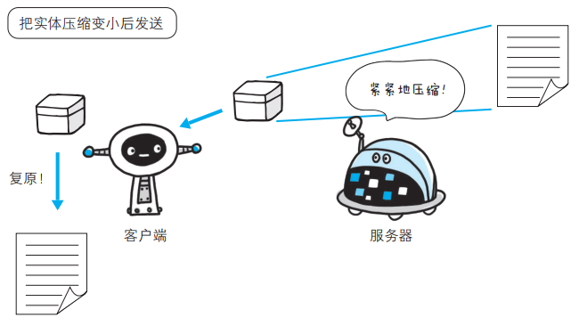

# HTTP 报文  

用于 HTTP 协议交互的信息被称为 HTTP 报文：

- 请求端（客户端）的HTTP 报文叫做请求报文
- 响应端（服务器端）的叫做响应报文
- HTTP 报文本身是由多行（用 CR+LF 作换行符）数据构成的字符串文本
- HTTP 报文大致可分为报文首部和报文主体两块，两者由空行（ CR+LF）来划分 ，通常，并不一定要有报文主体  

# 请求报文及响应报文的结构  

请求报文和响应报文的首部内容由以下数据组成：

- 请求行，包含用于请求的方法，请求 URI 和 HTTP 版本
- 状态行，包含表明响应结果的状态码，原因短语和 HTTP 版本
- 首部字段，包含表示请求和响应的各种条件和属性的各类首部，一般有 4 种首部，分别是：
  - 通用首部
  - 请求首部
  - 响应首部
  - 实体首部
- 其他， 可能包含 HTTP 的 RFC 里未定义的首部（ Cookie 等）

# 编码提升传输速率  

HTTP 在传输数据时可以按照数据原貌直接传输，但也可以在传输过程中通过编码提升传输速率。 通过在传输时编码，能有效地处理大量的访问请求。 但是，编码的操作需要计算机来完成，因此会消耗更多的CPU 等资源。  

## 报文主体和实体主体的差异  

HTTP 报文的主体用于传输请求或响应的实体主体。

通常，报文主体等于实体主体。只有当传输中进行编码操作时，实体主体的内容发生变化，才导致它和报文主体产生差异。  

### 报文（message） 

是 HTTP 通信中的基本单位，由 8 位组字节流（ octet sequence，其中 octet 为 8 个比特）组成，通过 HTTP 通信传输。  

### 实体（entity） 
作为请求或响应的有效载荷数据（补充项）被传输，其内容由实体首部和实体主体组成。  

## 压缩传输的内容编码  

HTTP 协议中有一种被称为内容编码的功能，内容编码指明应用在实体内容上的编码格式， 并保持实体信息原样压缩。内容编码后的实体由客户端接收并负责解码。   

常用的内容编码有以下几种：

- gzip（GNU zip）
- compress（UNIX 系统的标准压缩）
- deflate（zlib）
- identity（不进行编码）

