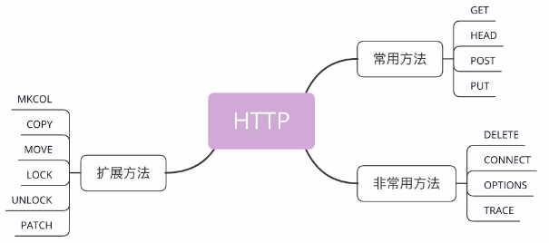

目前 HTTP/1.1 规定了八种方法，单词都必须是大写的形式：

- GET：获取资源，可以理解为读取或者下载数据
- HEAD：获取资源的元信息
- POST：向资源提交数据，相当于写入或上传数据、
- PUT：类似POST
- DELETE：删除资源
- CONNECT：建立特殊的连接隧道
- OPTIONS：列出可对资源实行的方法
- TRACE：追踪请求-响应的传输路径

请求方法是一个“指示”，客户端自然就没有决定权，服务器掌控着所有资源，也就有绝对的决策权力。它收到 HTTP 请求报文后，看到里面的请求方法，可以执行也可以拒绝，或者改变动作的含义，毕竟 HTTP 是一个“协议”，两边都要“商量着来”。

# 标准方法

## GET/HEAD

### GET

GET 方法应该是 HTTP 协议里最知名的请求方法了，也应该是用的最多的，自0.9版出现并一直被保留至今。它的含义是请求从服务器获取资源，这个资源既可以是静态的文本、页面、图片、视频，也可以是由 PHP、Java 动态生成的页面或者其他格式的数据。

GET 方法搭配URI和其他头字段就能实现对资源更精细的操作：

- 在URI后使用“#”，就可以在获取页面后直接定位到某个标签所在的位置
- 使用If-Modified-Since字段就变成了“有条件的请求”，仅当资源被修改时才会执行获取动作
- 使用Range字段就是“范围请求”，只获取资源的一部分数据

### HEAD

HEAD 方法与 GET 方法类似，也是请求从服务器获取资源，服务器的处理机制也是一样的，但服务器不会返回请求的实体数据，只会传回响应头，也就是资源的“元信息”。

HEAD 方法可以看做是 GET 方法的一个“简化版”或者“轻量版”。因为它的响应头与 GET 完全相同，所以可以用在很多并不真正需要资源的场合，避免传输 body 数据的浪费。比如：

- 想要检查一个文件是否存在，只要发个 HEAD 请求就可以了
- 要检查文件是否有最新版本，同样也应该用 HEAD，服务器会在响应头里把文件的修改时间传回来

## POST/PUT

### POST

POST 也是一个经常用到的请求方法，使用频率应该是仅次于 GET，应用的场景也非常多，只要向服务器发送数据，用的大多数都是 POST。比如：

- 论坛发帖
- 购物时添加商品到购物车

### PUT

PUT 的作用与 POST 类似，也可以向服务器提交数据，但与 POST 存在微妙的不同，通常 POST 表示的是“新建”，“create”的含义，而 PUT 则是“修改”，“update”的含义。

在实际应用中，PUT 用到的比较少。而且，因为它与 POST 的语义、功能太过近似，有的服务器甚至就直接禁止使用 PUT 方法，只用 POST 方法上传数据。

## DELETE

DELETE 方法指示服务器删除资源，因为这个动作危险性太大，所以通常服务器不会执行真正的删除操作，而是对资源做一个删除标记。当然，更多的时候服务器就直接不处理 DELETE 请求。

## CONNECT

CONNECT 是一个比较特殊的方法，要求服务器为客户端和另一台远程服务器建立一条特殊的连接隧道，这时 Web 服务器在中间充当了代理的角色。

## OPTIONS

OPTIONS 方法要求服务器列出可对资源实行的操作方法，在响应头的 Allow 字段里返回。它的功能很有限，用处也不大，有的服务器（例如Nginx）干脆就没有实现对它的支持。

## TRACE

TRACE 方法多用于对 HTTP 链路的测试或诊断，可以显示出请求-响应的传输路径。它的本意是好的，但存在漏洞，会泄漏网站的信息，所以 Web 服务器通常也是禁止使用。

# 扩展方法

虽然 HTTP/1.1 里规定了八种请求方法，但它并没有限制我们只能用这八种方法，这也体现了 HTTP 协议良好的扩展性，我们可以任意添加请求动作，只要请求方和响应方都能理解就行。例如，MKCOL、COPY、MOVE、LOCK、UNLOCK、PATCH等。如果有合适的场景，你也可以把它们应用到自己的系统里，比如用LOCK 方法锁定资源暂时不允许修改，或者使用 PATCH 方法给资源打个小补丁，部分更新数据。但因为这些方法是非标准的，所以需要为客户端和服务器编写额外的代码才能添加支持。

当然了，你也完全可以根据实际需求，自己发明新的方法，比如“PULL”拉取某些资源到本地，“PURGE” 清理某个目录下的所有缓存数据。

# 安全与幂等

在 HTTP 协议里，所谓的“安全”是指请求方法不会“破坏”服务器上的资源，即不会对服务器上的资源造成实质的修改。

按照这个定义，只有 GET 和 HEAD 方法是“安全”的，因为它们是“只读”操作，只要服务器不故意曲解请求方法的处理方式，无论 GET 和 HEAD 操作多少次，服务器上的数据都是“安全的”。

而 POST/PUT/DELETE 操作会修改服务器上的资源，增加或删除数据，所以是“不安全”的。

所谓的“幂等”实际上是一个数学用语，被借用到了HTTP协议里，意思是多次执行相同的操作，结果也都是相同的，即多次“幂”后结果“相等”。

很显然，GET 和 HEAD 既是安全的也是幂等的，DELETE 可以多次删除同一个资源，效果都是“资源不存在”，所以也是幂等的。

POST 和 PUT 的幂等性质就略费解一点：按照RFC里的语义，POS T是“新增或提交数据”，多次提交数据会创建多个资源，所以不是幂等的；而 PUT 是“替换或更新数据”，多次更新一个资源，资源还是会第一次更新的状态，所以是幂等的。

