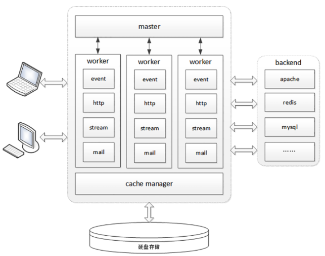
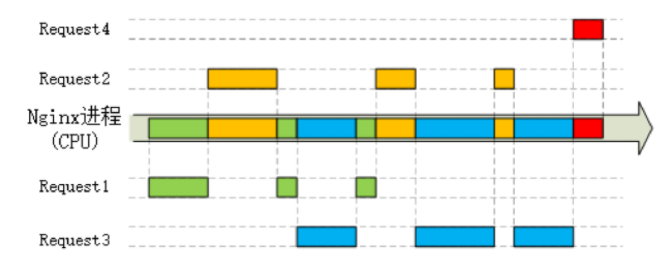
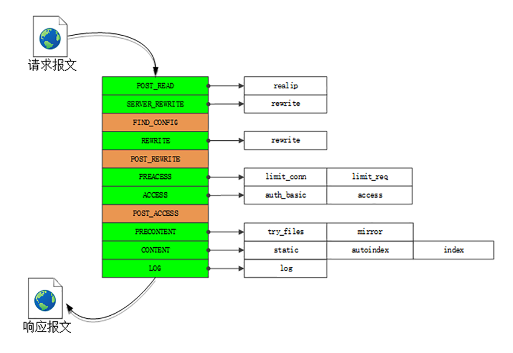

Web服务器就那么几款，目前市面上主流的只有两个：Apache和Nginx，两者合计占据了近90%的市场份额。Nginx 是Web服务器的“后起之秀”，虽然比Apache小了10岁，但增长速度十分迅猛，已经达到了与Apache“平起平坐”的地位。

作为一个Web服务器，Nginx的功能非常完善，完美支持HTTP/1、HTTPS和HTTP/2，而且还在不断进步。

# 进程池

Nginx是个“轻量级”的Web服务器，那么这个所谓的“轻量级”是什么意思呢？“轻量级”是相对于“重量级”而言的。“重量级”就是指服务器进程很“重”，占用很多资源，当处理HTTP请求时会消耗大量的CPU和内存，受到这些资源的限制很难提高性能。而Nginx作为“轻量级”的服务器，它的CPU、内存占用都非常少，同样的资源配置下就能够为更多的用户提供服务，其奥秘在于它独特的工作模式。

在Nginx之前，Web服务器的工作模式大多是“Per-Process”或者“Per-Thread”，对每一个请求使用单独的进程或者线程处理。这就存在创建进程或线程的成本，还会有进程、线程“上下文切换”的额外开销。如果请求数量很多，CPU就会在多个进程、线程之间切换时“疲于奔命”，平白地浪费了计算时间。

Nginx则完全不同，“一反惯例”地没有使用多线程，而是使用了“进程池+单线程”的工作模式。Nginx在启动的时候会预先创建好固定数量的worker进程，在之后的运行过程中不会再fork出新进程，这就是进程池，而且可以自动把进程“绑定”到独立的CPU上，这样就完全消除了进程创建和切换的成本，能够充分利用多核CPU的计算能力。

在进程池之上，还有一个“master”进程，专门用来管理进程池。它的作用有点像是supervisor，用来监控进程，自动恢复发生异常的worker，保持进程池的稳定和服务能力。不过master进程完全是Nginx自行用C语言实现的，这就摆脱了外部的依赖，简化了Nginx的部署和配置。

# I/O多路复用

使用多线程能够很容易实现并发处理。但多线程也有一些缺点，除了刚才说到的“上下文切换”成本，还有编程模型复杂、数据竞争、同步等问题，写出正确、快速的多线程程序并不是一件容易的事情。所以Nginx就选择了单线程的方式，带来的好处就是开发简单，没有互斥锁的成本，减少系统消耗。那么，疑问也就产生了：为什么单线程的Nginx，处理能力却能够超越其他多线程的服务器呢？

这要归功于Nginx利用了Linux内核里的一件“神兵利器”，“大名鼎鼎”的epoll。

Web服务器从根本上来说是“I/O密集型”而不是“CPU密集型”，处理能力的关键在于网络收发而不是CPU计算（这里暂时不考虑HTTPS的加解密），而网络I/O会因为各式各样的原因不得不等待，比如数据还没到达、对端没有响应、缓冲区满发不出去等等。

Nginx里使用的epoll，就好像是HTTP/2里的“多路复用”技术，它把多个HTTP请求处理打散成碎片，都“复用”到一个单线程里，不按照先来后到的顺序处理，而是只当连接上真正可读、可写的时候才处理，如果可能发生阻塞就立刻切换出去，处理其他的请求。通过这种方式，Nginx就完全消除了I/O阻塞，把CPU利用得“满满当当”，又因为网络收发并不会消耗太多CPU计算能力，也不需要切换进程、线程，所以整体的CPU负载是相当低的。

epoll还有一个特点，大量的连接管理工作都是在操作系统内核里做的，这就减轻了应用程序的负担，所以Nginx可以为每个连接只分配很小的内存维护状态，即使有几万、几十万的并发连接也只会消耗几百M内存，而其他的Web服务器这个时候早就“Memory not enough”了。

# 多阶段处理

Nginx在内部也采用的是“化整为零”的思路，把整个Web服务器分解成了多个“功能模块”，就好像是乐高积木，可以在配置文件里任意拼接搭建，从而实现了高度的灵活性和扩展性。

Nginx的HTTP处理有四大类模块：

- handler模块：直接处理HTTP请求
- filter模块：不直接处理请求，而是加工过滤响应报文
- upstream模块：实现反向代理功能，转发请求到其他服务器
- balance模块：实现反向代理时的负载均衡算法

Nginx里的handler模块和filter模块是按照“职责链”模式设计和组织的,下面的这张图显示了Nginx的“流水线”，在Nginx里的术语叫“阶段式处理”（Phases），一共有11个阶段，每个阶段里又有许多各司其职的模块：

- charset模块实现了字符集编码转换
- chunked模块实现了响应数据的分块传输
- range模块实现了范围请求，只返回数据的一部分
- rewrite模块实现了重定向和跳转，还可以使用内置变量自定义跳转的URI
- not_modified模块检查头字段“if-Modified-Since”和“If-None-Match”，处理条件请求
- realip模块处理“X-Real-IP”“X-Forwarded-For”等字段，获取客户端的真实IP地址
- ssl模块实现了SSL/TLS协议支持，读取磁盘上的证书和私钥，实现TLS握手和SNI、ALPN等扩展功能
- http_v2模块实现了完整的HTTP/2协议

limit_conn、limit_req、access、log等其他模块，它们实现的是限流限速、访问控制、日志等功能，不在HTTP协议规定之内，但对于运行在现实世界的Web服务器却是必备的。

