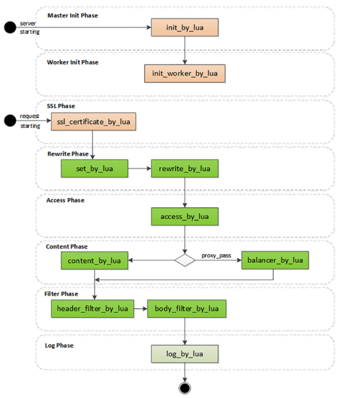

Nginx的服务管理思路延续了当时的流行做法，使用磁盘上的静态配置文件，所以每次修改后必须重启才能生效。

这在业务频繁变动的时候是非常致命的（例如流行的微服务架构），特别是对于拥有成千上万台服务器的网站来说，仅仅增加或者删除一行配置就要分发、重启所有的机器，对运维是一个非常大的挑战，要耗费很多的时间和精力，成本很高，很不灵活，难以“随需应变”。

# OpenResty是什么？

OpenResty诞生于2009年，到现在刚好满10周岁。它的创造者是章亦春**，网名叫“agentzh”。

OpenResty并不是一个全新的Web服务器，而是基于Nginx，它利用了Nginx模块化、可扩展的特性，开发了一系列的增强模块，并把它们打包整合，形成了一个“一站式”的Web开发平台。

虽然OpenResty的核心是Nginx，但它又超越了Nginx，关键就在于其中的ngx_lua模块，把小巧灵活的Lua语言嵌入了Nginx，可以用脚本的方式操作Nginx内部的进程、多路复用、阶段式处理等各种构件。

目前OpenResty有两个分支，分别是开源、免费的“OpenResty”和闭源、商业产品的“OpenResty+”。

# 动态的Lua

Lua的设计目标是嵌入到其他应用程序里运行，为其他编程语言带来“脚本化”能力，所以它的“个头”比较小，功能集有限，不追求“大而全”，而是“小而美”，大多数时间都“隐匿”在其他应用程序的后面，是“无名英雄”。

因为Nginx C开发实在是太麻烦了，限制了Nginx的真正实力。而Lua作为“最快的脚本语言”恰好可以成为Nginx的完美搭档，既可以简化开发，性能上又不会有太多的损耗。

作为脚本语言，Lua还有一个重要的“代码热加载”特性，不需要重启进程，就能够从磁盘、Redis或者任何其他地方加载数据，随时替换内存里的代码片段。这就带来了“动态配置”，让OpenResty能够永不停机，在微秒、毫秒级别实现配置和业务逻辑的实时更新，比起Nginx秒级的重启是一个极大的进步。

# 高效率的Lua

OpenResty能够高效运行的一大“秘技”是它的“同步非阻塞”编程范式。“同步非阻塞”本质上还是一种“多路复用”。、

epoll是操作系统级别的“多路复用”，运行在内核空间。而OpenResty的“同步非阻塞”则是基于Lua内建的“协程”，是应用程序级别的“多路复用”，运行在用户空间，所以它的资源消耗要更少。

OpenResty里每一段Lua程序都由协程来调度运行。和Linux的epoll一样，每当可能发生阻塞的时候“协程”就会立刻切换出去，执行其他的程序。这样单个处理流程是“阻塞”的，但整个OpenResty却是“非阻塞的”，多个程序都“复用”在一个Lua虚拟机里运行。


下面的代码是一个简单的例子，读取POST发送的body数据，然后再发回客户端：

```
ngx.req.read_body()                  -- 同步非阻塞(1)

local data = ngx.req.get_body_data()
if data then
    ngx.print("body: ", data)        -- 同步非阻塞(2)
end
```

代码中的“ngx.req.read_body”和“ngx.print”分别是数据的收发动作，只有收到数据才能发送数据，所以是“同步”的。

但即使因为网络原因没收到或者发不出去，OpenResty也不会在这里阻塞“干等着”，而是做个“记号”，把等待的这段CPU时间用来处理其他的请求，等网络可读或者可写时再“回来”接着运行。假设收发数据的等待时间是10毫秒，而真正CPU处理的时间是0.1毫秒，那么OpenResty就可以在这10毫秒内同时处理100个请求，而不是把这100个请求阻塞排队，用1000毫秒来处理。

除了“同步非阻塞”，OpenResty还选用了LuaJIT作为Lua语言的“运行时（Runtime）”，进一步“挖潜增效”。LuaJIT是一个高效的Lua虚拟机，支持JIT（Just In Time）技术，可以把Lua代码即时编译成“本地机器码”，这样就消除了脚本语言解释运行的劣势，让Lua脚本跑得和原生C代码一样快。另外，LuaJIT还为Lua语言添加了一些特别的增强，比如二进制位运算库bit，内存优化库table，还有FFI（Foreign Function Interface），让Lua直接调用底层C函数，比原生的压栈调用快很多。

# 阶段式处理

和Nginx一样，OpenResty也使用“流水线”来处理HTTP请求，底层的运行基础是Nginx的“阶段式处理”，但它又有自己的特色。Nginx的“流水线”是由一个个C模块组成的，只能在静态文件里配置，开发困难，配置麻烦（相对而言）。而OpenResty的“流水线”则是由一个个的Lua脚本组成的，不仅可以从磁盘上加载，也可以从Redis、MySQL里加载，而且编写、调试的过程非常方便快捷。



OpenResty里有几个阶段与Nginx是相同的，比如rewrite、access、content、filter，这些都是标准的HTTP处理。在这几个阶段里可以用“xxx_by_lua”指令嵌入Lua代码，执行重定向跳转、访问控制、产生响应、负载均衡、过滤报文等功能。因为Lua的脚本语言特性，不用考虑内存分配、资源回收释放等底层的细节问题，可以专注于编写非常复杂的业务逻辑，比C模块的开发效率高很多，即易于扩展又易于维护。

OpenResty里还有两个不同于Nginx的特殊阶段：

- 一个是“init阶段”，它又分成“master init”和“worker init”，在master进程和worker进程启动的时候运行。这个阶段还没有开始提供服务，所以慢一点也没关系，可以调用一些阻塞的接口初始化服务器，比如读取磁盘、MySQL，加载黑白名单或者数据模型，然后放进共享内存里供运行时使用
- 另一个是“ssl阶段”，这算得上是OpenResty的一大创举，可以在TLS握手时动态加载证书，或者发送“OCSP Stapling”。

Nginx可以依据“服务器名称指示”来选择证书实现HTTPS虚拟主机，但静态配置很不灵活，要编写很多雷同的配置块。虽然后来Nginx增加了变量支持，但它每次握手都要读磁盘，效率很低。而在OpenResty里就可以使用指令“ssl_certificate_by_lua”，编写Lua脚本，读取SNI名字后，直接从共享内存或者Redis里获取证书。不仅没有读盘阻塞，而且证书也是完全动态可配置的，无需修改配置文件就能够轻松支持大量的HTTPS虚拟主机。


