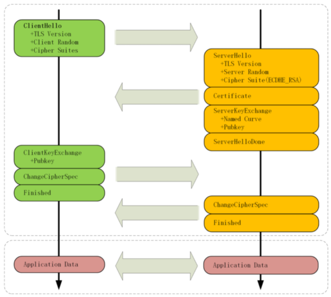
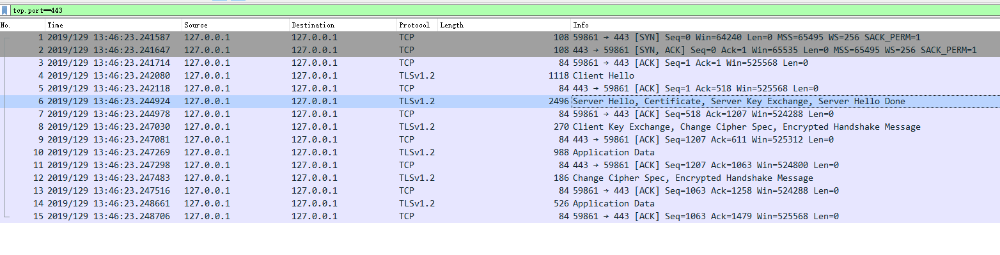
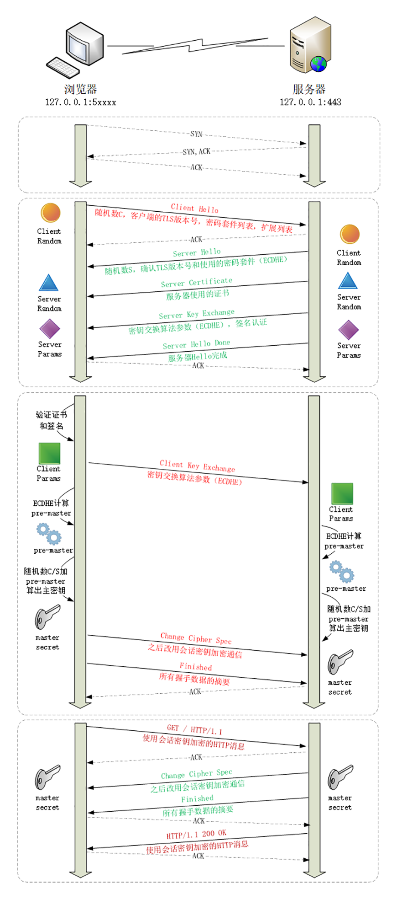
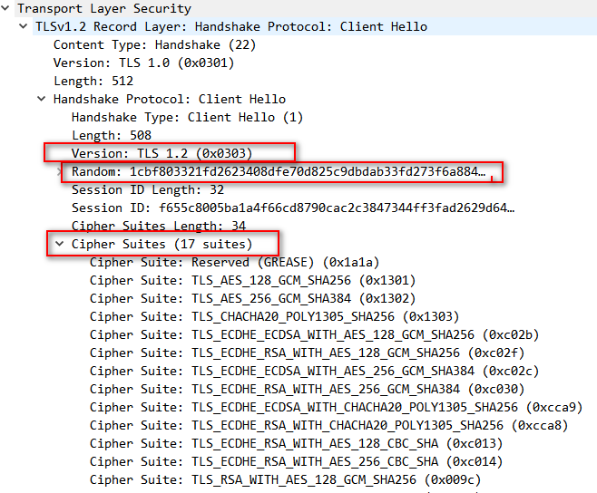
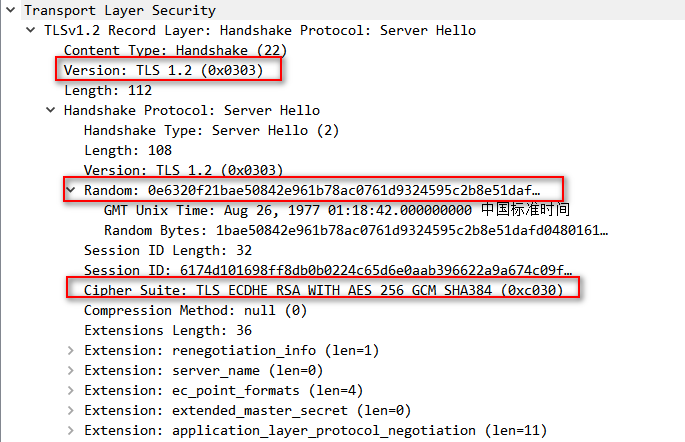
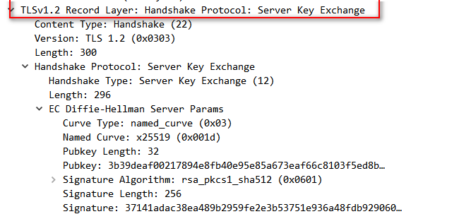
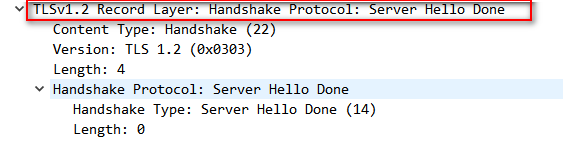
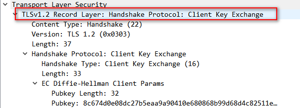
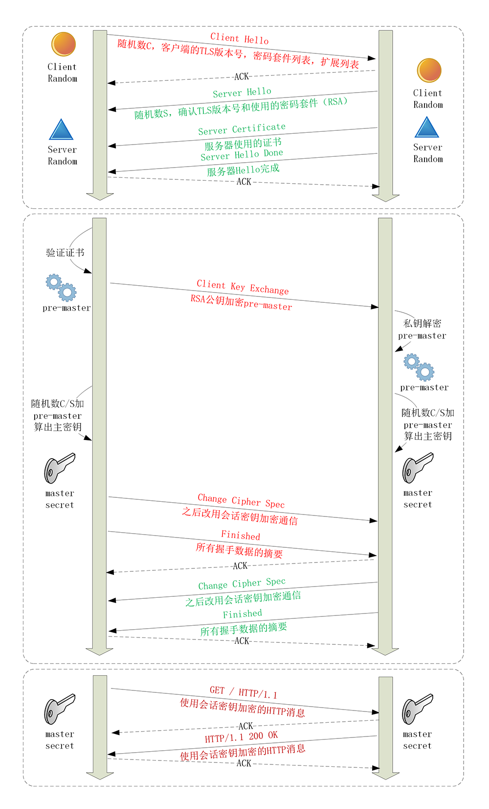

# HTTPS建立连接

当你在浏览器地址栏里键入“https”开头的URI，再按下回车，会发生什么呢？

因为协议名是“https”，所以浏览器就知道了端口号是默认的443，它再用DNS解析域名，得到目标的IP地址，然后就可以使用三次握手与网站建立TCP连接了。

在HTTP协议里，建立连接后，浏览器会立即发送请求报文。但现在是HTTPS协议，它需要再用另外一个“握手”过程，在TCP上建立安全连接，之后才是收发HTTP报文。

# TLS协议的组成

TLS包含几个子协议，你也可以理解为它是由几个不同职责的模块组成，比较常用的有记录协议、警报协议、握手协议、变更密码规范协议等。

记录协议（Record Protocol）规定了TLS收发数据的基本单位：记录（record）。它有点像是TCP里的segment，所有的其他子协议都需要通过记录协议发出。但多个记录数据可以在一个TCP包里一次性发出，也并不需要像TCP那样返回ACK。

警报协议（Alert Protocol）的职责是向对方发出警报信息，有点像是HTTP协议里的状态码。比如，protocol_version就是不支持旧版本，bad_certificate就是证书有问题，收到警报后另一方可以选择继续，也可以立即终止连接。

握手协议（Handshake Protocol）是TLS里最复杂的子协议，要比TCP的SYN/ACK复杂的多，浏览器和服务器会在握手过程中协商TLS版本号、随机数、密码套件等信息，然后交换证书和密钥参数，最终双方协商得到会话密钥，用于后续的混合加密系统。

变更密码规范协议（Change Cipher Spec Protocol），它非常简单，就是一个“通知”，告诉对方，后续的数据都将使用加密保护。那么反过来，在它之前，数据都是明文的。

# ECDHE握手过程

在TCP建立连接之后，浏览器会首先发一个“Client Hello”消息，也就是跟服务器“打招呼”。里面有客户端的版本号、支持的密码套件，还有一个随机数（Client Random），用于后续生成会话密钥。

这个的意思就是：“我这边有这些这些信息，你看看哪些是能用的，关键的随机数可得留着。”

作为“礼尚往来”，服务器收到“Client Hello”后，会返回一个“Server Hello”消息。把版本号对一下，也给出一个随机数（Server Random），然后从客户端的列表里选一个作为本次通信使用的密码套件

这个的意思就是：“版本号对上了，可以加密，你的密码套件挺多，我选一个最合适的吧，用椭圆曲线加RSA、AES、SHA384。我也给你一个随机数，你也得留着。”然后，服务器为了证明自己的身份，就把证书也发给了客户端（Server Certificate）。

接下来是一个关键的操作，因为服务器选择了ECDHE算法，所以它会在证书后发送“Server Key Exchange”消息，里面是椭圆曲线的公钥（Server Params），用来实现密钥交换算法，再加上自己的私钥签名认证。

这相当于说：“刚才我选的密码套件有点复杂，所以再给你个算法的参数，和刚才的随机数一样有用，别丢了。为了防止别人冒充，我又盖了个章。”

之后是“Server Hello Done”消息，服务器说：“我的信息就是这些，打招呼完毕。”

这样第一个消息往返就结束了（两个TCP包），结果是客户端和服务器通过明文共享了三个信息：Client Random、Server Random和Server Params。

之后开始走证书链逐级验证，确认证书的真实性，再用证书公钥验证签名，就确认了服务器的身份：“刚才跟我打招呼的不是骗子，可以接着往下走。”

然后，客户端按照密码套件的要求，也生成一个椭圆曲线的公钥（Client Params），用“Client Key Exchange”消息发给服务器。

现在客户端和服务器手里都拿到了密钥交换算法的两个参数（Client Params、Server Params），就用ECDHE算法一阵算，算出了一个新的东西，叫“Pre-Master”，其实也是一个随机数。算法可以保证即使黑客截获了之前的参数，也是绝对算不出这个随机数的。

现在客户端和服务器手里有了三个随机数：Client Random、Server Random和Pre-Master。用这三个作为原始材料，就可以生成用于加密会话的主密钥，叫“Master Secret”。而黑客因为拿不到“Pre-Master”，所以也就得不到主密钥。

为了保证真正的“完全随机”“不可预测”，把三个不可靠的随机数混合起来，那么“随机”的程度就非常高了，足够让黑客难以猜测。

有了主密钥和派生的会话密钥，握手就快结束了。客户端发一个“Change Cipher Spec”，然后再发一个“Finished”消息，把之前所有发送的数据做个摘要，再加密一下，让服务器做个验证。意思就是告诉服务器：“后面都改用对称算法加密通信了啊，用的就是打招呼时说的AES，加密对不对还得你测一下。”服务器也是同样的操作，发“Change Cipher Spec”和“Finished”消息，双方都验证加密解密OK，握手正式结束，后面就收发被加密的HTTP请求和响应了。

# RSA握手过程

刚才说的其实是如今主流的TLS握手过程，这与传统的握手有两点不同。

第一个，使用ECDHE实现密钥交换，而不是RSA，所以会在服务器端发出“Server Key Exchange”消息。

第二个，因为使用了ECDHE，客户端可以不用等到服务器发回“Finished”确认握手完毕，立即就发出HTTP报文，省去了一个消息往返的时间浪费。这个叫“TLS False Start”，意思就是“抢跑”，和“TCP Fast Open”有点像，都是不等连接完全建立就提前发应用数据，提高传输的效率。

传统的RSA密钥交换：

大体的流程没有变，只是“Pre-Master”不再需要用算法生成，而是客户端直接生成随机数，然后用服务器的公钥加密，通过“Client Key Exchange”消息发给服务器。服务器再用私钥解密，这样双方也实现了共享三个随机数，就可以生成主密钥。

# 双向认证

上面说的是“单向认证”握手过程，只认证了服务器的身份，而没有认证客户端的身份。这是因为通常单向认证通过后已经建立了安全通信，用账号、密码等简单的手段就能够确认用户的真实身份。

但为了防止账号、密码被盗，有的时候（比如网上银行）还会使用U盾给用户颁发客户端证书，实现“双向认证”，这样会更加安全。

双向认证的流程也没有太多变化，只是在“Server Hello Done”之后，“Client Key Exchange”之前，客户端要发送“Client Certificate”消息，服务器收到后也把证书链走一遍，验证客户端的身份。