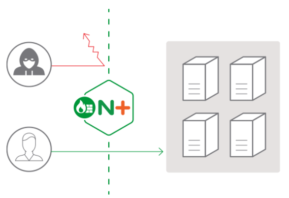

HTTPS只是网络安全中很小的一部分，仅仅保证了“通信链路安全”，让第三方无法得知传输的内容。在通信链路的两端，也就是客户端和服务器，它是无法提供保护的。因为HTTP是一个开放的协议，Web服务都运行在公网上，任何人都可以访问，所以天然就会成为黑客的攻击目标。虽然不能在传输过程中做手脚，但他们还可以“假扮”成合法的用户访问系统，然后伺机搞破坏。

# Web服务遇到的威胁

第一种叫“DDoS”攻击（distributed denial-of-service attack），有时候也叫“洪水攻击”。

黑客会控制许多“僵尸”计算机，向目标服务器发起大量无效请求。因为服务器无法区分正常用户和黑客，只能“照单全收”，这样就挤占了正常用户所应有的资源。如果黑客的攻击强度很大，就会像“洪水”一样对网站的服务能力造成冲击，耗尽带宽、CPU和内存，导致网站完全无法提供正常服务。

因为HTTP报文在语义结构上非常松散、灵活，URI里的query字符串、头字段、body数据都可以任意设置，这就带来了安全隐患，给了黑客“代码注入”的可能性。黑客可以精心编制HTTP请求报文，发送给服务器，服务程序如果没有做防备，就会“上当受骗”，执行黑客设定的代码。

- “SQL注入”（SQL injection）应该算是最著名的一种“代码注入”攻击了，它利用了服务器字符串拼接形成SQL语句的漏洞，构造出非正常的SQL语句，获取数据库内部的敏感信息
- “HTTP头注入”攻击的方式也是类似的原理，它在“Host”“User-Agent”“X-Forwarded-For”等字段里加入了恶意数据或代码，服务端程序如果解析不当，就会执行预设的恶意代码
- “跨站脚本”（XSS）攻击，它属于“JS代码注入”，利用JavaScript脚本获取未设防的Cookie

# 网络应用防火墙

“网络应用防火墙”（Web Application Firewall）了，简称为“WAF”。

传统的“防火墙”比较熟悉。传统“防火墙”工作在三层或者四层，隔离了外网和内网，使用预设的规则，只允许某些特定IP地址和端口号的数据包通过，拒绝不符合条件的数据流入或流出内网，实质上是一种网络数据过滤设备。

WAF也是一种“防火墙”，但它工作在七层，看到的不仅是IP地址和端口号，还能看到整个HTTP报文，所以就能够对报文内容做更深入细致的审核，使用更复杂的条件、规则来过滤数据。说白了，WAF就是一种“HTTP入侵检测和防御系统”。

通常一款产品能够称为WAF，要具备下面的一些功能：

- IP黑名单和白名单，拒绝黑名单上地址的访问，或者只允许白名单上的用户访问
- URI黑名单和白名单，与IP黑白名单类似，允许或禁止对某些URI的访问
- 防护DDoS攻击，对特定的IP地址限连限速
- 过滤请求报文，防御“代码注入”攻击
- 过滤响应报文，防御敏感信息外泄
- 审计日志，记录所有检测到的入侵操作

WAF拿到HTTP请求、响应报文，用字符串处理函数看看有没有关键字、敏感词，或者用正则表达式做一下模式匹配，命中了规则就执行对应的动作，比如返回403/404。

# 全面的WAF解决方案

ModSecurity 可以说是WAF界“事实上的标准”。ModSecurity是一个开源的、生产级的WAF工具包，历史很悠久，比Nginx还要大几岁。

ModSecurity有两个核心组件。第一个是“规则引擎”，它实现了自定义的“SecRule”语言，有自己特定的语法。但“SecRule”主要基于正则表达式，还是不够灵活，所以后来也引入了Lua，实现了脚本化配置。

只有引擎还不够，要让引擎运转起来，还需要完善的防御规则，所以ModSecurity的第二个核心组件就是它的“规则集”。

基本的规则集之外，ModSecurity还额外提供一个更完善的规则集，为网站提供全面可靠的保护。这个规则集的全名叫“OWASP ModSecurity 核心规则集”（Open Web Application Security Project ModSecurity Core Rule Set），因为名字太长了，所以有时候会简称为“核心规则集”或者“CRS”。

另外，ModSecurity还有强大的审计日志（Audit Log）功能，记录任何可疑的数据，供事后离线分析。但在生产环境中会遇到大量的攻击，日志会快速增长，消耗磁盘空间，而且写磁盘也会影响Nginx的性能，所以一般建议把它关闭。

