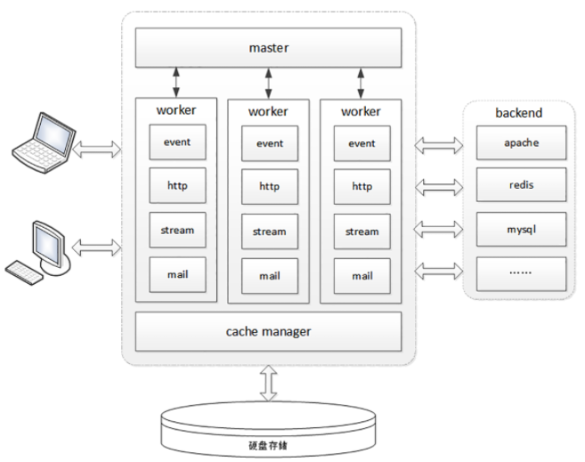
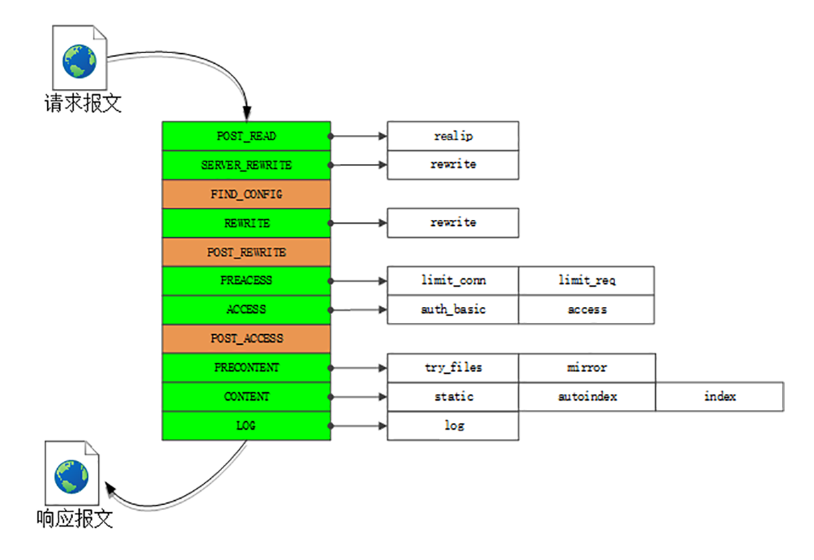
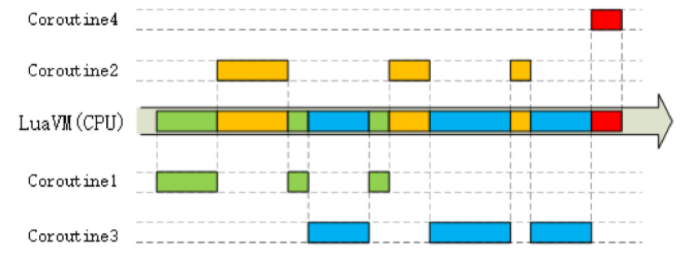
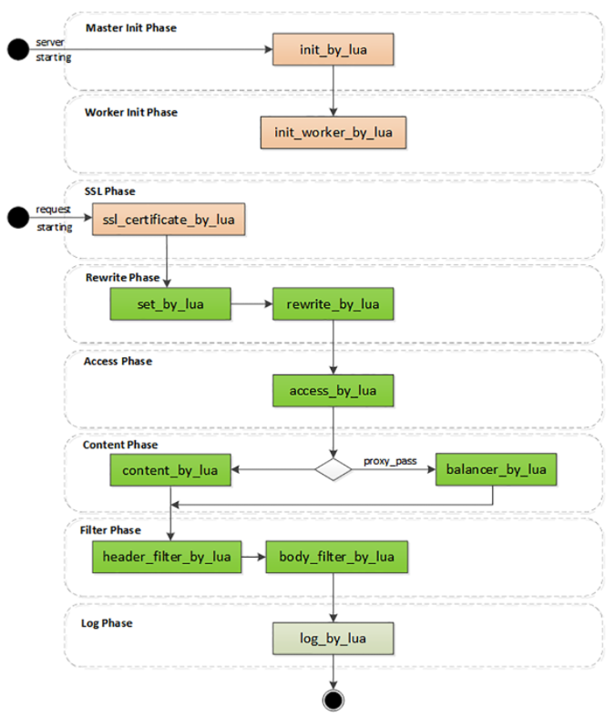

# Nginx

Web 服务器就那么几款，目前市面上主流的只有两个：Apache 和 Nginx，两者合计占据了近 90% 的市场份额。Nginx 是 Web 服务器的“后起之秀”，虽然比Apache 小了10岁，但增长速度十分迅猛，已经达到了与 Apache “平起平坐”的地位。

作为一个 Web 服务器，Nginx 的功能非常完善，完美支持 HTTP/1、HTTPS 和 HTTP/2，而且还在不断进步。

## 进程池

Nginx 是个“轻量级”的 Web 服务器，那么这个所谓的“轻量级”是什么意思呢？“轻量级”是相对于“重量级”而言的。“重量级”就是指服务器进程很“重”，占用很多资源，当处理 HTTP 请求时会消耗大量的 CPU 和内存，受到这些资源的限制很难提高性能。而 Nginx 作为“轻量级”的服务器，它的 CPU、内存占用都非常少，同样的资源配置下就能够为更多的用户提供服务，其奥秘在于它独特的工作模式。



在 Nginx 之前，Web 服务器的工作模式大多是 “Per-Process” 或者 “Per-Thread”，对每一个请求使用单独的进程或者线程处理。这就存在创建进程或线程的成本，还会有进程、线程“上下文切换”的额外开销。如果请求数量很多，CPU 就会在多个进程、线程之间切换时“疲于奔命”，平白地浪费了计算时间。

Nginx 则完全不同，“一反惯例”地没有使用多线程，而是使用了“进程池+单线程”的工作模式。Nginx 在启动的时候会预先创建好固定数量的 worker 进程，在之后的运行过程中不会再 fork 出新进程，这就是进程池，而且可以自动把进程“绑定”到独立的 CPU 上，这样就完全消除了进程创建和切换的成本，能够充分利用多核 CPU 的计算能力。

在进程池之上，还有一个 “master” 进程，专门用来管理进程池。它的作用有点像是 supervisor，用来监控进程，自动恢复发生异常的 worker，保持进程池的稳定和服务能力。不过 master 进程完全是 Nginx 自行用 C 语言实现的，这就摆脱了外部的依赖，简化了 Nginx 的部署和配置。

## I/O多路复用

使用多线程能够很容易实现并发处理。但多线程也有一些缺点，除了刚才说到的“上下文切换”成本，还有编程模型复杂、数据竞争、同步等问题，写出正确、快速的多线程程序并不是一件容易的事情。所以 Nginx 就选择了单线程的方式，带来的好处就是开发简单，没有互斥锁的成本，减少系统消耗。那么，疑问也就产生了：为什么单线程的 Nginx，处理能力却能够超越其他多线程的服务器呢？这要归功于 Nginx 利用了 Linux 内核里的一件“神兵利器”，“大名鼎鼎”的 epoll。

Web 服务器从根本上来说是“I/O 密集型”而不是“CPU 密集型”，处理能力的关键在于网络收发而不是 CPU 计算（这里暂时不考虑 HTTPS 的加解密），而网络 I/O会因为各式各样的原因不得不等待，比如数据还没到达、对端没有响应、缓冲区满发不出去等等。

Nginx 里使用的 epoll，就好像是 HTTP/2 里的“多路复用”技术，它把多个 HTTP 请求处理打散成碎片，都“复用”到一个单线程里，不按照先来后到的顺序处理，而是只当连接上真正可读、可写的时候才处理，如果可能发生阻塞就立刻切换出去，处理其他的请求。通过这种方式，Nginx 就完全消除了 I/O 阻塞，把 CPU 利用得“满满当当”，又因为网络收发并不会消耗太多 CPU 计算能力，也不需要切换进程、线程，所以整体的CPU负载是相当低的。


epoll 还有一个特点，大量的连接管理工作都是在操作系统内核里做的，这就减轻了应用程序的负担，所以 Nginx 可以为每个连接只分配很小的内存维护状态，即使有几万、几十万的并发连接也只会消耗几百M内存，而其他的 Web 服务器这个时候早就 “Memory not enough” 了。

## 多阶段处理

Nginx 在内部也采用的是“化整为零”的思路，把整个 Web 服务器分解成了多个“功能模块”，就好像是乐高积木，可以在配置文件里任意拼接搭建，从而实现了高度的灵活性和扩展性。

Nginx 的 HTTP 处理有四大类模块：

- handler 模块：直接处理 HTTP 请求
- filter 模块：不直接处理请求，而是加工过滤响应报文
- upstream 模块：实现反向代理功能，转发请求到其他服务器
- balance 模块：实现反向代理时的负载均衡算法

Nginx 里的 handler 模块和 filter 模块是按照“职责链”模式设计和组织的,下面的这张图显示了 Nginx 的“流水线”，在Nginx里的术语叫“阶段式处理”（Phases），一共有11个阶段，每个阶段里又有许多各司其职的模块：



- charset 模块实现了字符集编码转换
- chunked 模块实现了响应数据的分块传输
- range 模块实现了范围请求，只返回数据的一部分
- rewrite 模块实现了重定向和跳转，还可以使用内置变量自定义跳转的 URI
- not_modified 模块检查头字段 “if-Modified-Since” 和 “If-None-Match”，处理条件请求
- realip 模块处理 “X-Real-IP”，“X-Forwarded-For” 等字段，获取客户端的真实 IP 地址
- ssl 模块实现了 SSL/TLS 协议支持，读取磁盘上的证书和私钥，实现 TLS 握手和 SNI、ALPN 等扩展功能
- http_v2 模块实现了完整的 HTTP/2 协议

limit_conn、limit_req、access、log 等其他模块，它们实现的是限流限速、访问控制、日志等功能，不在 HTTP 协议规定之内，但对于运行在现实世界的 Web 服务器却是必备的。

# OpenResty

Nginx 的服务管理思路延续了当时的流行做法，使用磁盘上的静态配置文件，所以每次修改后必须重启才能生效。这在业务频繁变动的时候是非常致命的（例如流行的微服务架构），特别是对于拥有成千上万台服务器的网站来说，仅仅增加或者删除一行配置就要分发、重启所有的机器，对运维是一个非常大的挑战，要耗费很多的时间和精力，成本很高，很不灵活，难以“随需应变”。

OpenResty 诞生于2009年，它的创造者是**章亦春**。OpenResty 并不是一个全新的 Web 服务器，而是基于Nginx，它利用了 Nginx 模块化、可扩展的特性，开发了一系列的增强模块，并把它们打包整合，形成了一个“一站式”的 Web 开发平台。

虽然 OpenResty 的核心是 Nginx，但它又超越了 Nginx，关键就在于其中的 ngx_lua 模块，把小巧灵活的 Lua 语言嵌入了 Nginx，可以用脚本的方式操作 Nginx 内部的进程、多路复用、阶段式处理等各种构件。目前 OpenResty 有两个分支，分别是开源、免费的 “OpenResty” 和闭源、商业产品的 “OpenResty+”。

## 动态的Lua

Lua 的设计目标是嵌入到其他应用程序里运行，为其他编程语言带来“脚本化”能力，所以它的“个头”比较小，功能集有限，不追求“大而全”，而是“小而美”，大多数时间都“隐匿”在其他应用程序的后面，是“无名英雄”。

因为 Nginx C 开发实在是太麻烦了，限制了 Nginx 的真正实力。而 Lua 作为“最快的脚本语言”恰好可以成为Nginx的完美搭档，既可以简化开发，性能上又不会有太多的损耗。作为脚本语言，Lua 还有一个重要的“代码热加载”特性，不需要重启进程，就能够从磁盘、Redis 或者任何其他地方加载数据，随时替换内存里的代码片段。这就带来了“动态配置”，让 OpenResty 能够永不停机，在微秒、毫秒级别实现配置和业务逻辑的实时更新，比起 Nginx 秒级的重启是一个极大的进步。

## 高效率的Lua

OpenResty 能够高效运行的一大“秘技”是它的“同步非阻塞”编程范式。“同步非阻塞”本质上还是一种“多路复用”。

epoll 是操作系统级别的“多路复用”，运行在内核空间。而 OpenResty 的“同步非阻塞”则是基于 Lua 内建的“协程”，是应用程序级别的“多路复用”，运行在用户空间，所以它的资源消耗要更少。

OpenResty 里每一段 Lua 程序都由协程来调度运行。和 Linux 的 epoll 一样，每当可能发生阻塞的时候“协程”就会立刻切换出去，执行其他的程序。这样单个处理流程是“阻塞”的，但整个 OpenResty 却是“非阻塞的”，多个程序都“复用”在一个 Lua 虚拟机里运行。



下面的代码是一个简单的例子，读取 POST 发送的 body 数据，然后再发回客户端：

```
ngx.req.read_body()                  -- 同步非阻塞(1)

local data = ngx.req.get_body_data()
if data then
    ngx.print("body: ", data)        -- 同步非阻塞(2)
end
```

代码中的 “ngx.req.read_body” 和 “ngx.print” 分别是数据的收发动作，只有收到数据才能发送数据，所以是“同步”的。

但即使因为网络原因没收到或者发不出去，OpenResty 也不会在这里阻塞“干等着”，而是做个“记号”，把等待的这段 CPU 时间用来处理其他的请求，等网络可读或者可写时再“回来”接着运行。假设收发数据的等待时间是 10 毫秒，而真正CPU处理的时间是 0.1 毫秒，那么 OpenResty 就可以在这 10 毫秒内同时处理 100 个请求，而不是把这 100 个请求阻塞排队，用 1000 毫秒来处理。

除了“同步非阻塞”，OpenResty 还选用了 LuaJIT 作为 Lua 语言的“运行时（Runtime）”，进一步“挖潜增效”。LuaJIT 是一个高效的 Lua 虚拟机，支持 JIT（Just In Time）技术，可以把 Lua 代码即时编译成“本地机器码”，这样就消除了脚本语言解释运行的劣势，让 Lua 脚本跑得和原生 C 代码一样快。另外，LuaJIT 还为 Lua 语言添加了一些特别的增强，比如二进制位运算库 bit，内存优化库 table，还有 FFI（Foreign Function Interface），让 Lua 直接调用底层 C 函数，比原生的压栈调用快很多。

## 阶段式处理

和 Nginx 一样，OpenResty 也使用“流水线”来处理 HTTP 请求，底层的运行基础是 Nginx 的“阶段式处理”，但它又有自己的特色。Nginx 的“流水线”是由一个个 C 模块组成的，只能在静态文件里配置，开发困难，配置麻烦（相对而言）。而 OpenResty 的“流水线”则是由一个个的 Lua 脚本组成的，不仅可以从磁盘上加载，也可以从 Redis、MySQL 里加载，而且编写、调试的过程非常方便快捷。



OpenResty 里有几个阶段与 Nginx 是相同的，比如：rewrite、access、content、filter 这些都是标准的 HTTP 处理。在这几个阶段里可以用 “xxx_by_lua” 指令嵌入 Lua 代码，执行重定向跳转、访问控制、产生响应、负载均衡、过滤报文等功能。因为 Lua 的脚本语言特性，不用考虑内存分配、资源回收释放等底层的细节问题，可以专注于编写非常复杂的业务逻辑，比C模块的开发效率高很多，即易于扩展又易于维护。

OpenResty 里还有两个不同于 Nginx 的特殊阶段：

- 一个是“init阶段”，它又分成 “master init” 和 “worker init”，在 master 进程和 worker 进程启动的时候运行。这个阶段还没有开始提供服务，所以慢一点也没关系，可以调用一些阻塞的接口初始化服务器，比如读取磁盘、MySQL，加载黑白名单或者数据模型，然后放进共享内存里供运行时使用
- 另一个是 “ssl阶段”，这算得上是 OpenResty 的一大创举，可以在 TLS 握手时动态加载证书，或者发送 “OCSP Stapling”。

Nginx 可以依据“服务器名称指示”来选择证书实现 HTTPS 虚拟主机，但静态配置很不灵活，要编写很多雷同的配置块。虽然后来 Nginx 增加了变量支持，但它每次握手都要读磁盘，效率很低。而在 OpenResty 里就可以使用指令 “ssl_certificate_by_lua”，编写 Lua 脚本，读取 SNI 名字后，直接从共享内存或者 Redis 里获取证书。不仅没有读盘阻塞，而且证书也是完全动态可配置的，无需修改配置文件就能够轻松支持大量的 HTTPS 虚拟主机。


