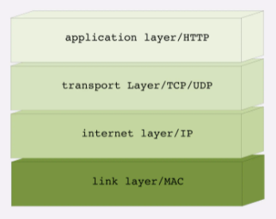
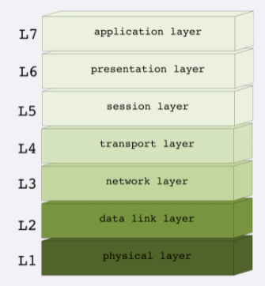
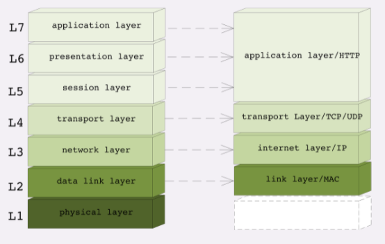
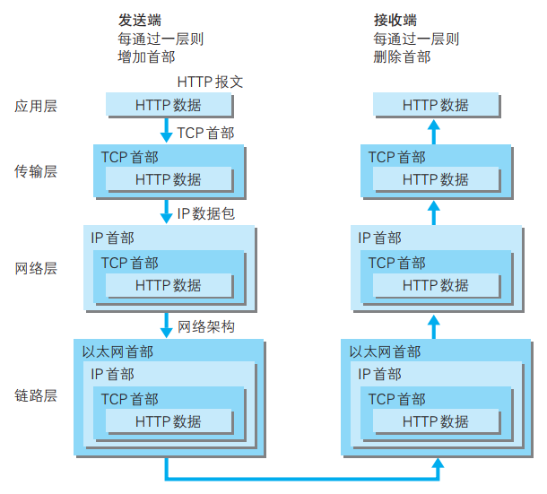
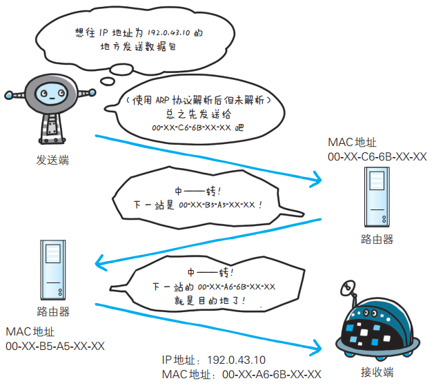
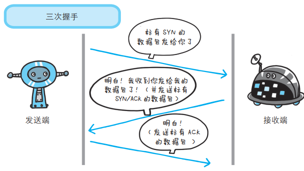
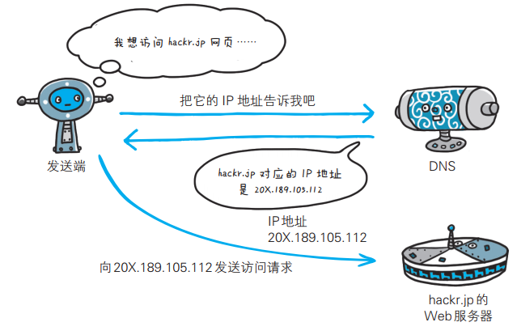
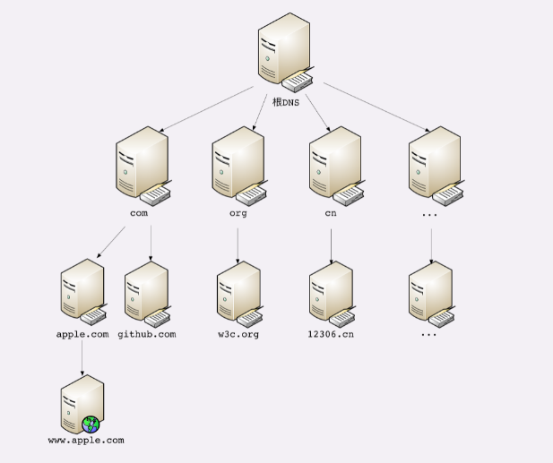
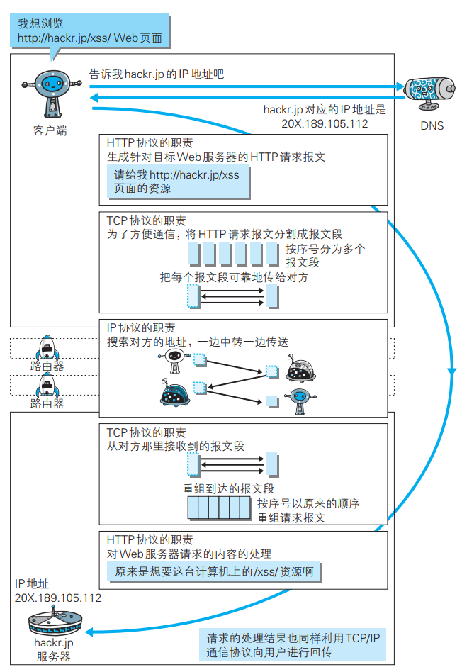
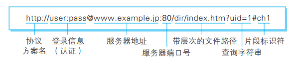

# Http 的发展

- HTTP 是一个用在计算机世界里的协议，它确立了一种计算机之间交流通信的规范，以及相关的各种控制和错误处理方式
- HTTP 专门用来在两点之间传输数据，不能用于广播、寻址或路由
- HTTP 传输的是文字、图片、音频、视频等超文本数据

## 版本历史

- HTTP协议始于三十年前蒂姆·伯纳斯-李的一篇论文
- HTTP/0.9是个简单的文本协议，只能获取文本资源
- HTTP/1.0确立了大部分现在使用的技术，但它不是正式标准
- HTTP/1.1是目前互联网上使用最广泛的协议，功能也非常完善
- HTTP/2 基于Google的 SPDY 协议，注重性能改善，但还未普及
- HTTP/3 基于Google的 QUIC 协议，是将来的发展方向

# 网络基础 TCP/IP

## TCP/IP 网络分层模型

第一层叫链接层（link layer），负责在以太网、WiFi 这样的底层网络上发送原始数据包，工作在网卡这个层次，使用 MAC 地址来标记网络上的设备，所以有时候也叫 MAC 层。

第二层叫“网际层”或者“网络互连层”（internet layer），IP 协议就处在这一层。因为 IP 协议定义了“IP地址”的概念，所以就可以在“链接层”的基础上，用IP地址取代MAC 地址，把许许多多的局域网、广域网连接成一个虚拟的巨大网络，在这个网络里找设备时只要把 IP 地址再“翻译”成 MAC 地址就可以了。

第三层叫“传输层”（transport layer），这个层次协议的职责是保证数据在 IP 地址标记的两点之间“可靠”地传输，是TCP协议工作的层次，另外还有它的一个“小伙伴”UDP。

- TCP是一个有状态的协议，需要先与对方建立连接然后才能发送数据，而且保证数据不丢失不重复
- 而UDP则比较简单，它无状态，不用事先建立连接就可以任意发送数据，但不保证数据一定会发到对方
- 两个协议的另一个重要区别在于数据的形式，TCP 的数据是连续的“字节流”，有先后顺序，而 UDP 则是分散的小数据包，是顺序发，乱序收

第四层叫“应用层”（application layer），有各种面向具体应用的协议。例如，Telnet、SSH、FTP、SMTP等等，当然还有HTTP。

MAC 层的传输单位是帧（frame），IP 层的传输单位是包（packet），TCP 层的传输单位是段（segment），HTTP的传输单位则是消息或报文（message）。但这些名词并没有什么本质的区分，可以统称为数据包。

##　OSI 网络分层模型

OSI，全称是“开放式系统互联通信参考模型”（Open System Interconnection Reference Model）：

- 第一层：物理层，网络的物理形式，例如，电缆、光纤、网卡、集线器等等
- 第二层：数据链路层，它基本相当于 TCP/IP 的链接层
- 第三层：网络层，相当于 TCP/IP 里的网际层
- 第四层：传输层，相当于 TCP/IP 里的传输层
- 第五层：会话层，维护网络中的连接状态，即保持会话和同步
- 第六层：表示层，把数据转换为合适、可理解的语法和语义
- 第七层：应用层，面向具体的应用传输数据

## 两种模型对比

- 第一层：物理层，TCP/IP 里无对应
- 第二层：数据链路层，对应 TCP/IP 的链接层
- 第三层：网络层，对应 TCP/IP 的网际层
- 第四层：传输层，对应 TCP/IP 的传输层
- 第五、六、七层：统一对应到 TCP/IP 的应用层

所谓的“四层负载均衡”就是指工作在传输层上，基于 TCP/IP 协议的特性，例如IP地址、端口号等实现对后端服务器的负载均衡。

所谓的“七层负载均衡”就是指工作在应用层上，看到的是HTTP协议，解析HTTP报文里的URI、主机名、资源类型等数据，再用适当的策略转发给后端服务器。

## TCP/IP协议栈的工作方式

HTTP协议的传输过程就是这样通过协议栈逐层向下，每一层都添加本层的专有数据，层层打包，然后通过下层发送出去。

接收数据是则是相反的操作，从下往上穿过协议栈，逐层拆包，每层去掉本层的专有头，上层就会拿到自己的数据。

# Http 密切相关的协议

## 负责传输的 IP 协议

IP 协议的作用是把各种数据包传送给对方。 而要保证确实传送到对方那里， 则需要满足各类条件。 其中两个重要的条件是 IP 地址和 MAC地址。

## 确保可靠的 TCP 协议

TCP 位于传输层， 提供可靠的字节流服务 。为了准确无误地将数据送达目标处， TCP 协议采用了三次握手（three-way handshaking） 策略。

## 负责域名解析的 DNS 服务

DNS（Domain Name System） 服务是和 HTTP 协议一样位于应用层的协议。 它提供域名到 IP 地址之间的解析服务。

计算机可以被赋予主机名，域名和IP地址，通常会使用主机名或者域名来访问计算机，而不是IP地址。

### 域名解析

域名是一个有层次的结构，是一串用“.”分隔的多个单词，最右边的被称为“顶级域名”，然后是“二级域名”，层级关系向左依次降低。

域名本质上还是个名字空间系统，使用多级域名就可以划分出不同的国家、地区、组织、公司、部门，每个域名都是独一无二的，可以作为一种身份的标识。

DNS的核心系统是一个三层的树状、分布式服务，基本对应域名的结构：

- 根域名服务器（Root DNS Server）：管理顶级域名服务器，返回 `com`，`net`，`cn` 等顶级域名服务器的 IP 地址
- 顶级域名服务器（Top-level DNS Server）：管理各自域名下的权威域名服务器，比如com顶级域名服务器可以返回 `apple.com` 域名服务器的 IP 地址
- 权威域名服务器（Authoritative DNS Server）：管理自己域名下主机的 IP 地址，比如 `apple.com` 权威域名服务器可以返回 `www.apple.com` 的 IP 地址

你要访问`www.apple.com`，就要进行下面的三次查询：

- 访问根域名服务器，它会告诉你 `com` 顶级域名服务器的地址
- 访问 `com` 顶级域名服务器，它再告诉你 `apple.com` 域名服务器的地址
- 最后访问 `apple.com` 域名服务器，就得到了 `www.apple.com` 的地址

### 缓存

虽然核心的 DNS 系统遍布全球，服务能力很强也很稳定，但如果全世界的网民都往这个系统里挤，即使不挤瘫痪了，访问速度也会很慢。所以在核心 DNS 系统之外，还有两种手段用来减轻域名解析的压力，并且能够更快地获取结果，基本思路就是“缓存”：

- 许多大公司、网络运行商都会建立自己的DNS服务器，作为用户DNS查询的代理，代替用户访问核心DNS系统。这些“野生”服务器被称为“非权威域名服务器”，可以缓存之前的查询结果，如果已经有了记录，就无需再向根服务器发起查询，直接返回对应的IP地址
- 操作系统里也会对DNS解析结果做缓存，如果你之前访问过 `www.apple.com`，那么下一次在浏览器里再输入这个网址的时候就不会再跑到DNS那里去问了，直接在操作系统里就可以拿到IP地址
- 操作系统里还有一个特殊的“主机映射”文件，通常是一个可编辑的文本，在Linux里是 `/etc/hosts`，在 Windows 里是 `C:\WINDOWS\system32\drivers\etc\hosts`，如果操作系统在缓存里找不到DNS记录，就会找这个文件

### 新玩法

**重定向**

因为域名代替了IP地址，所以可以让对外服务的域名不变，而主机的IP地址任意变动。当主机有情况需要下线、迁移时，可以更改 DNS 记录，让域名指向其他的机器。

**内部使用**

因为域名是一个名字空间，所以可以使用 bind9 等开源软件搭建一个在内部使用的 DNS，作为名字服务器。这样我们开发的各种内部服务就都用域名来标记，比如数据库服务都用域名 “mysql.inner.app”，商品服务都用 “goods.inner.app”，发起网络通信时也就不必再使用写死的 IP 地址了，可以直接用域名。

**负载均衡**

有两种方式，两种方式可以混用：

- 第一种方式，因为域名解析可以返回多个 IP 地址，所以一个域名可以对应多台主机，客户端收到多个 IP 地址后，就可以自己使用轮询算法依次向服务器发起请求，实现负载均衡
- 第二种方式，域名解析可以配置内部的策略，返回离客户端最近的主机，或者返回当前服务质量最好的主机，这样在 DNS 端把请求分发到不同的服务器，实现负载均衡

## 各种协议与 Http 之间的关系

# URI 和 URL

URI（Uniform Resource Identifier ，统一资源标识符）、URL（Uniform Resource Locattor，统一资源定位符）

URI 用字符串标识某一互联网资源， 而 URL 表示资源的地点（互联网上所处的位置） ， 可见 URL 是 URI 的子集。

URI 格式：

- 协议方案名：
  - 使用 `http:` 或者 `https:` 等协议方案名获取访问资源时要指定的协议类型，不区分大小写，最后附加一个 `:`
  - 也可以使用 `data:`  或者 `javascript:` 这类指定数据或脚本程序的方案名
- 登录信息：
  - 指定用户名和密码作为从服务器获取资源时的必要登录信息
  - 此项是可选项
- 服务器地址：
  - 可以是域名也可以是 IP 地址
- 服务器端口号：
  - 指定服务器连接的端口号
  - 此项是可选项，如果缺省则自动使用默认端口号
- 带层次的文件路径：
  - 指定服务器上的文件路径来定位特定的资源，与 UNIX 系统的文件目录结构相似
- 查询字符串：
  - 针对已指定的文件路径内的资源，可以使用查询字符串传入任意参数
  - 此项是可选项
- 片段标识符：
  - 使用片段标识符通常可以标记出已获取资源中的子资源
  - 此项是可选项

