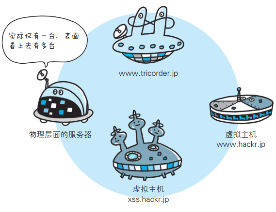
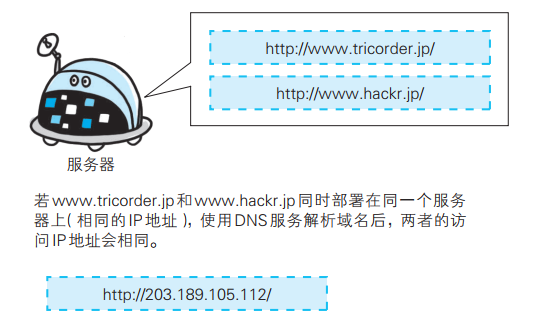
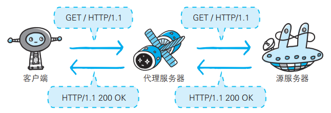
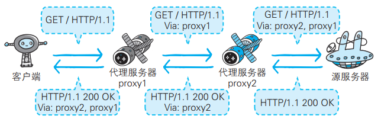
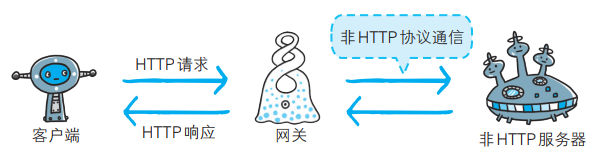
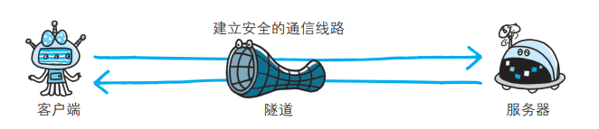

# 用单台虚拟主机实现多个域名  

HTTP/1.1 规范允许一台 HTTP 服务器搭建多个 Web 站点。即使物理层面只有一台服务器， 但只要使用虚拟主机的功能，则可
以假想已具有多台服务器。  

在互联网上， 域名通过 DNS 服务映射到 IP 地址（域名解析）之后访问目标网站。 可见，当请求发送到服务器时，已经是以 IP 地址形式访问了。  

在相同的 IP 地址下，由于虚拟主机可以寄存多个不同主机名和域名的 Web 网站，因此在发送 HTTP 请求时，必须在 Host 首部内完整指定主机名或域名的 URI。  

# 通信数据转发程序：代理、网关、隧道  

HTTP 通信时，除客户端和服务器以外，还有一些用于通信数据转发的应用程序，例如代理、网关和隧道。它们可以配合服务器工作。  

## 代理  

代理是一种有转发功能的应用程序，它扮演了位于服务器和客户端“中间人”的角色， 接收由客户端发送的请求并转发给服务器，同时也接收服务器返回的响应并转发给客户端。  

代理服务器的基本行为就是接收客户端发送的请求后转发给其他服务器。代理不改变请求 URI，会直接发送给前方持有资源的目标服务器。  

持有资源实体的服务器被称为源服务器。 从源服务器返回的响应经过代理服务器后再传给客户端。  

转发时，需要附加 Via 首部字段以标记出经过的主机信息。  

使用代理服务器的理由有：利用缓存技术减少网络带宽的流量，组织内部针对特定网站的访问控制，以获取访问日志为主要目的等等。  

代理有多种使用方法， 按两种基准分类：

- 一种是是否使用缓存
- 另一种是是否会修改报文  

### 缓存代理
代理转发响应时，缓存代理（ Caching Proxy）会预先将资源的副本（缓存）保存在代理服务器上。

当代理再次接收到对相同资源的请求时， 就可以不从源服务器那里获取资源，而是将之前缓存的资源作为响应返回。

### 透明代理
转发请求或响应时，不对报文做任何加工的代理类型被称为透明代理（ Transparent Proxy）。

反之，对报文内容进行加工的代理被称为非透明代理。  

## 网关  

网关是转发其他服务器通信数据的服务器，接收从客户端发送来的请求时，它就像自己拥有资源的源服务器一样对请求进行处理。有时客户端可能都不会察觉，自己的通信目标是一个网关。     

网关的工作机制和代理十分相似。而网关能使通信线路上的服务器提供非 HTTP 协议服务。

利用网关能提高通信的安全性， 因为可以在客户端与网关之间的通信线路上加密以确保连接的安全。 比如：

- 网关可以连接数据库，使用SQL 语句查询数据、
- 在 Web 购物网站上进行信用卡结算时，网关可以和信用卡结算系统联动

## 隧道  

隧道是在相隔甚远的客户端和服务器两者之间进行中转，并保持双方通信连接的应用程序。  

隧道可按要求建立起一条与其他服务器的通信线路，届时使用 SSL 等加密手段进行通信。 隧道的目的是确保客户端能与服务器进行安全的通信。

隧道本身不会去解析 HTTP 请求。也就是说，请求保持原样中转给之后的服务器。隧道会在通信双方断开连接时结束。  

# 保存资源的缓存  

