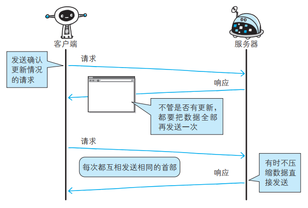
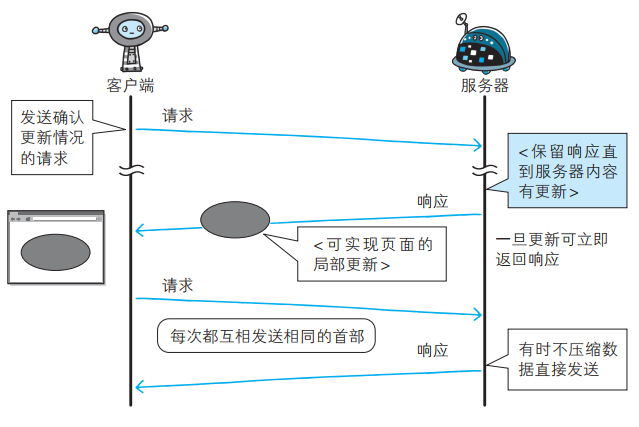
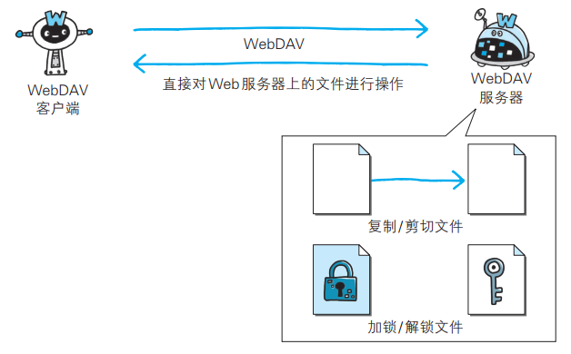
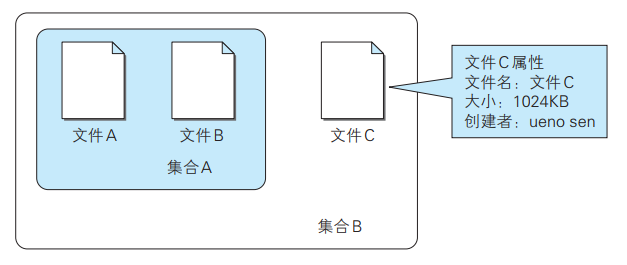

# 消除 HTTP 瓶颈的 SPDY  

Google 在 2010 年发布了 SPDY（取自 SPeeDY，发音同 speedy），其开发目标旨在解决 HTTP 的性能瓶颈，缩短 Web 页面的加载时间（ 50%）。

## HTTP 的瓶颈  

使用 HTTP 协议探知服务器上是否有内容更新，就必须频繁地从客户端到服务器端进行确认。 如果服务器上没有内容更新，那么就会产生徒劳的通信。

若想在现有 Web 实现所需的功能，以下这些 HTTP 标准就会成为瓶颈：

- 一条连接上只可发送一个请求
- 请求只能从客户端开始。客户端不可以接收除响应以外的指令
- 请求/响应首部未经压缩就发送。首部信息越多延迟越大
- 发送冗长的首部。每次互相发送相同的首部造成的浪费较多
- 可任意选择数据压缩格式。非强制压缩发送

### Ajax 的解决方法  

Ajax（ Asynchronous JavaScript and XML，异步 JavaScript 与 XML 技术）是一种有效利用 JavaScript 和 DOM（ Document Object Model，文档对象模型）的操作， 以达到局部 Web 页面替换加载的异步通信手段。和以前的同步通信相比， 由于它只更新一部分页面，响应中传输的数据量会因此而减少，这一优点显而易见。  

Ajax 的核心技术是名为 XMLHttpRequest 的 API，通过 JavaScript 脚本语言的调用就能和服务器进行 HTTP 通信。借由这种手段，就能从 已加载完毕的 Web 页面上发起请求，只更新局部页面。

而利用 Ajax 实时地从服务器获取内容，有可能会导致大量请求产生。另外， Ajax 仍未解决 HTTP 协议本身存在的问题。  

### Comet 的解决方法  

一旦服务器端有内容更新了， Comet 不会让请求等待，而是直接给客户端返回响应。这是一种通过延迟应答，模拟实现服务器端向客户端推送（ Server Push）的功能。  

通常，服务器端接收到请求，在处理完毕后就会立即返回响应，但为了实现推送功能， Comet 会先将响应置于挂起状态，当服务器端有内容更新时，再返回该响应。因此，服务器端一旦有更新，就可以立即反馈给客户端。

内容上虽然可以做到实时更新， 但为了保留响应，一次连接的持续时间也变长了。 期间，为了维持连接会消耗更多的资源。另外， Comet 也仍未解决 HTTP 协议本身存在的问题。  

### SPDY 的目标  

为了进行根本性的改善，需要有一些协议层面上的改动。  处于持续开发状态中的 SPDY 协议，正是为了在协议级别消除 HTTP 所遭遇的瓶颈。  

## SPDY 的设计与功能  

SPDY 没有完全改写 HTTP 协议，而是在 TCP/IP 的应用层与运输层之间通过新加会话层的形式运作。 同时，考虑到安全性问题， SPDY 规定通信中使用 SSL。

SPDY 以会话层的形式加入， 控制对数据的流动，但还是采用 HTTP 建立通信连接。 因此，可照常使用 HTTP 的 GET 和 POST 等方法、 Cookie 以及 HTTP 报文等。  

使用 SPDY 后， HTTP 协议额外获得以下功能：

- 多路复用流
  - 通过单一的 TCP 连接，可以无限制处理多个 HTTP 请求。所有请求的处理都在一条 TCP 连接上完成，因此 TCP 的处理效率得到提高
- 赋予请求优先级
  - SPDY 不仅可以无限制地并发处理请求，还可以给请求逐个分配优先级顺序。这样主要是为了在发送多个请求时，解决因带宽低而导致响应变慢的问题
- 压缩 HTTP 首部
  - 压缩 HTTP 请求和响应的首部。这样一来，通信产生的数据包数量和发送的字节数就更少了
- 推送功能
  - 支持服务器主动向客户端推送数据的功能。这样，服务器可直接发送数据，而不必等待客户端的请求
- 服务器提示功能
    - 服务器可以主动提示客户端请求所需的资源。由于在客户端发现资源之前就可以获知资源的存在， 因此在资源已缓存等情况下，可以避免发送不必要的请求

## SPDY 消除 Web 瓶颈了吗  

希望使用 SPDY 时， Web 的内容端不必做什么特别改动，而 Web 浏览器及 Web 服务器都要为对应 SPDY 做出一定程度上的改动。  

因为 SPDY 基本上只是将单个域名（ IP 地址）的通信多路复用，所以当一个 Web 网站上使用多个域名下的资源，改善效果就会受到限制。  

# WebSocket  

WebSocket，即 Web 浏览器与 Web 服务器之间全双工通信标准。其中， WebSocket 协议由 IETF 定为标准， WebSocket API 由 W3C 定为标准。 WebSocket 通信协议在 2011 年 12 月 11 日，被 RFC 6455 - The WebSocket Protocol 定为标准。  

一旦 Web 服务器与客户端之间建立起 WebSocket 协议的通信连接，之后所有的通信都依靠这个专用协议进行。 通信过程中可互相发送JSON、 XML、 HTML 或图片等任意格式的数据。由于是建立在 HTTP 基础上的协议，因此连接的发起方仍是客户端，而一旦确立 WebSocket 通信连接，不论服务器还是客户端，任意一方都可直接向对方发送报文。  

WebSocket 协议的主要特点：

- 推送功能
  - 支持由服务器向客户端推送数据的推送功能。这样，服务器可直接发送数据，而不必等待客户端的请求

- 减少通信量
  - 只要建立起 WebSocket 连接，就希望一直保持连接状态。和 HTTP 相比，不但每次连接时的总开销减少，而且由于 WebSocket 的首部信息很小，通信量也相应减少了

WebSocket的默认端口也选择了 80 和 443，因为现在互联网上的防火墙屏蔽了绝大多数的端口，只对HTTP的80、443端口“放行”，所以WebSocket就可以“伪装”成HTTP协议，比较容易地“穿透”防火墙，与服务器建立连接。

## 帧结构

WebSocket虽然有“帧”，但却没有像HTTP/2那样定义“流”，也就不存在“多路复用”“优先级”等复杂的特性，而它自身就是“全双工”的，也就不需要“服务器推送”。

下图就是 WebSocket 的帧结构定义，长度不固定，最少2个字节，最多14字节：

- 第一个字节的第一位“FIN”是消息结束的标志位，相当于HTTP/2里的“END_STREAM”，表示数据发送完毕。一个消息可以拆成多个帧，接收方看到“FIN”后，就可以把前面的帧拼起来，组成完整的消息，“FIN”后面的三个位是保留位，目前没有任何意义，但必须是 0
- 第一个字节的后4位很重要，叫“Opcode”，操作码，其实就是帧类型，比如 1 表示帧内容是纯文本，2 表示帧内容是二进制数据，8 是关闭连接，9 和 10 分别是连接保活的 PING 和 PONG
- 第二个字节第一位是掩码标志位“MASK”，表示帧内容是否使用异或操作（xor）做简单的加密。目前的WebSocket标准规定，客户端发送数据必须使用掩码，而服务器发送则必须不使用掩码
- 第二个字节后7位是“Payload len”，表示帧内容的长度。它是另一种变长编码，最少 7 位，最多是 7+64 位，也就是额外增加 8 个字节，所以一个 WebSocket帧最大是2^64
- 长度字段后面是“Masking-key”，掩码密钥，它是由上面的标志位“MASK”决定的，如果使用掩码就是4个字节的随机数，否则就不存在

## 握手

为了实现 WebSocket 通信，在 HTTP 连接建立之后，需要完成一次 “握手”（ Handshaking）的步骤。  

### 握手-请求  

为了实现 WebSocket 通信，需要用到 HTTP 的 Upgrade 首部字段，告知服务器通信协议发生改变，以达到握手的目的。  

WebSocket的握手是一个标准的 HTTP GET 请求，但要带上两个协议升级的专用头字段：

- “Connection: Upgrade”，表示要求协议“升级”
- “Upgrade: websocket”，表示要“升级”成 WebSocket 协议

为了防止普通的 HTTP 消息被“意外”识别成 WebSocket，握手消息还增加了两个额外的认证用头字段：

- Sec-WebSocket-Key：一个 Base64 编码的 16 字节随机数，作为简单的认证密钥
- Sec-WebSocket-Version：协议的版本号，当前必须是 13

### 握手-响应  

服务器收到 HTTP 请求报文，看到上面的四个字段，就知道这不是一个普通的 GET 请求，而是 WebSocket 的升级请求，于是就不走普通的 HTTP 处理流程，而是构造一个特殊的 “101 Switching Protocols” 响应报文，通知客户端，接下来就不用 HTTP 了，全改用 WebSocket 协议通信。

WebSocket 的握手响应报文也是有特殊格式的，要用字段 “Sec-WebSocket-Accept” 验证客户端请求报文，同样也是为了防止误连接。具体的做法是把请求头里“ Sec-WebSocket-Key” 的值，加上一个专用的UUID “258EAFA5-E914-47DA-95CA-C5AB0DC85B11”，再计算SHA-1摘要。客户端收到响应报文，就可以用同样的算法，比对值是否相等，如果相等，就说明返回的报文确实是刚才握手时连接的服务器，认证成功。握手完成，后续传输的数据就不再是HTTP报文，而是WebSocket格式的二进制帧了。

# HTTP/2.0  

# WebDAV  

WebDAV（ Web-based Distributed Authoring and Versioning，基于万维网的分布式创作和版本控制）是一个可对 Web 服务器上的内容直接进行文件复制、 编辑等操作的分布式文件系统。它作为扩展 HTTP/1.1 的协议定义在 RFC4918。  

除了创建、删除文件等基本功能，它还具备文件创建者管理、文件编辑过程中禁止其他用户内容覆盖的加锁功能， 以及对文件内容修改的版本控制功能。  

针对服务器上的资源， WebDAV 新增加了一些概念，如下所示：

- 集合（Collection）：是一种统一管理多个资源的概念。以集合为单位
- 可进行各种操作。也可实现类似集合的集合这样的叠加
- 资源（Resource）：把文件或集合称为资源
- 属性（Property）：定义资源的属性。定义以“名称 = 值”的格式执行
- 锁（Lock）：把文件设置成无法编辑状态。多人同时编辑时，可防止在同一时间进行内容写入

## WebDAV 内新增的方法及状态码  

WebDAV 为实现远程文件管理，向 HTTP/1.1 中追加了以下这些方法：

- PROPFIND ： 获取属性
- PROPPATCH ： 修改属性
- MKCOL ： 创建集合
- COPY ： 复制资源及属性
- MOVE ： 移动资源
- LOCK ： 资源加锁
- UNLOCK ： 资源解锁

为配合扩展的方法，状态码也随之扩展：
- 102 Processing ： 可正常处理请求，但目前是处理中状态
- 207 Multi-Status ： 存在多种状态
- 422 Unprocessible Entity ： 格式正确，内容有误
- 423 Locked ： 资源已被加锁
- 424 Failed Dependency ： 处理与某请求关联的请求失败，因此不再维持依赖关系
- 507 Insufficient Storage ： 保存空间不足  

