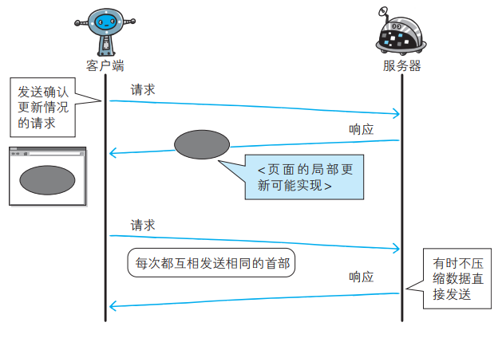
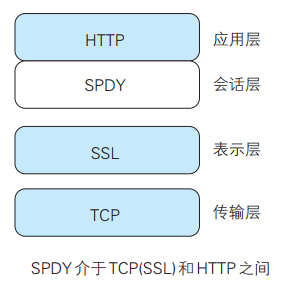
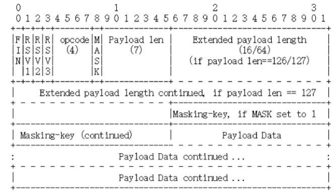
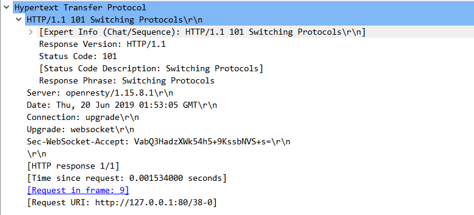
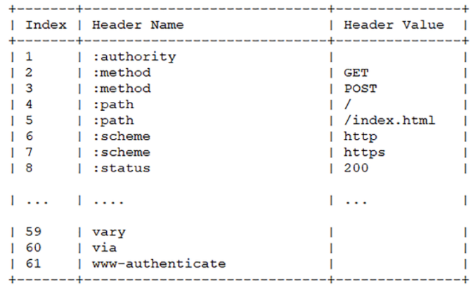
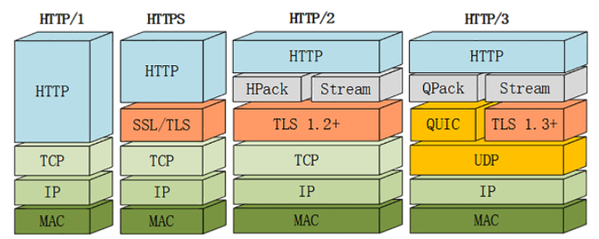
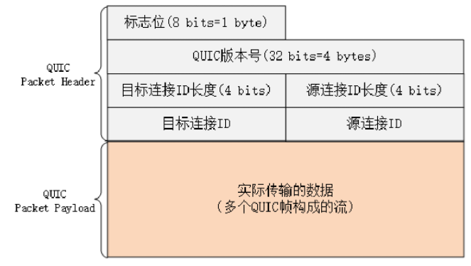
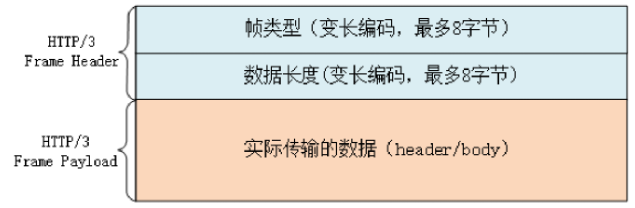

# 消除 HTTP 瓶颈的 SPDY  

Google 在 2010 年发布了 SPDY（取自 SPeeDY，发音同 speedy），其开发目标旨在解决 HTTP 的性能瓶颈，缩短 Web 页面的加载时间（ 50%）。

## HTTP 的瓶颈  

使用 HTTP 协议探知服务器上是否有内容更新，就必须频繁地从客户端到服务器端进行确认。 如果服务器上没有内容更新，那么就会产生徒劳的通信。

若想在现有 Web 实现所需的功能，以下这些 HTTP 标准就会成为瓶颈：

- 一条连接上只可发送一个请求
- 请求只能从客户端开始。客户端不可以接收除响应以外的指令
- 请求/响应首部未经压缩就发送。首部信息越多延迟越大
- 发送冗长的首部。每次互相发送相同的首部造成的浪费较多
- 可任意选择数据压缩格式。非强制压缩发送


### Ajax 的解决方法  

Ajax（ Asynchronous JavaScript and XML，异步 JavaScript 与 XML 技术）是一种有效利用 JavaScript 和 DOM（ Document Object Model，文档对象模型）的操作， 以达到局部 Web 页面替换加载的异步通信手段。和以前的同步通信相比， 由于它只更新一部分页面，响应中传输的数据量会因此而减少，这一优点显而易见。  

Ajax 的核心技术是名为 XMLHttpRequest 的 API，通过 JavaScript 脚本语言的调用就能和服务器进行 HTTP 通信。借由这种手段，就能从 已加载完毕的 Web 页面上发起请求，只更新局部页面。

而利用 Ajax 实时地从服务器获取内容，有可能会导致大量请求产生。另外， Ajax 仍未解决 HTTP 协议本身存在的问题。  



### Comet 的解决方法  

一旦服务器端有内容更新了， Comet 不会让请求等待，而是直接给客户端返回响应。这是一种通过延迟应答，模拟实现服务器端向客户端推送（ Server Push）的功能。  

通常，服务器端接收到请求，在处理完毕后就会立即返回响应，但为了实现推送功能， Comet 会先将响应置于挂起状态，当服务器端有内容更新时，再返回该响应。因此，服务器端一旦有更新，就可以立即反馈给客户端。

内容上虽然可以做到实时更新， 但为了保留响应，一次连接的持续时间也变长了。 期间，为了维持连接会消耗更多的资源。另外， Comet 也仍未解决 HTTP 协议本身存在的问题。  


### SPDY 的目标  

为了进行根本性的改善，需要有一些协议层面上的改动。  处于持续开发状态中的 SPDY 协议，正是为了在协议级别消除 HTTP 所遭遇的瓶颈。  

## SPDY 的设计与功能  

SPDY 没有完全改写 HTTP 协议，而是在 TCP/IP 的应用层与运输层之间通过新加会话层的形式运作。 同时，考虑到安全性问题， SPDY 规定通信中使用 SSL。

SPDY 以会话层的形式加入， 控制对数据的流动，但还是采用 HTTP 建立通信连接。 因此，可照常使用 HTTP 的 GET 和 POST 等方法、 Cookie 以及 HTTP 报文等。  



使用 SPDY 后， HTTP 协议额外获得以下功能：

- 多路复用流
  - 通过单一的 TCP 连接，可以无限制处理多个 HTTP 请求。所有请求的处理都在一条 TCP 连接上完成，因此 TCP 的处理效率得到提高
- 赋予请求优先级
  - SPDY 不仅可以无限制地并发处理请求，还可以给请求逐个分配优先级顺序。这样主要是为了在发送多个请求时，解决因带宽低而导致响应变慢的问题
- 压缩 HTTP 首部
  - 压缩 HTTP 请求和响应的首部。这样一来，通信产生的数据包数量和发送的字节数就更少了
- 推送功能
  - 支持服务器主动向客户端推送数据的功能。这样，服务器可直接发送数据，而不必等待客户端的请求
- 服务器提示功能
    - 服务器可以主动提示客户端请求所需的资源。由于在客户端发现资源之前就可以获知资源的存在， 因此在资源已缓存等情况下，可以避免发送不必要的请求

## SPDY 消除 Web 瓶颈了吗  

希望使用 SPDY 时， Web 的内容端不必做什么特别改动，而 Web 浏览器及 Web 服务器都要为对应 SPDY 做出一定程度上的改动。  

因为 SPDY 基本上只是将单个域名（ IP 地址）的通信多路复用，所以当一个 Web 网站上使用多个域名下的资源，改善效果就会受到限制。  

# WebSocket  

WebSocket，即 Web 浏览器与 Web 服务器之间全双工通信标准。其中， WebSocket 协议由 IETF 定为标准， WebSocket API 由 W3C 定为标准。 WebSocket 通信协议在 2011 年 12 月 11 日，被 RFC 6455 - The WebSocket Protocol 定为标准。  

一旦 Web 服务器与客户端之间建立起 WebSocket 协议的通信连接，之后所有的通信都依靠这个专用协议进行。 通信过程中可互相发送JSON、 XML、 HTML 或图片等任意格式的数据。由于是建立在 HTTP 基础上的协议，因此连接的发起方仍是客户端，而一旦确立 WebSocket 通信连接，不论服务器还是客户端，任意一方都可直接向对方发送报文。  

WebSocket 协议的主要特点：

- 推送功能
  - 支持由服务器向客户端推送数据的推送功能。这样，服务器可直接发送数据，而不必等待客户端的请求

- 减少通信量
  - 只要建立起 WebSocket 连接，就希望一直保持连接状态。和 HTTP 相比，不但每次连接时的总开销减少，而且由于 WebSocket 的首部信息很小，通信量也相应减少了

WebSocket的默认端口也选择了 80 和 443，因为现在互联网上的防火墙屏蔽了绝大多数的端口，只对HTTP的80、443端口“放行”，所以WebSocket就可以“伪装”成HTTP协议，比较容易地“穿透”防火墙，与服务器建立连接。

## 帧结构

WebSocket虽然有“帧”，但却没有像HTTP/2那样定义“流”，也就不存在“多路复用”“优先级”等复杂的特性，而它自身就是“全双工”的，也就不需要“服务器推送”。

下图就是 WebSocket 的帧结构定义，长度不固定，最少2个字节，最多14字节：



- 第一个字节的第一位“FIN”是消息结束的标志位，相当于HTTP/2里的“END_STREAM”，表示数据发送完毕。一个消息可以拆成多个帧，接收方看到“FIN”后，就可以把前面的帧拼起来，组成完整的消息，“FIN”后面的三个位是保留位，目前没有任何意义，但必须是 0
- 第一个字节的后4位很重要，叫“Opcode”，操作码，其实就是帧类型，比如 1 表示帧内容是纯文本，2 表示帧内容是二进制数据，8 是关闭连接，9 和 10 分别是连接保活的 PING 和 PONG
- 第二个字节第一位是掩码标志位“MASK”，表示帧内容是否使用异或操作（xor）做简单的加密。目前的WebSocket标准规定，客户端发送数据必须使用掩码，而服务器发送则必须不使用掩码
- 第二个字节后7位是“Payload len”，表示帧内容的长度。它是另一种变长编码，最少 7 位，最多是 7+64 位，也就是额外增加 8 个字节，所以一个 WebSocket帧最大是2^64
- 长度字段后面是“Masking-key”，掩码密钥，它是由上面的标志位“MASK”决定的，如果使用掩码就是4个字节的随机数，否则就不存在

## 握手

为了实现 WebSocket 通信，在 HTTP 连接建立之后，需要完成一次 “握手”（ Handshaking）的步骤。  


### 握手-请求  

为了实现 WebSocket 通信，需要用到 HTTP 的 Upgrade 首部字段，告知服务器通信协议发生改变，以达到握手的目的。  

WebSocket的握手是一个标准的 HTTP GET 请求，但要带上两个协议升级的专用头字段：

- “Connection: Upgrade”，表示要求协议“升级”
- “Upgrade: websocket”，表示要“升级”成 WebSocket 协议

为了防止普通的 HTTP 消息被“意外”识别成 WebSocket，握手消息还增加了两个额外的认证用头字段：

- Sec-WebSocket-Key：一个 Base64 编码的 16 字节随机数，作为简单的认证密钥
- Sec-WebSocket-Version：协议的版本号，当前必须是 13


### 握手-响应  

服务器收到 HTTP 请求报文，看到上面的四个字段，就知道这不是一个普通的 GET 请求，而是 WebSocket 的升级请求，于是就不走普通的 HTTP 处理流程，而是构造一个特殊的 “101 Switching Protocols” 响应报文，通知客户端，接下来就不用 HTTP 了，全改用 WebSocket 协议通信。



WebSocket 的握手响应报文也是有特殊格式的，要用字段 “Sec-WebSocket-Accept” 验证客户端请求报文，同样也是为了防止误连接。具体的做法是把请求头里“ Sec-WebSocket-Key” 的值，加上一个专用的UUID “258EAFA5-E914-47DA-95CA-C5AB0DC85B11”，再计算SHA-1摘要。客户端收到响应报文，就可以用同样的算法，比对值是否相等，如果相等，就说明返回的报文确实是刚才握手时连接的服务器，认证成功。握手完成，后续传输的数据就不再是HTTP报文，而是WebSocket格式的二进制帧了。

# HTTP/2.0  

HTTP/2 是建立在“HPack”“Stream”“TLS1.2”基础之上的，比HTTP/1、HTTPS复杂了一些。


## 兼容HTTP/1

因为必须要保持功能上的兼容，所以 HTTP/2 把 HTTP 分解成了“语义”和“语法”两个部分，“语义”层不做改动，与 HTTP/1 完全一致（即RFC7231）。比如请求方法、URI、状态码、头字段等概念都保留不变，这样就消除了再学习的成本，基于 HTTP 的上层应用也不需要做任何修改，可以无缝转换到 HTTP/2。HTTP/2 没有在URI里引入新的协议名，仍然用 “http” 表示明文协议，用 “https” 表示加密协议。

在“语义”保持稳定之后，HTTP/2 在“语法”层做了“天翻地覆”的改造，完全变更了 HTTP 报文的传输格式。

## 连接前言

由于 HTTP/2 “事实上”是基于 TLS，所以在正式收发数据之前，会有 TCP 握手和 TLS 握手。

TLS 握手成功之后，客户端必须要发送一个“连接前言”（connection preface），用来确认建立 HTTP/2 连接。这个“连接前言”是标准的 HTTP/1 请求报文，使用纯文本的 ASCII 码格式，请求方法是特别注册的一个关键字 “PRI”，全文只有 24 个字节：

```
PRI * HTTP/2.0\r\n\r\nSM\r\n\r\n
```

在 Wireshark 里，HTTP/2 的“连接前言”被称为 “Magic”，意思就是“不可知的魔法”。

## 头部压缩

由于报文 Header 有许多固定的头字段，多达几百字节甚至上千字节，但 Body 却经常只有几十字节，成了不折不扣的“大头儿子”。更要命的是，成千上万的请求响应报文里有很多字段值都是重复的，非常浪费。所以，HTTP/2 把“头部压缩”作为性能改进的一个重点，优化的方式还是“压缩”。不过 HTTP/2 并没有使用传统的压缩算法，而是开发了专门的 “HPACK” 算法，在客户端和服务器两端建立 “字典”，用索引号表示重复的字符串，还釆用哈夫曼编码来压缩整数和字符串，可以达到 50%~90% 的高压缩率。

“HPACK” 算法是专门为压缩 HTTP 头部定制的算法，与 gzip、zlib 等压缩算法不同，它是一个“有状态”的算法，需要客户端和服务器各自维护一份“索引表”，也可以说是“字典”，压缩和解压缩就是查表和更新表的操作。

HTTP/2 废除了原有的起始行概念，把起始行里面的请求方法、URI、状态码等统一转换成了头字段的形式，并且给这些“不是头字段的头字段”起了个特别的名字——“伪头字段”（pseudo-header fields）。而起始行里的版本号和错误原因短语因为没什么大用，顺便也给废除了。为了与“真头字段”区分开来，这些“伪头字段”会在名字前加一个“:”，比如“:authority” “:method” “:status”，分别表示的是域名、请求方法和状态码。

HTTP/2 为一些最常用的头字段定义了一个只读的“静态表”（Static Table）。下面的这个表格列出了“静态表”的一部分，这样只要查表就可以知道字段名和对应的值：



但如果表里只有 Key 没有 Value，或者是自定义字段根本找不到该怎么办呢？这就要用到“动态表”（Dynamic Table），它添加在静态表后面，结构相同，但会在编码解码的时候随时更新。比如说，第一次发送请求时的 “user-agent” 字段长是一百多个字节，用哈夫曼压缩编码发送之后，客户端和服务器都更新自己的动态表，添加一个新的索引号 “65”。那么下一次发送的时候就不用再重复发那么多字节了，只要用一个字节发送编号就好。


随着在 HTTP/2 连接上发送的报文越来越多，两边的“字典”也会越来越丰富，最终每次的头部字段都会变成一两个字节的代码，原来上千字节的头用几十个字节就可以表示了，压缩效果比 gzip 要好得多。

## 二进制格式

HTTP/2 不再使用肉眼可见的 ASCII 码，而是全面采用二进制格式。这样虽然对人不友好，但却大大方便了计算机的解析。把TCP协议的部分特性挪到了应用层，把原来的 “Header+Body” 的消息“打散”为数个小片的二进制“帧”（Frame），用 “HEADERS” 帧存放头数据、“DATA” 帧存放实体数据。HTTP/2数据分帧后 “Header+Body” 的报文结构就完全消失了，协议看到的只是一个个的“碎片”。


HTTP/2 的帧结构报头很小，只有9字节，非常地节省：


- 帧开头是 3 个字节的长度，默认上限是 2^14，最大是 2^24，也就是说 HTTP/2 的帧通常不超过 16K，最大是 16M
- 长度后面的一个字节是帧类型，大致可以分成数据帧和控制帧两类，HEADERS 帧和 DATA 帧属于数据帧，存放的是 HTTP 报文，而 SETTINGS、PING、PRIORITY 等则是用来管理流的控制帧，HTTP/2 总共定义了 10 种类型的帧，但一个字节可以表示最多 256 种，所以也允许在标准之外定义其他类型实现功能扩展
- 第5个字节是非常重要的帧标志信息，可以保存 8 个标志位，携带简单的控制信息。常用的标志位有 END_HEADERS 表示头数据结束，相当于 HTTP/1 里头后的空行（“\r\n”），END_STREAM 表示单方向数据发送结束（即 EOS，End of Stream），相当于 HTTP/1 里 Chunked 分块结束标志（“0\r\n\r\n”）
- 报文头里最后 4 个字节是流标识符，也就是帧所属的“流”，接收方使用它就可以从乱序的帧里识别出具有相同流 ID 的帧序列，按顺序组装起来就实现了虚拟的“流”。流标识符虽然有 4 个字节，但最高位被保留不用，所以只有 31 位可以使用，也就是说，流标识符的上限是 2^31，大约是 21 亿

## 虚拟的“流”

消息的“碎片”到达目的地后应该怎么组装起来呢？HTTP/2 为此定义了一个“流”（Stream）的概念，它是二进制帧的双向传输序列，同一个消息往返的帧会分配一个唯一的流 ID。你可以想象把它成是一个虚拟的“数据流”，在里面流动的是一串有先后顺序的数据帧，这些数据帧按照次序组装起来就是 HTTP/1 里的请求报文和响应报文。

因为“流”是虚拟的，实际上并不存在，所以HTTP/2就可以在一个TCP连接上用“流”同时发送多个“碎片化”的消息，这就是常说的“多路复用”（ Multiplexing）——多个往返通信都复用一个连接来处理。

在“流”的层面上看，消息是一些有序的“帧”序列，而在“连接”的层面上看，消息却是乱序收发的“帧”。多个请求/响应之间没有了顺序关系，不需要排队等待，也就不会再出现“队头阻塞”问题，降低了延迟，大幅度提高了连接的利用率。


### 流特点

- 流是可并发的，一个 HTTP/2 连接上可以同时发出多个流传输数据，也就是并发多请求，实现“多路复用”
- 客户端和服务器都可以创建流，双方互不干扰
- 流是双向的，一个流里面客户端和服务器都可以发送或接收数据帧，也就是一个“请求-应答”来回
- 流之间没有固定关系，彼此独立，但流内部的帧是有严格顺序的
- 流可以设置优先级，让服务器优先处理，比如先传 HTML/CSS，后传图片，优化用户体验
- 流 ID 不能重用，只能顺序递增，客户端发起的 ID 是奇数，服务器端发起的 ID 是偶数
- 在流上发送 “RST_STREAM” 帧可以随时终止流，取消接收或发送
- 第 0 号流比较特殊，不能关闭，也不能发送数据帧，只能发送控制帧，用于流量控制

HTTP/2 在一个连接上使用多个流收发数据，那么它本身默认就会是长连接，所以永远不需要 “Connection” 头字段（keepalive 或 close）。

下载大文件的时候想取消接收，在 HTTP/1 里只能断开TCP连接重新“三次握手”，成本很高，而在 HTTP/2 里就可以简单地发送一个 “RST_STREAM” 中断流，而长连接会继续保持。

因为客户端和服务器两端都可以创建流，而流ID有奇数偶数和上限的区分，所以大多数的流 ID 都会是奇数，而且客户端在一个连接里最多只能发出 2^30，也就是10 亿个请求。ID 用完了以后，可以再发一个控制帧 “GOAWAY”，真正关闭 TCP 连接。

### 流状态转换

HTTP/2 借鉴了 TCP，根据帧的标志位实现流状态转换。当然，这些状态也是虚拟的，只是为了辅助理解。


- 最开始的时候流都是“空闲”（idle）状态，也就是“不存在”，可以理解成是待分配的“号段资源”
- 当客户端发送 HEADERS 帧后，有了流 ID，流就进入了“打开”状态，两端都可以收发数据，然后客户端发送一个带 “END_STREAM” 标志位的帧，流就进入了“半关闭”状态。这个“半关闭”状态很重要，意味着客户端的请求数据已经发送完了，需要接受响应数据，而服务器端也知道请求数据接收完毕，之后就要内部处理，再发送响应数据
- 响应数据发完了之后，也要带上 “END_STREAM” 标志位，表示数据发送完毕，这样流两端就都进入了“关闭”状态，流就结束了。

流 ID 不能重用，所以流的生命周期就是 HTTP/1 里的一次完整的“请求-应答”，流关闭就是一次通信结束。

下一次再发请求就要开一个新流（而不是新连接），流 ID 不断增加，直到到达上限，发送 “GOAWAY” 帧开一个新的 TCP 连接，流 ID 就又可以重头计数。

## 强化安全

出于兼容的考虑，HTTP/2 延续了HTTP/1的“明文”特点，可以像以前一样使用明文传输数据，不强制使用加密通信，不过格式是二进制，只是不需要解密。但由于 HTTPS 已经是大势所趋，所以“事实上”的 HTTP/2 是加密的。也就是说，互联网上通常所能见到的 HTTP/2 都是使用 “https” 协议名，跑在TLS上面。

为了区分“加密”和“明文”这两个不同的版本，HTTP/2 协议定义了两个字符串标识符：“h2” 表示加密的HTTP/2，“h2c” 表示明文的HTTP/2，多出的那个字母“c”的意思是“clear text”。

HTTP/2 在安全方面做了强化，要求下层的通信协议必须是 TLS1.2 以上，还要支持前向安全和 SNI，并且把几百个弱密码套件列入了“黑名单”，比如 DES、RC4、CBC、SHA-1 都不能在 HTTP/2 里使用，相当于底层用的是 “TLS1.25”。

## 迁移到HTTP/2

虽然已经有了不少的网站改造升级到了HTTP/2，但普及的速度远不及HTTPS。

### 优点

- HTTP/2 最大的一个优点是完全保持了与 HTTP/1 的兼容，在语义上没有任何变化
- 在安全上，HTTP/2 对 HTTPS 在各方面都做了强化。下层的 TLS 至少是 1.2，而且只能使用前向安全的密码套件（即ECDHE）
- HTTP/2的头部压缩、多路复用、流优先级、服务器推送等手段其实针对“带宽”和“延迟”做了优化

### 缺点

- HTTP/2 在 TCP 级别还是存在“队头阻塞”的问题。所以，如果网络连接质量差，发生丢包，那么 TCP 会等待重传，传输速度就会降低
- 发生 IP 地址切换的时候，下层的 TCP 必须重新建连，要再次“握手”，经历“慢启动”，而且之前连接里积累的HPACK字典也都消失了，必须重头开始计算，导致带宽浪费和时延
- HTTP/2 对一个域名只开一个连接，所以一旦这个连接出问题，那么整个网站的体验也就变差了。而这些情况下 HTTP/1 反而不会受到影响，因为它“本来就慢”，而且还会对一个域名开 6~8 个连接，顶多其中的一两个连接会“更慢”，其他的连接不会受到影响

### 该迁移到HTTP/2吗？

HTTP/2 处于一个略“尴尬”的位置，前面有“老前辈” HTTP/1，后面有“新来者” HTTP/3。但这绝不是说 HTTP/2 “一无是处”，实际上 HTTP/2 的性能改进效果是非常明显的。

因为 HTTP/2 的侧重点是“性能”，所以“是否迁移”就需要在这方面进行评估。如果网站的流量很大，那么 HTTP/2 就可以带来可观的收益；反之，如果网站流量比较小，那么升级到 HTTP/2 就没有太多必要了，只要利用现有的 HTTP 再优化就足矣。

# HTTP/3.0

## HTTP/2的“队头阻塞”

HTTP/2 虽然使用“帧”“流”“多路复用”，没有了“队头阻塞”，但这些手段都是在应用层里，而在下层，也就是 TCP 协议里，还是会发生“队头阻塞”。在 HTTP/2 把多个“请求-响应”分解成流，交给 TCP 后，TCP 会再拆成更小的包依次发送。在网络良好的情况下，包可以很快送达目的地。但如果网络质量比较差，就有可能会丢包。而 TCP 为了保证可靠传输，有个特别的“丢包重传”机制，丢失的包必须要等待重新传输确认，其他的包即使已经收到了，也只能放在缓冲区里，上层的应用拿不出来，只能“干着急”。

由于这种“队头阻塞”是 TCP 协议固有的，所以 HTTP/2 即使设计出再多的“花样”也无法解决。Google 在推 SPDY 的时候就已经意识到了这个问题，于是就又发明了一个新的 QUIC 协议，让 HTTP 跑在 QUIC 上而不是 TCP 上。而这个 “HTTP over QUIC” 就是 HTTP 协议的下一个大版本，HTTP/3。它在 HTTP/2 的基础上又实现了质的飞跃，真正“完美”地解决了“队头阻塞”问题。



## QUIC 协议

UDP 是一个简单、不可靠的传输协议，只是对 IP 协议的一层很薄的包装，和 TCP 相比，它实际应用的较少。不过正是因为它简单，不需要建连和断连，通信成本低，也就非常灵活、高效，“可塑性”很强。所以，QUIC 就选定了 UDP，在它之上把 TCP 的那一套连接管理、拥塞窗口、流量控制等“搬”了过来，“去其糟粕，取其精华”，打造出了一个全新的可靠传输协议，可以认为是“新时代的 TCP”。

QUIC 最早是由 Google 发明的，被称为 gQUIC。而当前正在由IETF标准化的 QUIC 被称为 iQUIC。两者的差异非常大。gQUIC 混合了 UDP、TLS、HTTP，是一个应用层的协议。而 IETF 则对 gQUIC 做了“清理”，把应用部分分离出来，形成了 HTTP/3，原来的 UDP 部分“下放”到了传输层。

### QUIC 的特点

- QUIC 基于UDP，而 UDP 是“无连接”的，根本就不需要“握手”和“挥手”，所以天生就要比 TCP 快
- QUIC 基于 UDP 实现了可靠传输，保证数据一定能够抵达目的地。它还引入了类似 HTTP/2 的“流”和“多路复用”，单个“流”是有序的，可能会因为丢包而阻塞，但其他“流”不会受到影响
- QUIC 并不是建立在 TLS 之上，而是内部“包含”了 TLS。它使用自己的帧“接管”了 TLS 里的“记录”，握手消息、警报消息都不使用 TLS 记录，直接封装成QUIC 的帧发送，省掉了一次开销

### QUIC 内部细节

QUIC 的基本数据传输单位是包（packet）和帧（frame），一个包由多个帧组成，包面向的是“连接”，帧面向的是“流”。

QUIC 使用不透明的“连接ID”来标记通信的两个端点，客户端和服务器可以自行选择一组 ID 来标记自己，这样就解除了 TCP 里连接对“IP地址+端口”（即常说的四元组）的强绑定，支持“连接迁移”（Connection Migration）。



QUIC 的帧里有多种类型，PING、ACK 等帧用于管理连接，而 STREAM 帧专门用来实现流。QUIC 里的流与 HTTP/2 的流非常相似，也是帧的序列：


QUIC 帧普遍采用变长编码，最少只要1个字节，最多有8个字节。流 ID 的最大可用位数是 62，数量上比 HTTP/2 的 2^31 大大增加。

流 ID 还保留了最低两位用作标志，第 1 位标记流的发起者，0 表示客户端，1 表示服务器；第 2 位标记流的方向，0 表示双向流，1 表示单向流。所以 QUIC 流 ID 的奇偶性质和 HTTP/2 刚好相反，客户端的 ID 是偶数，从 0 开始计数。

## HTTP/3

因为 QUIC 本身就已经支持了加密、流和多路复用，所以 HTTP/3 的工作减轻了很多，把流控制都交给 QUIC 去做。调用的不再是 TLS 的安全接口，也不是Socket API，而是专门的 QUIC 函数。不过这个“QUIC 函数”还没有形成标准，必须要绑定到某一个具体的实现库。

HTTP/3 里仍然使用流来发送“请求-响应”，但它自身不需要像 HTTP/2 那样再去定义流，而是直接使用 QUIC 的流，相当于做了一个“概念映射”。HTTP/3 里的“双向流”可以完全对应到 HTTP/2 的流，而“单向流”在 HTTP/3 里用来实现控制和推送，近似地对应 HTTP/2 的0号流。

由于流管理被“下放”到了 QUIC，所以 HTTP/3 里帧的结构也变简单了。帧头只有两个字段：类型和长度，而且同样都采用变长编码，最小只需要两个字节。



HTTP/3 里的帧仍然分成数据帧和控制帧两类，HEADERS 帧和 DATA 帧传输数据，但其他一些帧因为在下层的 QUIC 里有了替代，所以在 HTTP/3 里就都消失了，比如 RST_STREAM、WINDOW_UPDATE、PING 等。

头部压缩算法在HTTP/3里升级成了“QPACK”，使用方式上也做了改变。虽然也分成静态表和动态表，但在流上发送HEADERS帧时不能更新字段，只能引用，索引表的更新需要在专门的单向流上发送指令来管理，解决了 HPACK 的“队头阻塞”问题。另外，QPACK 的字典也做了优化，静态表由之前的 61 个增加到了 98 个，而且序号从 0 开始，也就是说“:authority”的编号是0。

## HTTP/3服务发现

HTTP/3 没有指定默认的端口号，也就是说不一定非要在 UDP 的 80 或者 443 上提供 HTTP/3 服务。

那么，该怎么“发现” HTTP/3 呢？这就要用到 HTTP/2 里的“扩展帧”了。浏览器需要先用 HTTP/2 协议连接服务器，然后服务器可以在启动 HTTP/2 连接后发送一个“Alt-Svc”帧，包含一个“h3=host:port”的字符串，告诉浏览器在另一个端点上提供等价的 HTTP/3 服务。浏览器收到“Alt-Svc”帧，会使用 QUIC 异步连接指定的端口，如果连接成功，就会断开 HTTP/2 连接，改用新的 HTTP/3 收发数据。

# WebDAV  

WebDAV（ Web-based Distributed Authoring and Versioning，基于万维网的分布式创作和版本控制）是一个可对 Web 服务器上的内容直接进行文件复制、 编辑等操作的分布式文件系统。它作为扩展 HTTP/1.1 的协议定义在 RFC4918。  

除了创建、删除文件等基本功能，它还具备文件创建者管理、文件编辑过程中禁止其他用户内容覆盖的加锁功能， 以及对文件内容修改的版本控制功能。  


针对服务器上的资源， WebDAV 新增加了一些概念，如下所示：


- 集合（Collection）：是一种统一管理多个资源的概念。以集合为单位
- 可进行各种操作。也可实现类似集合的集合这样的叠加
- 资源（Resource）：把文件或集合称为资源
- 属性（Property）：定义资源的属性。定义以“名称 = 值”的格式执行
- 锁（Lock）：把文件设置成无法编辑状态。多人同时编辑时，可防止在同一时间进行内容写入

## WebDAV 内新增的方法及状态码  

WebDAV 为实现远程文件管理，向 HTTP/1.1 中追加了以下这些方法：

- PROPFIND ： 获取属性
- PROPPATCH ： 修改属性
- MKCOL ： 创建集合
- COPY ： 复制资源及属性
- MOVE ： 移动资源
- LOCK ： 资源加锁
- UNLOCK ： 资源解锁

为配合扩展的方法，状态码也随之扩展：
- 102 Processing ： 可正常处理请求，但目前是处理中状态
- 207 Multi-Status ： 存在多种状态
- 422 Unprocessible Entity ： 格式正确，内容有误
- 423 Locked ： 资源已被加锁
- 424 Failed Dependency ： 处理与某请求关联的请求失败，因此不再维持依赖关系
- 507 Insufficient Storage ： 保存空间不足  

