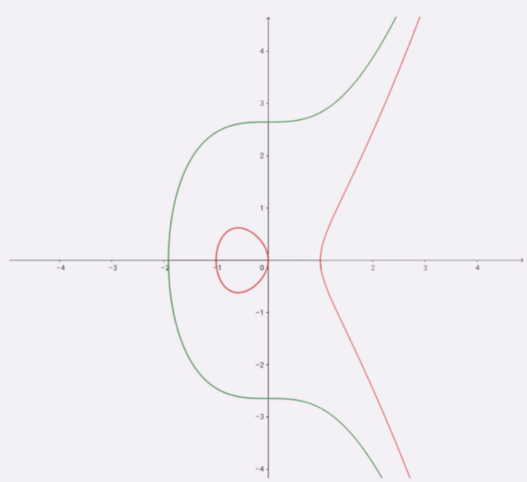

实现机密性最常用的手段是“加密”（encrypt），就是把消息用某种方式转换成谁也看不懂的乱码，只有掌握特殊“钥匙”的人才能再转换出原始文本。这里的“钥匙”就叫做“密钥”（key），加密前的消息叫“明文”（plain text/clear text），加密后的乱码叫“密文”（cipher text），使用密钥还原明文的过程叫“解密”（decrypt），是加密的反操作，加密解密的操作过程就是“加密算法”。所有的加密算法都是公开的，任何人都可以去分析研究，而算法使用的“密钥”则必须保密。

按照密钥的使用方式，加密可以分为两大类：对称加密和非对称加密。

# 对称加密

“对称加密”很好理解，就是指加密和解密时使用的密钥都是同一个，是“对称”的。

举个例子，你想要登录某网站，只要事先和它约定好使用一个对称密码，通信过程中传输的全是用密钥加密后的密文，只有你和网站才能解密。黑客即使能够窃听，看到的也只是乱码，因为没有密钥无法解出明文，所以就实现了机密性。

TLS里有非常多的对称加密算法可供选择，比如RC4、DES、3DES、AES、ChaCha20等，但前三种算法都被认为是不安全的，通常都禁止使用，目前常用的只有AES和ChaCha20。

AES的意思是“高级加密标准”（Advanced Encryption Standard），密钥长度可以是128、192或256。它是DES算法的替代者，安全强度很高，性能也很好，而且有的硬件还会做特殊优化，所以非常流行，是应用最广泛的对称加密算法。

ChaCha20是Google设计的另一种加密算法，密钥长度固定为256位，纯软件运行性能要超过AES，曾经在移动客户端上比较流行，但ARMv8之后也加入了AES硬件优化，所以现在不再具有明显的优势，但仍然算得上是一个不错算法。

## 加密分组模式

对称算法还有一个“分组模式”的概念，它可以让算法用固定长度的密钥加密任意长度的明文，把小秘密（即密钥）转化为大秘密（即密文）。

最早有ECB、CBC、CFB、OFB等几种分组模式，但都陆续被发现有安全漏洞，所以现在基本都不怎么用了。最新的分组模式被称为AEAD（Authenticated Encryption with Associated Data），在加密的同时增加了认证的功能，常用的是GCM、CCM和Poly1305。

把上面这些组合起来，就可以得到TLS密码套件中定义的对称加密算法。比如，AES128-GCM，意思是密钥长度为128位的AES算法，使用的分组模式是GCM；ChaCha20-Poly1305的意思是ChaCha20算法，使用的分组模式是Poly1305。

# 非对称加密

对称加密中如何把密钥安全地传递给对方，术语叫“密钥交换”。因为在对称加密算法中只要持有密钥就可以解密。如果你和网站约定的密钥在传递途中被黑客窃取，那他就可以在之后随意解密收发的数据，通信过程也就没有机密性可言了。

非对称加密（也叫公钥加密算法）有两个密钥，一个叫“公钥”（public key），一个叫“私钥”（private key）。两个密钥是不同的，“不对称”，公钥可以公开给任何人使用，而私钥必须严格保密。公钥和私钥有个特别的“单向”性，虽然都可以用来加密解密，但公钥加密后只能用私钥解密，反过来，私钥加密后也只能用公钥解密。

网站秘密保管私钥，在网上任意分发公钥，你想要登录网站只要用公钥加密就行了，密文只能由私钥持有者才能解密。而黑客因为没有私钥，所以就无法破解密文。

非对称加密算法的设计要比对称算法难得多，在TLS里只有很少的几种，比如DH、DSA、RSA、ECC等。

RSA可能是其中最著名的一个，几乎可以说是非对称加密的代名词，它的安全性基于“整数分解”的数学难题，使用两个超大素数的乘积作为生成密钥的材料，想要从公钥推算出私钥是非常困难的。10年前RSA密钥的推荐长度是1024，但随着计算机运算能力的提高，现在1024已经不安全，普遍认为至少要2048位。

ECC（Elliptic Curve Cryptography）是非对称加密里的“后起之秀”，它基于“椭圆曲线离散对数”的数学难题，使用特定的曲线方程和基点生成公钥和私钥，子算法ECDHE用于密钥交换，ECDSA用于数字签名。目前比较常用的两个曲线是P-256（secp256r1，在OpenSSL称为prime256v1）和x25519。P-256是NIST（美国国家标准技术研究所）和NSA（美国国家安全局）推荐使用的曲线，而x25519被认为是最安全、最快速的曲线。

ECC名字里的“椭圆”经常会引起误解，其实它的曲线并不是椭圆形，只是因为方程很类似计算椭圆周长的公式，实际的形状更像抛物线，比如下面的图就展示了两个简单的椭圆曲线。

比起RSA，ECC在安全强度和性能上都有明显的优势。160位的ECC相当于1024位的RSA，而224位的ECC则相当于2048位的RSA。因为密钥短，所以相应的计算量、消耗的内存和带宽也就少，加密解密的性能就上去了，对于现在的移动互联网非常有吸引力。

# 混合加密

虽然非对称加密没有“密钥交换”的问题，但因为它们都是基于复杂的数学难题，运算速度很慢，即使是ECC也要比AES差上好几个数量级。如果仅用非对称加密，虽然保证了安全，但通信速度太慢，实用性就降低了。于是就出现了把对称加密和非对称加密结合起来的混合加密方式：

- 在通信刚开始的时候使用非对称算法，比如RSA、ECDHE，首先解决密钥交换的问题
- 然后用随机数产生对称算法使用的“会话密钥”（session key），再用公钥加密。因为会话密钥很短，通常只有16字节或32字节，所以慢一点也无所谓
- 对方拿到密文后用私钥解密，取出会话密钥。这样，双方就实现了对称密钥的安全交换，后续就不再使用非对称加密，全都使用对称加密

