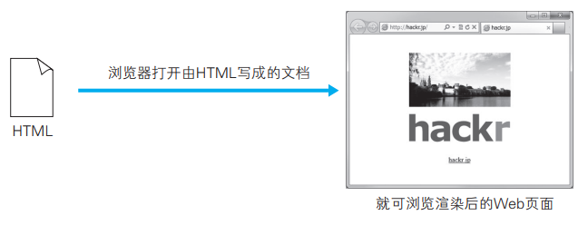
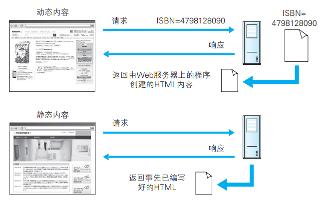
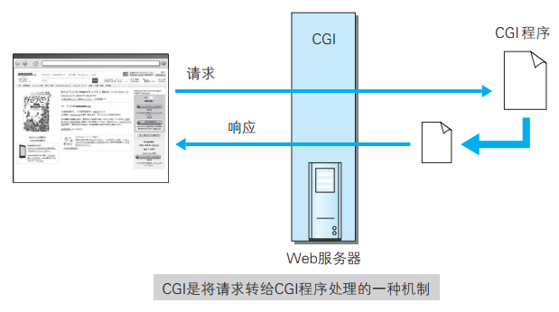
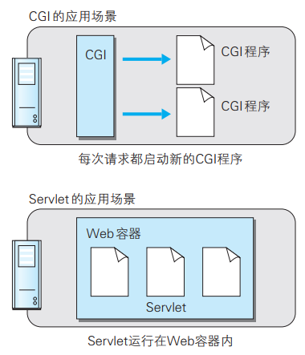

# HTML  

HTML（ HyperText Markup Language，超文本标记语言）是为了发送 Web 上的超文本（ Hypertext）而开发的标记语言：

- 超文本是一种文档系统，可将文档中任意位置的信息与其他信息（文本或图片等）建立关联，即超链接文本
- 标记语言是指通过在文档的某部分穿插特别的字符串标签，用来修饰文档的语言。我们把出现在 HTML 文档内的这种特殊字符串叫做 HTML 标签（ Tag）

平 时 我 们 浏 览 的 Web 页 面 几 乎 全 是 使 用 HTML 写 成 的。 由 HTML 构成的文档经过浏览器的解析、渲染后，呈现出来的结果就是 Web 页面：



以下就是用 HTML 编写的文档的例子。而这份 HTML 文档内这种被 < > 包围着的文字就是标签。在标签的作用下，文档会改变样式，或插入图片、链接：

```
<html>
<head>
<meta http-equiv="Content-Type" content="text/html; charset=utf-8" />
<title>hackr.jp</title>
<style type="text/css">
.logo {
padding: 20px;
text-align: center;
}
</style>
</head>
<body>
<div class="logo">
<p></p>
<p></p>
<p><a href="http://hackr.jp/">hackr.jp</a> </p>
</div>
</body>
</html>
```

## 设计应用 CSS  

CSS（ Cascading Style Sheets，层叠样式表）可以指定如何展现 HTML 内的各种元素， 属于样式表标准之一。即使是相同的 HTML 文档，通过改变应用的CSS，用浏览器看到的页面外观也会随之改变。CSS 的理念就是让文档的结构和设计分离，达到解耦的目的。  

```
.logo {
padding: 20px;
text-align: center;
}
```

# 动态 HTML  

所谓动态 HTML（ Dynamic HTML），是指使用客户端脚本语言将静态 的 HTML 内容变成动态的技术的总称。鼠标单击点开的新闻、Google Maps 等可滚动的地图就用到了动态 HTML。

动态 HTML 技术是通过调用客户端脚本语言 JavaScript，实现对HTML 的 Web 页面的动态改造。利用 DOM（ Document Object Model，文档对象模型）可指定发生动态变化的 HTML 元素。  

## 更易控制 HTML 的 DOM  

DOM 是用以操作 HTML 文档和 XML 文档的 API（ Application  Programming Interface，应用编程接口）。使用 DOM 可以将 HTML 内的元素当作对象操作， 如取出元素内的字符串、改变那个 CSS 的属性等，使页面的设计发生改变。  

通过调用 JavaScript 等脚本语言对 DOM 的操作，可以以更为简单的方式控制 HTML 的改变。  

```
<body>
<h1>繁琐的Web安全</h1>
<p>第Ⅰ部分　Web的构成元素</p>
<p>第Ⅱ部分　浏览器的安全功能</p>
<p>第Ⅲ部分　接下来发生的事</p>
</body>
```

比如，从 JavaScript 的角度来看，将上述 HTML 文档的第 3 个 P 元素（ P 标签）改变文字颜色时，会像下方这样编写代码：

```
<script type="text/javascript">
var content = document.getElementsByTagName('P');
content[2].style.color = '#FF0000';
</script>
```

# Web 应用  

## 通过 Web 提供功能的 Web 应用  

Web 应用是指通过 Web 功能提供的应用程序。比如购物网站、网上银行、 SNS、 BBS、搜索引擎和 e-learning 等。 互联网（ Internet）或企业内网（ Intranet）上遍布各式各样的 Web 应用。  

原本应用 HTTP 协议的 Web 的机制就是对客户端发来的请求，返回事前准备好的内容。 可随着 Web 越来越普及，仅靠这样的做法已不足以应对所有的需求，更需要引入由程序创建 HTML 内容的做法。

类似这种由程序创建的内容称为动态内容， 而事先准备好的内容称为静态内容。 Web 应用则作用于动态内容之上。  



## 与 Web 服务器及程序协作的 CGI  

CGI（ Common Gateway Interface，通用网关接口）是指 Web 服务器在接收到客户端发送过来的请求后转发给程序的一组机制。 在 CGI 的作用下，程序会对请求内容做出相应的动作，比如创建 HTML 等动态内容。使用 CGI 的程序叫做 CGI 程序，通常是用 Perl、 PHP、 Ruby 和 C 等编程语言编写而成。  



有关 CGI 更为翔实的内容请参考 RFC3875“The Common Gateway Interface (CGI) Version 1.1” 。

## 因 Java 而普及的 Servlet  

Servlet 是一种能在服务器上创建动态内容的程序。 Servlet 是用 Java 语 言 实 现 的 一 个 接 口， 属 于 面 向 企 业 级 Java（ JavaEE， Java Enterprise Edition）的一部分。  

CGI，由于每次接到请求，程序都要跟着启动一次。因此一旦访问量过大， Web 服务器要承担相当大的负载。而 Servlet 运行在与 Web 服务器相同的进程中，因此受到的负载较小。 Servlet 的运行环境叫做 Web 容器或 Servlet 容器。



随着 CGI 的普及，每次请求都要启动新 CGI 程序的 CGI 运行机制逐渐变成了性能瓶颈， 所以之后 Servlet 和 mod_perl 等可直接在 Web 服务器上运行的程序才得以开发、普及。  

# 数据发布的格式及语言  

## XML

XML（ eXtensible Markup Language，可扩展标记语言）是一种可按应用目标进行扩展的通用标记语言。 旨在通过使用 XML，使互联网数据共享变得更容易。  

XML 和 HTML 都是从标准通用标记语言 SGML（ Standard Generalized Markup Language）简化而成。与 HTML 相比，它对数据的记录方式做了特殊处理。  

HTML 编写的某公司的研讨会议议程：

```
<html>
<head>
<title>T公司研讨会介绍</title>
</head>
<body>
<h1>T公司研讨会介绍</h1>
<ul>
<li>研讨会编号 ： TR001
<ul>
<li>Web应用程序脆弱性诊断讲座</li>
</ul>
</li>
<li>研讨会编号 ： TR002
<ul>
<li>网络系统脆弱性诊断讲座</li>
</ul>
</li>
</ul>
</body>
</html>
```

用浏览器打开该文档时，就会显示排列的列表内容，但这份 HTML 的样式一旦改变，要读取数据内容也就变得相对困难了。 可见，为了保持数据的正确读取，HTML 不适合用来记录数据结构。  

接着将这份列表以 XML 的形式改写就成了以下的示例：

```
<研讨会 编号="TR001" 主题="Web应用程序脆弱性诊断讲座">
<类别>安全</类别>
<概要>为深入研究Web应用程序脆弱性诊断必要的…</概要>
</研讨会>
<研讨会 编号="TR002" 主题="网络系统脆弱性诊断讲座">
<类别>安全</类别>
<概要>为深入研究网络系统脆弱性诊断必要的…</概要>
</研讨会>
```

XML 和 HTML 一样，使用标签构成树形结构，并且可自定义扩展标签。  

从 XML 文档中读取数据比起 HTML 更为简单。由于 XML 的结构基本上都是用标签分割而成的树形结构，因此通过语法分析器（ Parser）的解析功能解析 XML 结构并取出数据元素，可更容易地对数据进行读取。  

## RSS/Atom  

RSS（简易信息聚合，也叫聚合内容）和 Atom 都是发布新闻或博客日志等更新信息文档的格式的总称。两者都用到了 XML。

RSS 有以下版本，名称和编写方式也不相同：

- RSS 0.9（RDF Site Summary）： 最初的 RSS 版本，基础构图创建在初期的 RDF 规格上
- RSS 0.91（Rich Site Summary）：非 RDF 规格，使用 XML 方式编写  
- RSS 1.0（RDF Site Summary）  ：  次采用 RSS0.9 中使用的 RDF 规格发布  
- RSS2.0（Really Simple Syndication）：非 RSS1.0 发展路线。增加支持 RSS0.91 的兼容性  

Atom 具有以下两种标准：

- Atom 供稿格式（Atom●Syndication●Format）：为发布内容而制定的网站消息来源格式，单讲 Atom 时，就是指此标准  
- Atom 出版协定（Atom●Publishing●Protocol）：为 Web 上内容的新增或修改而制定的协议  

## JSON

JSON（ JavaScript Object Notation）是一种以 JavaScript（ ECMAScript） 的对象表示法为基础的轻量级数据标记语言。 能够处理的数据类型有 false/null/true/对象/数组/数字/ 字符串，这 7 种类型。

```
{"name": "Web Application Security", "num": "TR001"}
```

JSON 让数据更轻更纯粹，并且 JSON 的字符串形式可被 JavaScript 轻易地读入。 

有关 JSON 更为翔实的内容请参考 RFC4627“The application/json Media Type for JavaScript Object Notation (JSON)”。

