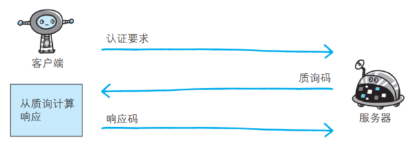

# HTTP 使用的认证方式
HTTP/1.1 使用的认证方式：

- BASIC 认证（基本认证）
- DIGEST 认证（摘要认证）
- SSL 客户端认证
- FormBase 认证（基于表单认证）  

# BASIC 认证  

BASIC 认证（基本认证）是从 HTTP/1.0 就定义的认证方式。即便是现在仍有一部分的网站会使用这种认证方式。  

## BASIC 认证的认证步骤  

- 当请求的资源需要 BASIC 认证时，服务器会随状态码 401 Authorization Required，返回带 WWW-Authenticate 首部字段的响应。该字段内包含认证的方式（ BASIC）及Request-URI 安全域字符串（ realm）  
- 接收到状态码 401 的客户端为了通过 BASIC 认证，需要将用户 ID 及密码发送给服务器。发送的字符串内容是由用户 ID 和密码构成，两者中间以冒号（ :）连接后，再经过 Base64 编码处理。假设用户 ID 为 guest，密码是 guest，连接起来就会形成 guest:guest 这样的字符串。然后经过 Base64 编码，最后的
  结果即是 Z3Vlc3Q6Z3Vlc3Q=。把这串字符串写入首部字 段 Authorization 后，发送请求
- 接收到包含首部字段 Authorization 请求的服务器，会对认证信息的正确性进行验证。如验证通过，则返回一条包含 Request-URI 资源的响应  

BASIC 认证缺点：

- 由于明文解码后就是用户 ID 和密码，在 HTTP 等非加密通信的线路上进行 BASIC 认证的过程中，  如果被人窃听，被盗的可能性极高
- 如果想再进行一次 BASIC 认证时，一般的浏览器却无法实现认证注销操作  

BASIC 认证使用上不够便捷灵活， 且达不到多数 Web 网站期望的安全性等级，因此它并不常用。  

# DIGEST 认证  

为弥补 BASIC 认证存在的弱点，从 HTTP/1.1 起就有了 DIGEST 认证。 DIGEST 认证同样使用质询 / 响应的方式（ challenge/response），但不会像 BASIC 认证那样直接发送明文密码。  

## DIGEST 认证的认证步骤  

- 请求需认证的资源时，服务器会随着状态码 401 Authorization Required， 返回带 WWW-Authenticate 首部字段的响应。该字段内包含质问响应方式认证所需的临时质询码（随机数， nonce）。首部字段 WWW-Authenticate 内必须包含 realm 和 nonce 这两个字段的信息。客户端就是依靠向服务器回送这两个值进行认证的。nonce 是一种每次随返回的 401 响应生成的任意随机字符串。该字符串通常推荐由 Base64 编码的十六进制数的组成形式，但实际内容依赖服务器的具体实现
- 接收到 401 状态码的客户端，返回的响应中包含 DIGEST 认证必须的首部字段 Authorization 信息。  首 部 字 段 Authorization 内 必 须 包 含 username、 realm、nonce、 uri 和 response 的字段信息。其中， realm 和 nonce 就是之前从服务器接收到的响应中的字段。username 是 realm 限定范围内可进行认证的用户名。uri（ digest-uri）即 Request-URI 的值，但考虑到经代理转发后 Request-URI 的值可能被修改，因此事先会复制一份副本保存在 uri 内。response 也可叫做 Request-Digest，存放经过 MD5 运算后的密码字符串，形成响应码。响应中其他的实体请参见第6章的请求首部字段 Authorization。另外，有关 Request-Digest 的计算规则较复杂，有兴趣的读者不妨深入学习一下 RFC2617。  

