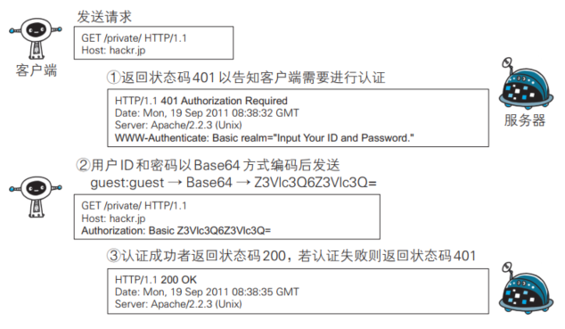

# HTTP 使用的认证方式
HTTP/1.1 使用的认证方式：

- BASIC 认证（基本认证）
- DIGEST 认证（摘要认证）
- SSL 客户端认证
- FormBase 认证（基于表单认证）  

# BASIC 认证  

BASIC 认证（基本认证）是从 HTTP/1.0 就定义的认证方式。即便是现在仍有一部分的网站会使用这种认证方式。  

## BASIC 认证的认证步骤  

- 当请求的资源需要 BASIC 认证时，服务器会随状态码 401 Authorization Required，返回带 WWW-Authenticate 首部字段的响应。该字段内包含认证的方式（ BASIC）及Request-URI 安全域字符串（ realm）  
- 接收到状态码 401 的客户端为了通过 BASIC 认证，需要将用户 ID 及密码发送给服务器。发送的字符串内容是由用户 ID 和密码构成，两者中间以冒号（ :）连接后，再经过 Base64 编码处理。假设用户 ID 为 guest，密码是 guest，连接起来就会形成 guest:guest 这样的字符串。然后经过 Base64 编码，最后的
  结果即是 Z3Vlc3Q6Z3Vlc3Q=。把这串字符串写入首部字 段 Authorization 后，发送请求
- 接收到包含首部字段 Authorization 请求的服务器，会对认证信息的正确性进行验证。如验证通过，则返回一条包含 Request-URI 资源的响应  

BASIC 认证缺点：

- 由于明文解码后就是用户 ID 和密码，在 HTTP 等非加密通信的线路上进行 BASIC 认证的过程中，  如果被人窃听，被盗的可能性极高
- 如果想再进行一次 BASIC 认证时，一般的浏览器却无法实现认证注销操作  

BASIC 认证使用上不够便捷灵活， 且达不到多数 Web 网站期望的安全性等级，因此它并不常用。  

# DIGEST 认证  

为弥补 BASIC 认证存在的弱点，从 HTTP/1.1 起就有了 DIGEST 认证。 DIGEST 认证同样使用质询 / 响应的方式（ challenge/response），但不会像 BASIC 认证那样直接发送明文密码。  

## DIGEST 认证的认证步骤  

- 请求需认证的资源时，服务器会随着状态码 401 Authorization Required， 返回带 WWW-Authenticate 首部字段的响应。该字段内包含质问响应方式认证所需的临时质询码（随机数， nonce）。首部字段 WWW-Authenticate 内必须包含 realm 和 nonce 这两个字段的信息。客户端就是依靠向服务器回送这两个值进行认证的。nonce 是一种每次随返回的 401 响应生成的任意随机字符串。该字符串通常推荐由 Base64 编码的十六进制数的组成形式，但实际内容依赖服务器的具体实现
- 接收到 401 状态码的客户端，返回的响应中包含 DIGEST 认证必须的首部字段 Authorization 信息。  首 部 字 段 Authorization 内 必 须 包 含 username、 realm、nonce、 uri 和 response 的字段信息。其中， realm 和 nonce 就是之前从服务器接收到的响应中的字段。username 是 realm 限定范围内可进行认证的用户名。uri（ digest-uri）即 Request-URI 的值，但考虑到经代理转发后 Request-URI 的值可能被修改，因此事先会复制一份副本保存在 uri 内。response 也可叫做 Request-Digest，存放经过 MD5 运算后的密码字符串，形成响应码。响应中其他的实体请参见第6章的请求首部字段 Authorization。另外，有关 Request-Digest 的计算规则较复杂，有兴趣的读者不妨深入学习一下 RFC2617。  

# 摘要算法

实现完整性的手段主要是摘要算法（Digest Algorithm），也就是常说的散列函数、哈希函数（Hash Function）。可以把摘要算法近似地理解成一种特殊的压缩算法，它能够把任意长度的数据“压缩”成固定长度、而且独一无二的“摘要”字符串，就好像是给这段数据生成了一个数字“指纹”。换一个角度，也可以把摘要算法理解成特殊的“单向”加密算法，它只有算法，没有密钥，加密后的数据无法解密，不能从摘要逆推出原文。

摘要算法实际上是把数据从一个“大空间”映射到了“小空间”，所以就存在“冲突”（collision，也叫碰撞）的可能性，可能会有两份不同的原文对应相同的摘要。好的摘要算法必须能够“抵抗冲突”，让这种可能性尽量地小。

因为摘要算法对输入具有“单向性”和“雪崩效应”，输入的微小不同会导致输出的剧烈变化，所以也被 TLS 用来生成伪随机数（PRF，pseudo random function）。

MD5（Message-Digest 5）、SHA-1（Secure Hash Algorithm 1），是最常用的两个摘要算法，能够生成 16 字节和 20 字节长度的数字摘要。但这两个算法的安全强度比较低，不够安全，在 TLS 里已经被禁止使用了。

目前 TLS 推荐使用的是 SHA-1 的后继者：SHA-2。SHA-2 实际上是一系列摘要算法的统称，总共有 6 种，常用的有 SHA224、SHA256、SHA384，分别能够生成 28 字节、32 字节、48 字节的摘要。

# 完整性

摘要算法保证了“数字摘要”和原文是完全等价的。所以，我们只要在原文后附上它的摘要，就能够保证数据的完整性。

比如，你发了条消息，然后再加上一个 SHA-2 的摘要。网站收到后也计算一下消息的摘要，把这两份“指纹”做个对比，如果一致，就说明消息是完整可信的，没有被修改。如果黑客在中间哪怕改动了一个标点符号，摘要也会完全不同，网站计算比对就会发现消息被窜改，是不可信的。不过摘要算法不具有机密性，如果明文传输，那么黑客可以修改消息后把摘要也一起改了，网站还是鉴别不出完整性。所以，真正的完整性必须要建立在机密性之上，在混合加密系统里用会话密钥加密消息和摘要，这样黑客无法得知明文，也就没有办法动手脚了。这有个术语，叫哈希消息认证码（HMAC）。

# 数字签名

加密算法结合摘要算法，我们的通信过程可以说是比较安全了。但这里还有漏洞，就是通信的两个端点（endpoint）。黑客可以伪装成网站来窃取信息。而反过来，也可以伪装成你，向网站发送支付、转账等消息，网站没有办法确认你的身份，钱可能就这么被偷走了。

使用私钥再加上摘要算法，就能够实现“数字签名”，同时实现“身份认证”和“不可否认”。数字签名的原理其实很简单，就是把公钥私钥的用法反过来，之前是公钥加密、私钥解密，现在是私钥加密、公钥解密。但又因为非对称加密效率太低，所以私钥只加密原文的摘要，这样运算量就小的多，而且得到的数字签名也很小，方便保管和传输。

签名和公钥一样完全公开，任何人都可以获取。但这个签名只有用私钥对应的公钥才能解开，拿到摘要后，再比对原文验证完整性，就可以像签署文件一样证明消息确实是你发的。

这两个行为也有专用术语，叫做“签名”和“验签”。只要你和网站互相交换公钥，就可以用“签名”和“验签”来确认消息的真实性，因为私钥保密，黑客不能伪造签名，就能够保证通信双方的身份。

# 数字证书和CA

还有一个“公钥的信任”问题。因为谁都可以发布公钥，我们还缺少防止黑客伪造公钥的手段。

CA（Certificate Authority，证书认证机构）。它就像网络世界里的公安局、教育部、公证中心，具有极高的可信度，由它来给各个公钥签名，用自身的信誉来保证公钥无法伪造，是可信的。CA对公钥的签名认证也是有格式的，不是简单地把公钥绑定在持有者身份上就完事了，还要包含序列号、用途、颁发者、有效时间等等，把这些打成一个包再签名，完整地证明公钥关联的各种信息，形成“数字证书”（Certificate）。

知名的CA全世界就那么几家，比如DigiCert、VeriSign、Entrust、Let’s Encrypt等，它们签发的证书分DV、OV、EV三种，区别在于可信程度。DV是最低的，只是域名级别的可信，背后是谁不知道。EV是最高的，经过了法律和审计的严格核查，可以证明网站拥有者的身份。

小一点的CA可以让大CA签名认证，但链条的最后，也就是Root CA，就只能自己证明自己了，这个就叫“自签名证书”（Self-Signed Certificate）或者“根证书”（Root Certificate）。你必须相信，否则整个证书信任链就走不下去了。

有了这个证书体系，操作系统和浏览器都内置了各大CA的根证书，上网的时候只要服务器发过来它的证书，就可以验证证书里的签名，顺着证书链（Certificate Chain）一层层地验证，直到找到根证书，就能够确定证书是可信的，从而里面的公钥也是可信的。

# 证书体系的弱点

证书体系（PKI，Public Key Infrastructure）虽然是目前整个网络世界的安全基础设施，但绝对的安全是不存在的，它也有弱点，还是关键的“信任”二字。

如果CA失误或者被欺骗，签发了错误的证书，虽然证书是真的，可它代表的网站却是假的。

还有一种更危险的情况，CA被黑客攻陷，或者CA有恶意，因为它（即根证书）是信任的源头，整个信任链里的所有证书也就都不可信了。

针对第一种，开发出了CRL（证书吊销列表，Certificate revocation list）和OCSP（在线证书状态协议，Online Certificate Status Protocol），及时废止有问题的证书。

对于第二种，因为涉及的证书太多，就只能操作系统或者浏览器从根上“下狠手”了，撤销对CA的信任，列入“黑名单”，这样它颁发的所有证书就都会被认为是不安全的。

